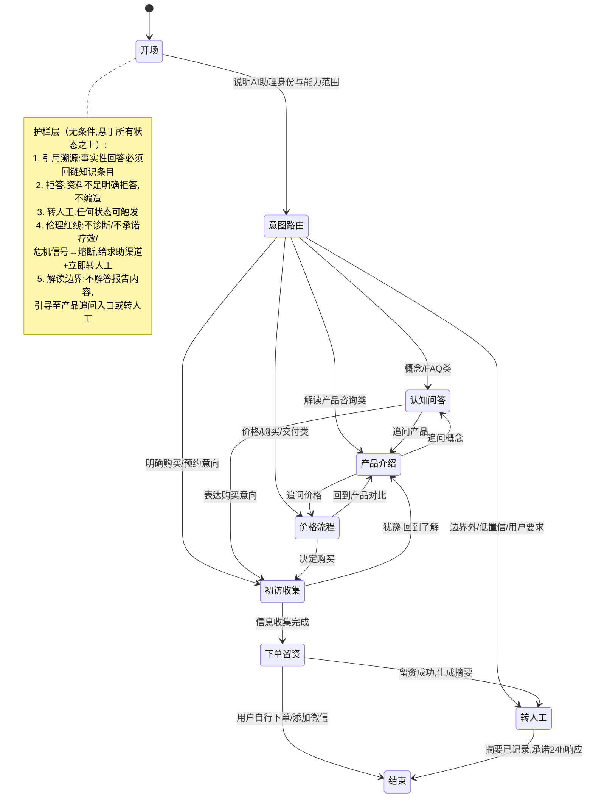

# 客服 Agent 项目 B Framing Spec

> 状态：draft
> 版本：0.2.0
> 日期：2026-08-17
> 变更说明：v0.2 场景修订——项目 B 定为「一套骨架 + 双场景应用适配」；C 端语料依托从「未存在的课程」改为已存在的曼陀罗绘画解读产品；B 端确认沿用 8-16 SPEC，不出方案草稿
> owner：CEO / Orchestrator
> source_of_truth：projects/ai-service-studio/specs/2026-08-17-客服Agent项目B-Framing.md
> 项目：ai-service-studio / 客服 Agent 项目 B
> 阶段：framing（SDD 第一站，后续产出 spec → architecture → task → qa）
> 上游文档：[需求分析启动 handoff](2026-08-16-客服Agent项目B-需求分析启动handoff.md)、[企业级知识库建构方法论研究简报](../internal-research/2026-08-16-企业级知识库建构方法论研究简报.md)

## 0. 项目定位（引用 handoff，不重开）

项目 B 同时服务三个目标：求职旗舰叙事（企业级 Agent 开发 + 企业级知识库建构）、FDE 接单能力储备、为自己的业务承担初访接待与分流。组合位置：A（内容矩阵，分发）→ B（本项目，主旗舰）→ C（AI 课程，等 B 的知识库底座可复用后启动）。

## 1. 总体架构：一套骨架 + 双场景应用适配（v0.2 决策）

项目 B v1 承接两个真实业务场景，**做成两个 Agent 应用适配，共享同一套企业级骨架**，而不是一个 Agent 加意图识别。

**两个场景**：

| 场景 | 业务线 | 入口 | 规格来源 |
| --- | --- | --- | --- |
| B1 企业咨询/合作承接 | 墨予镜企业 AI 服务（B2B） | 公众号 / 企微 | 沿用 [2026-08-16 初访与交接 Agent SPEC](2026-08-16-墨予镜企业AI服务初访与交接Agent-SPEC.md)，本文不重复定义 |
| B2 曼陀罗解读客服 | 疗愈业务（C 端） | 内容账号私信 / 微信 | 本文第 2-6 节 |

**分开的理由**：

1. 护栏集不同：B2 有疗愈伦理红线（不诊断/不承诺疗效/危机熔断）；B1 是企业服务表达边界（不承诺效果/不包装未验证能力）。混在一个 Agent 里，prompt 与评测集要同时扛两套规则。
2. 误判代价高：B/C 意图互串的体验代价（把企业客户当疗愈来访者接待）远大于共享一个路由层省下的成本。
3. 入口与流量天然分开，不会混流。
4. 复用发生在组件层：检索、护栏机制、交接卡、评测框架、状态机骨架全复用；各场景只配自己的知识包、话术、状态机。与疗愈体系知识库「体系 + 应用适配」分层一致，也是求职叙事的主线：**一套企业级 Agent 骨架，两条业务线的应用适配**。

**B1 的边界确认（2026-08-17）**：不出初步方案草稿，维持 8-16 SPEC 的「范围说明 + 合作识别 + 交接卡 + 转人工」。方案能力如未来启动，已定边界：**Agent 只产草稿，本人审核后人工发出**，不直接对企业发送。

## 2. B2 真实场景边界（曼陀罗解读客服）

**已确认事实**：两个账号均未起号、当前咨询量为零——仍按**冷启动**设计（模拟对话 + 评测集驱动，验收标准 = 起号后一周内可完成接入）。

**与 v0.1 的关键差异**：C 端语料依托不再是「未做出来的课程」，而是**已存在的曼陀罗绘画解读产品**（aimandala 应用链路：解读报告 Lite + 升级解锁 Pro）。客服围绕这个真实产品承接咨询。

**接入入口（起号后三选一，不锁定）**：账号私信 / 微信 / 落地页表单。无论选哪个，转人工终点都是微信，对话链路以「最终引导到微信」为收敛方向。

## 3. B2 职责边界

**管**：

- 产品咨询：曼陀罗绘画解读是什么、适合谁、Lite 与 Pro 的区别、价格、购买与交付流程
- 认知类问题：曼陀罗绘画疗愈概念科普（薄层，见第 5 节）
- 初访信息收集：结构化、选择题为主、先说明再征得同意
- 预约/下单引导与留资：引导添加微信，记录对话摘要
- 转人工：高风险/低置信/用户明确要求时转出

**不管**：

- **解读内容本身**：付费后的报告解读、追问、个性化分析是 aimandala 解读智能体的职责，客服管到下单/预约为止。用户拿着报告来问，客服说明边界并引导至产品内追问入口或转人工
- 课程相关咨询：课程尚未存在，遇到则说明「课程筹备中」并引导留资，不编造课程信息
- 售后：退款、投诉（当前业务量为零，该类对话风险最高）
- 任何诊断、疗愈建议、疗效承诺、危机干预（伦理红线，无条件）

遇到「不管」类问题：说明边界 → 转人工或引导留资，不硬答。

## 4. 转人工设计（两个场景共用机制）

**接收方 = 本人微信；机制 = 留微信号 + 对话摘要记录 + 承诺 24 小时内响应。**

- Agent 引导用户添加微信号（或留下微信号），同时把本轮对话的结构化摘要记录下来供人工查看。
- 话术必须做预期管理：明确「人工会在 24 小时内回复」，避免用户把转人工理解为即时响应。
- 冷启动阶段：转人工链路的验收方式为模拟触发 + 检查摘要字段完整性，不接真实通知渠道。

摘要最小字段（初稿，spec 阶段细化）：场景标记（B1/B2）、用户核心诉求、意图分类、已回答过的关键事实、危机信号标记（B2 必备）、用户留下的联系方式。

## 5. B2 语料首批范围

**决策：产品事实层新写 + 疗愈体系知识库抽薄层概念科普。**

| 语料类 | 来源 | 说明 |
| --- | --- | --- |
| 产品事实层（新写/整理） | 本人 + aimandala 产品资料 | 曼陀罗解读产品介绍、Lite/Pro 区别与价格、购买与交付流程、FAQ、初访流程、边界声明话术。产品已存在，语料工作主要是**整理与客服化改写**，而非从零撰写——比 v0.1 假设的课程语料可行性高 |
| 概念科普薄层（抽取） | [疗愈体系知识库](../../aimandala/docs/疗愈体系知识库/README.md) `20-疗愈体系/20-流派层/10-曼陀罗` | 只抽「是什么、适合谁」级别的科普，重组为客服问答条目 |
| 不进入 v1 | 议题层深度内容、`30-疗愈方案层` | 属服务交付内容与项目 C 底座；进入客服库会增加检索噪声和越界回答风险 |

结构化规则沿用方法论简报：taxonomy（产品/流程/价格/疗愈概念/边界声明）+ 元数据 schema（来源、版本、有效期）+ 受控词表，不上本体。

**待本人提供**（spec 阶段启动）：曼陀罗解读的完整产品事实—— Lite/Pro 权益清单、价格、下单路径、交付时长、常见问题。建议直接从 aimandala 现有产品文档与定价页整理。

## 6. B2 对话状态图（草案 v0.2）

**设计原则（已定决策）**：状态机是「网」不是「流水线」。LLM 每轮判断意图决定跳转；状态机定义每个状态下的行为规则；护栏无条件生效，悬在所有状态上方。

**状态行为规则要点**：

| 状态 | 进入条件 | 行为规则 | 退出方向 |
| --- | --- | --- | --- |
| 开场 | 会话开始 | 声明 AI 助理身份、非咨询师、能做什么 | 意图路由 |
| 认知问答 | 概念/FAQ 意图 | 检索知识库回答 + 引用溯源；答不出走拒答 | 产品介绍/初访收集/转人工 |
| 产品介绍 | 产品咨询意图 | 基于产品条目回答（是什么/适合谁/Lite vs Pro），不编造未收录信息 | 价格流程/认知问答/初访收集 |
| 价格流程 | 价格/购买/交付意图 | 只引用价格与流程条目，不口头承诺优惠与时效 | 产品介绍/初访收集 |
| 初访收集 | 明确购买/预约意向 | 先说明收集目的并征得同意；选择题为主；有「不确定/暂停」出口 | 下单留资/回到了解 |
| 下单留资 | 收集完成或直接留资 | 引导下单路径或添加微信；生成对话摘要 | 转人工/结束 |
| 转人工 | 用户要求/低置信/边界外/危机熔断/解读内容追问 | 记录摘要 + 24h 响应承诺话术 | 结束 |
| 危机熔断 | 任何状态下检测到危机信号 | 中断当前流程；固定话术给求助渠道；立即标记转人工 | 结束（流程挂起） |

**待定（spec 阶段细化）**：各状态话术模板、初访收集字段清单、危机信号词表与熔断测试用例、摘要 schema、「解读边界」的识别规则（如何区分售前产品咨询与售后解读追问）。

## 7. 做/不做清单（v1）

**做**：

1. 五层骨架完整：L1 采集治理允许半人工、L3 检索允许单库简化（混合检索，不 rerank）
2. taxonomy + 元数据 schema + 受控词表
3. 护栏四件套 + B2 专属的解读边界护栏
4. 网状对话状态机（LLM 判意图跳转 + 状态行为规则）
5. 20-30 题评测集（含故意越界问题：诱导诊断、诱导疗效承诺、模拟危机信号、诱导解答报告内容）+ badcase 归因表
6. 转人工摘要记录机制（B1/B2 共用）
7. 语料：曼陀罗解读产品事实层整理 + KB 概念科普薄层抽取
8. B1 沿用 8-16 SPEC 推进，与 B2 共享骨架组件

**不做**（v1）：

1. 本体/知识图谱（二期，与项目 C 联动评估）
2. rerank、多库路由、复杂查询改写、权限感知检索、Agent 长期记忆
3. B1 出方案草稿（未来如做：草稿 + 人工审核后发出）
4. 解读内容答疑（aimandala 解读智能体职责）、课程咨询（课程不存在）、售后
5. 真实渠道接入（冷启动，起号后一周内完成接入为验收点）
6. 真实危机干预机制（只有熔断转介话术，词库需专业核验后才可上真实流量）

## 8. 开放问题（带入 spec 阶段）

1. 技术选型对照实验的具体设计：同一份语料、同一批测试题，框架版 vs 平台版比什么指标
2. 是否在 monorepo 建独立项目工作区：建议 spec 稳定后再建，前期工作物暂存 `ai-service-studio/specs/`
3. B2 初访信息收集的字段清单：哪些标准化为选择题、哪些必须人工判断
4. 危机信号词表来源与专业核验路径：v1 只做模拟熔断测试，真实上线前必须专业核验
5. 三个候选入口（私信/微信/落地页）的平台能力核实：起号后一周内完成
6. B1/B2 共享骨架的组件边界划分：哪些组件进能力包、哪些留在场景适配层（architecture 阶段回答）
7. 曼陀罗解读产品事实的完整性确认：Lite/Pro 权益、价格、交付流程以哪份文档为准（需本人指定 source of truth）

## 9. 风险与联动检查点

**主要风险（不变）**：起号（项目 A）是所有变现线与真实流量线的共同瓶颈。项目 B 的工程价值不依赖流量，照常推进；若 A 长期停滞，B 将长期只有模拟流量。

**A/B 联动检查点**：项目 A 起号后 2 周内，完成客服接入试运行（入口三选一落地 + 真实流量 badcase 回流机制启动）。

**次要风险**：

- B2 产品事实层语料虽比 v0.1 假设的课程语料可行，但仍需本人投入整理；建议 spec 阶段同步启动，从 aimandala 现有产品文档改写
- 冷启动期「自己扮演用户」有盲区，评测集需包含外部来源的真实咨询问题样式（可从行业公开咨询帖改写）
- B1/B2 双场景并行推进时，注意骨架组件不要过早抽象——先让 B2 跑通，再从两个场景的重复中提取共享组件

## 10. 下一步（SDD 流程）

1. 本 framing 确认后，产出 B2 正式 spec：状态行为规则细化、初访字段清单、摘要 schema、评测集 v1 题目
2. 同步启动曼陀罗解读产品事实层语料整理（本人主导，从 aimandala 产品资料改写）
3. B1 按 8-16 SPEC 独立推进，架构阶段统一划分共享组件边界
4. 技术选型对照实验设计（开放问题 1）可并行，作为 spec 附录或独立 task
