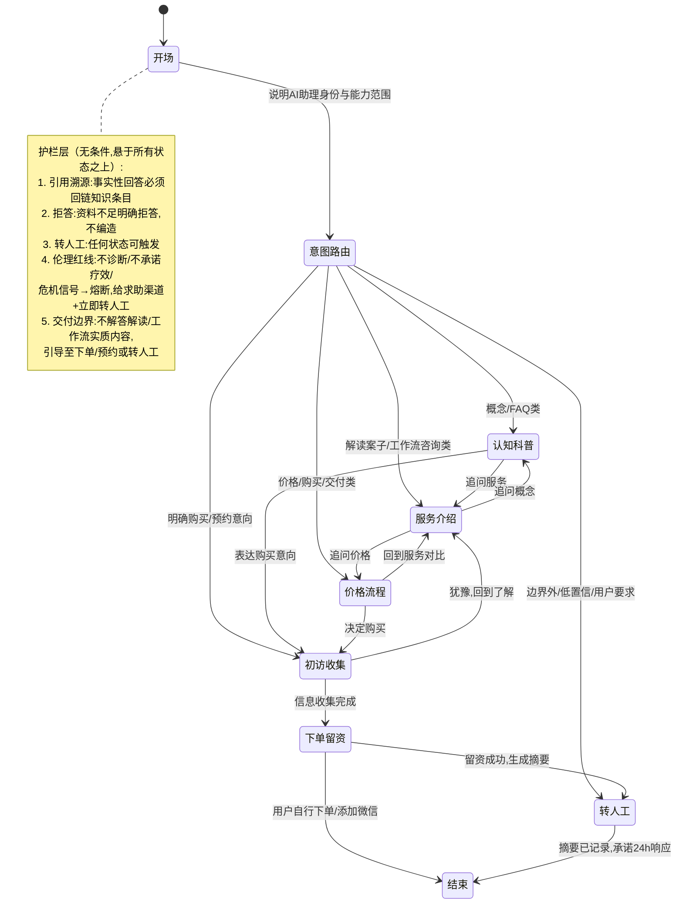

# 客服 Agent 项目 B Framing Spec

> 状态：draft
> 版本：0.3.0
> 日期：2026-08-17
> 变更说明：v0.3 定位重构——通用客服 Agent 骨架为核心交付物，两条自有业务线为落地场景；修正 B2 定义（个人解读案子 + 工作流售卖，非 AI 解读智能体购买咨询）；语料从「硬事实层」降级为「可迭代适配层」
> owner：CEO / Orchestrator
> source_of_truth：projects/ai-service-studio/specs/2026-08-17-客服Agent项目B-Framing.md
> 项目：ai-service-studio / 客服 Agent 项目 B
> 阶段：framing（SDD 第一站，后续产出 spec → architecture → task → qa）
> 上游文档：[需求分析启动 handoff](2026-08-16-客服Agent项目B-需求分析启动handoff.md)、[企业级知识库建构方法论研究简报](../internal-research/2026-08-16-企业级知识库建构方法论研究简报.md)

## 0. 项目定位

项目 B 同时服务三个目标：

- **求职**：企业级 Agent 开发 + 企业级知识库建构两个经验的载体，简历叙事主线
- **FDE 接单储备**：客服/知识库是企业买单意愿最强的场景，沉淀到 ai-service-studio 能力包
- **真实业务**：为自己的业务承担初访接待、分流、转人工

**v0.3 新增的核心动机（决定架构重心）**：这个 Agent 很通用——创业者、一人公司、自由职业者都需要同一套「接得住咨询、答得上 FAQ、转得动人工」的东西。因此**骨架本身就是要交付的产品**，自己的业务是它的第一个落地场景，而不是反过来。

组合位置：A（内容矩阵，分发）→ B（本项目，主旗舰）→ C（AI 课程，等 B 的知识库底座可复用后启动）。

## 1. 总体架构：通用骨架 + 应用适配（v0.3 决策）

项目 B 交付的是一套**通用客服 Agent 骨架**，通过「配置一个场景 = 换一份知识包 + 一套话术 + 一份状态机 + 一套护栏」完成接入。骨架的组件全部复用；场景之间的差异只发生在配置层。

**v1 用两条自有业务线做第一批落地场景**：

| 场景 | 业务线 | 入口 | 规格来源 |
| --- | --- | --- | --- |
| B1 企业咨询/合作承接 | 墨予镜企业 AI 服务（B2B） | 公众号 / 企微 | 沿用 [2026-08-16 初访与交接 Agent SPEC](2026-08-16-墨予镜企业AI服务初访与交接Agent-SPEC.md) |
| B2 疗愈业务客服 | 个人解读案子 + 工作流售卖（C 端 + 同行） | 两个内容账号私信 / 微信 | 本文第 2-6 节 |

**分开做两个 Agent（而非一个 + 意图识别）的理由**：

1. 护栏集不同：B2 有疗愈伦理红线（不诊断/不承诺疗效/危机熔断）；B1 是企业服务表达边界。混在一个 Agent 里，prompt 与评测集要同时扛两套规则。
2. 误判代价高：B/C 意图互串的体验代价大于共享路由层省下的成本。
3. 入口与流量天然分开。
4. 复用发生在组件层（检索、护栏机制、交接卡、评测框架、状态机骨架），不是 Agent 层——这正体现了「通用骨架」的价值。

**B1 边界确认（2026-08-17）**：不出初步方案草稿，维持 8-16 SPEC 的「范围说明 + 合作识别 + 交接卡 + 转人工」。方案能力如未来启动，已定边界：**Agent 只产草稿，本人审核后人工发出**。

## 2. B2 场景定义（疗愈业务客服）

**承接两类产品**（两个内容账号均发布）：

1. **个人解读案子**：以咨询师/疗愈师身份接的解读服务（如曼陀罗绘画解读），人工交付。注意：**不是** aimandala 的 AI 解读智能体——客服承接的是「我想找你本人做解读」的咨询。
2. **工作流售卖**：面向心理咨询师/疗愈师同行的方法论/工作流产品。

**冷启动事实（不变）**：账号未起号、当前咨询量为零。按冷启动设计——模拟对话 + 评测集驱动，验收标准 = 起号后一周内可完成接入。

**接入入口**：私信 / 微信 / 落地页表单三选一，不锁定；无论选哪个，转人工终点收敛到微信。

## 3. 骨架是核心，语料是可迭代适配层（v0.3 关键立场）

**客服具体能答哪些内容不重要，会随产品迭代更新。** 因此 framing 不把语料范围当硬边界来抠，而是明确机制：

- **骨架（固定，本次交付）**：状态机、护栏、转人工、评测回流、引用溯源。跑通这套流程是第一目标。
- **适配层（可迭代，随时换）**：知识包内容、FAQ 条目、话术模板、产品介绍与价格。上线后靠评测 badcase 回流持续更新。

职责边界只保留**不可迭代的硬线**，其余交给适配层：

**硬线（无条件，属护栏而非语料）**：

- 不做诊断、不给疗愈建议、不承诺疗效、不做危机干预（危机信号 → 熔断 + 转人工）
- 不解答解读/服务交付本身的内容：解读交付、工作流的实质内容由你本人交付，客服管到预约/下单/留资为止
- 不包装未验证能力、不承诺效果

**适配层（会迭代，spec 阶段给初版即可）**：

- 解读案子的介绍、适合谁、流程、价格
- 工作流产品的介绍与价格
- FAQ 与认知科普薄层（曼陀罗等概念，从疗愈体系知识库抽「是什么/适合谁」级别即可）
- 产品事实的 source of truth 以你届时指定的文档为准，逐条可换

## 4. 转人工设计（骨架固定组件）

**接收方 = 本人微信；机制 = 留微信号 + 对话摘要记录 + 承诺 24 小时内响应。**

- Agent 引导用户添加微信号（或留下微信号），同时记录本轮对话的结构化摘要供人工查看。
- 话术必须做预期管理：明确「人工会在 24 小时内回复」，避免把转人工理解为即时响应。
- 冷启动阶段：转人工链路以「模拟触发 + 检查摘要字段完整性」验收，不接真实通知渠道。

摘要最小字段（spec 阶段细化）：场景标记（B1/B2）、用户核心诉求、意图分类、已回答过的关键事实、危机信号标记（B2 必备）、用户联系方式。

## 5. B2 对话状态图（骨架，场景配置层可替换）

**设计原则（已定决策）**：状态机是「网」不是「流水线」。LLM 每轮判断意图决定跳转；状态机定义每个状态下的行为规则；护栏无条件生效，悬在所有状态上方。

**状态行为规则要点**（spec 阶段细化话术）：

| 状态 | 进入条件 | 行为规则 | 退出方向 |
| --- | --- | --- | --- |
| 开场 | 会话开始 | 声明 AI 助理身份、非咨询师、能做什么 | 意图路由 |
| 认知科普 | 概念/FAQ 意图 | 检索知识库回答 + 引用溯源；答不出走拒答 | 服务介绍/初访收集/转人工 |
| 服务介绍 | 服务咨询意图 | 基于服务条目回答，不编造未收录信息 | 价格流程/认知科普/初访收集 |
| 价格流程 | 价格/购买/交付意图 | 只引用价格与流程条目，不口头承诺优惠与时效 | 服务介绍/初访收集 |
| 初访收集 | 明确购买/预约意向 | 先说明收集目的并征得同意；选择题为主；有「不确定/暂停」出口 | 下单留资/回到了解 |
| 下单留资 | 收集完成或直接留资 | 引导下单路径或添加微信；生成对话摘要 | 转人工/结束 |
| 转人工 | 用户要求/低置信/边界外/危机熔断/交付内容追问 | 记录摘要 + 24h 响应承诺话术 | 结束 |
| 危机熔断 | 任何状态下检测到危机信号 | 中断当前流程；固定话术给求助渠道；立即标记转人工 | 结束（流程挂起） |

**待定（spec 阶段）**：各状态话术模板、初访收集字段清单、危机信号词表与熔断测试用例、摘要 schema、「交付边界」识别规则（区分售前咨询与交付内容追问）。

## 6. 做/不做清单（v1）

**做**：

1. 通用客服 Agent 骨架跑通：状态机、护栏、转人工、评测回流、引用溯源
2. 五层骨架完整：L1 采集治理半人工、L3 检索单库简化（混合检索，不 rerank）
3. taxonomy + 元数据 schema + 受控词表
4. 护栏四件套 + B2 专属交付边界护栏
5. 网状对话状态机（LLM 判意图跳转 + 状态行为规则）
6. 20-30 题评测集（含故意越界问题）+ badcase 归因表
7. 转人工摘要记录机制（B1/B2 共用骨架组件）
8. 两条业务线各配一份初版适配层（知识包 + 话术 + 状态机配置）
9. B1 沿用 8-16 SPEC 推进，与 B2 共享骨架

**不做**（v1）：

1. 本体/知识图谱（二期，与项目 C 联动评估）
2. rerank、多库路由、复杂查询改写、权限感知检索、Agent 长期记忆
3. B1 出方案草稿（未来如做：草稿 + 人工审核后发出）
4. 解读/工作流的实质交付内容答疑（由本人交付，客服管到预约/下单为止）
5. 真实渠道接入（冷启动，起号后一周内完成接入为验收点）
6. 真实危机干预机制（只有熔断转介话术，词库需专业核验后才可上真实流量）

## 7. 开放问题（带入 spec 阶段）

1. 技术选型对照实验的具体设计：同一份语料、同一批测试题，框架版 vs 平台版比什么指标
2. 是否在 monorepo 建独立项目工作区：建议 spec 稳定后再建，前期工作物暂存 `ai-service-studio/specs/`
3. B2 初访信息收集的字段清单：哪些标准化为选择题、哪些必须人工判断
4. 危机信号词表来源与专业核验路径：v1 只做模拟熔断测试，真实上线前必须专业核验
5. 三个候选入口（私信/微信/落地页）的平台能力核实：起号后一周内完成
6. B1/B2 共享骨架的组件边界划分：哪些组件进能力包、哪些留在场景适配层（architecture 阶段回答）
7. 适配层初版内容：解读案子与工作流的介绍/价格/流程，届时以你指定的文档为 source of truth（内容可迭代，不阻塞骨架开发）

## 8. 风险与联动检查点

**主要风险（不变）**：起号（项目 A）是所有变现线与真实流量线的共同瓶颈。项目 B 的工程价值不依赖流量，照常推进；若 A 长期停滞，B 将长期只有模拟流量。

**A/B 联动检查点**：项目 A 起号后 2 周内，完成客服接入试运行（入口三选一落地 + 真实流量 badcase 回流机制启动）。

**次要风险**：

- 冷启动期「自己扮演用户」有盲区，评测集需包含外部来源的真实咨询问题样式（可从行业公开咨询帖改写）
- 双场景并行推进时，骨架组件不要过早抽象——先让一条线跑通，再从两条线的重复中提取共享组件
- 适配层内容会不断迭代，注意把「内容更新」和「骨架改版」分开管理：内容更新不触发骨架回归，避免每次改 FAQ 都重跑评测

## 9. 下一步（SDD 流程）

1. 本 framing 确认后，先跑通骨架：产出 B2 正式 spec（状态话术、初访字段、摘要 schema、评测集 v1 题目）
2. 适配层初版内容由本人主导（解读案子/工作流的介绍、价格、流程，以指定文档为准），不阻塞骨架开发
3. B1 按 8-16 SPEC 独立推进，架构阶段统一划分共享组件边界
4. 技术选型对照实验设计（开放问题 1）可并行，作为 spec 附录或独立 task
