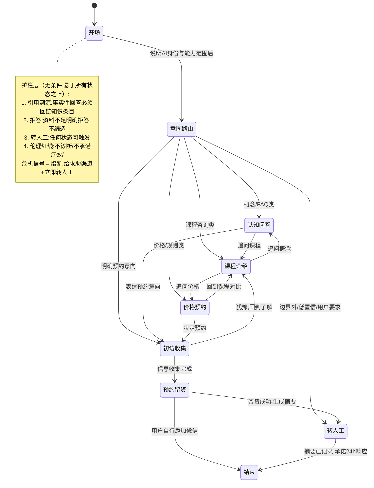

# 客服 Agent 项目 B Framing Spec

> 状态：draft
> 版本：0.1.0
> 日期：2026-08-17
> owner：CEO / Orchestrator
> source_of_truth：projects/ai-service-studio/specs/2026-08-17-客服Agent项目B-Framing.md
> 项目：ai-service-studio / 客服 Agent 项目 B
> 阶段：framing（SDD 第一站，后续产出 spec → architecture → task → qa）
> 上游文档：[需求分析启动 handoff](2026-08-16-客服Agent项目B-需求分析启动handoff.md)、[企业级知识库建构方法论研究简报](../internal-research/2026-08-16-企业级知识库建构方法论研究简报.md)
> 区分说明：本文档是**疗愈/课程业务（C 端）客服 Agent**的 framing；[2026-08-16 初访与交接 Agent SPEC](2026-08-16-墨予镜企业AI服务初访与交接Agent-SPEC.md) 是 B2B 企业 AI 服务线索交接的局部实验，两者是不同业务线的 Agent，不要混用规格。

## 0. 项目定位（引用 handoff，不重开）

项目 B 同时服务三个目标：求职旗舰叙事（企业级 Agent 开发 + 企业级知识库建构）、FDE 接单能力储备、为自己的疗愈/课程业务承担初访接待与分流。组合位置：A（内容矩阵，分发）→ B（本项目，主旗舰）→ C（AI 课程，等 B 的知识库底座可复用后启动）。

## 1. 真实场景边界（开放问题 1 的落地）

**已确认事实（2026-08-16）**：两个账号均未起号、当前咨询量为零。

因此项目 B 按**冷启动**设计：

- 第一版的"真实场景"= 模拟咨询对话 + 自己扮演用户 + 评测集驱动开发。
- 验收标准不是"接住了多少真实咨询"，而是"**账号起号后一周内可完成接入**"。
- 业务边界：客服对象为疗愈/课程业务的潜在来访者，入口为内容账号引来的私信咨询。

**接入时的最小改造点（起号后三选一，framing 阶段不锁定）**：

| 候选入口 | 改造内容 | 备注 |
| --- | --- | --- |
| 账号私信入口 | 私信自动回复/关键词引导到对话入口 | 依赖平台开放能力，需起号后核实 |
| 微信/企微 | 个人号或企微接入对话链路 | 与转人工路径天然同渠道，摩擦最小 |
| 落地页表单 | 落地页嵌入对话或表单 → 初访信息收集 | 与"留资"目标一致，但对话体验弱 |

设计约束：无论选哪个入口，**转人工终点都是微信**（见第 3 节），因此对话链路设计应以"最终引导到微信"为收敛方向。

## 2. 职责边界（开放问题 2 的决策）

**决策：客服 Agent 管到预约/留资为止。**

**管**：

- 售前 FAQ：课程是什么、适合谁、价格、形式、时长、老师背景
- 认知类问题：疗愈概念科普（如"曼陀罗绘画疗愈是什么"），限薄层（见第 4 节）
- 初访信息收集：结构化、选择题为主、先说明再征得同意
- 预约引导与留资：引导添加微信，记录对话摘要
- 转人工：高风险/低置信/用户明确要求时转出

**不管**：

- 已购用户的课程内容答疑（属项目 C 范围，v1 无此语料也不做）
- 售后：退款、投诉、已购用户支持（当前业务量为零，该类对话情绪与合规风险最高）
- 任何诊断、疗愈建议、疗效承诺、危机干预（伦理红线，无条件）

遇到"不管"类问题：说明边界 → 转人工或引导留资，不硬答。

## 3. 转人工设计（开放问题 3 的决策）

**决策：接收方 = 本人微信；机制 = 留微信号 + 对话摘要记录 + 承诺 24 小时内响应。**

- Agent 引导用户添加微信号（或留下微信号），同时把本轮对话的结构化摘要记录下来供人工查看。
- 话术必须做预期管理：明确"人工会在 24 小时内回复"，避免用户把"转人工"理解为即时响应。
- 冷启动阶段（无真实流量）：转人工链路的验收方式为模拟触发 + 检查摘要字段完整性，不接真实通知渠道。

摘要最小字段（初稿，spec 阶段细化）：用户表达的核心诉求、意图分类、已回答过的关键事实、危机信号标记（有/无）、用户留下的联系方式。

## 4. 语料首批范围（开放问题 4 的决策）

**决策：事实层新写 + 疗愈体系知识库抽薄层概念科普。**

| 语料类 | 来源 | 说明 |
| --- | --- | --- |
| 产品事实层（新写） | 需本人撰写 | 课程介绍、价格、预约规则、FAQ、初访流程、边界声明话术。这是客服语料主体，目前不存在，是 v1 的语料工作大头 |
| 概念科普薄层（抽取） | [疗愈体系知识库](../../aimandala/docs/疗愈体系知识库/README.md) `20-疗愈体系` | 只抽"是什么、适合谁"级别的科普（如曼陀罗绘画疗愈入门解释），重组为客服问答条目 |
| 不进入 v1 | `20-疗愈体系` 议题层深度内容、`30-疗愈方案层` | 属服务交付内容与项目 C 底座；进入客服库会增加检索噪声和越界回答（AI 滑向"给建议"）的风险 |

结构化规则沿用方法论简报：taxonomy（课程/流程/价格/疗愈概念/边界声明）+ 元数据 schema（来源、版本、有效期）+ 受控词表，不上本体。

## 5. 对话状态图（草案 v0.1）

**设计原则（已定决策，handoff 第 4.6 条）**：状态机是"网"不是"流水线"。LLM 每轮判断意图决定跳转；状态机定义每个状态下的行为规则；护栏无条件生效，悬在所有状态上方。

**状态行为规则要点**：

| 状态 | 进入条件 | 行为规则 | 退出方向 |
| --- | --- | --- | --- |
| 开场 | 会话开始 | 声明 AI 助理身份、非咨询师、能做什么 | 意图路由 |
| 认知问答 | 概念/FAQ 意图 | 检索知识库回答 + 引用溯源；答不出走拒答 | 课程介绍/初访收集/转人工 |
| 课程介绍 | 课程咨询意图 | 基于课程条目回答，不编造未收录信息 | 价格预约/认知问答/初访收集 |
| 价格预约 | 价格/规则意图 | 只引用价格与预约规则条目，不口头承诺优惠 | 课程介绍/初访收集 |
| 初访收集 | 明确预约意向 | 先说明收集目的并征得同意；选择题为主；有"不确定/暂停"出口 | 预约留资/回到了解 |
| 预约留资 | 收集完成或直接留资 | 引导添加微信；生成对话摘要 | 转人工/结束 |
| 转人工 | 用户要求/低置信/边界外/危机熔断 | 记录摘要 + 24h 响应承诺话术 | 结束 |
| 危机熔断 | 任何状态下检测到危机信号 | 中断当前流程；固定话术给求助渠道；立即标记转人工 | 结束（流程挂起） |

**待定（spec 阶段细化）**：各状态的具体话术模板、初访收集的字段清单、危机信号词表与熔断测试用例、摘要的结构化 schema。

## 6. 做/不做清单（v1）

**做**（沿用方法论简报第 5 章 + 本次场景决策）：

1. 五层骨架完整：L1 采集治理允许半人工、L3 检索允许单库简化（混合检索，不 rerank）
2. taxonomy + 元数据 schema + 受控词表
3. 护栏四件套：引用溯源、拒答、转人工、疗愈伦理红线
4. 网状对话状态机（LLM 判意图跳转 + 状态行为规则）
5. 20-30 题评测集（含故意越界问题：诱导诊断、诱导疗效承诺、模拟危机信号）+ badcase 归因表
6. 转人工摘要记录机制
7. 语料：产品事实层新写 + KB 概念科普薄层抽取

**不做**（v1）：

1. 本体/知识图谱（二期，与项目 C 联动评估）
2. rerank、多库路由、复杂查询改写、权限感知检索、Agent 长期记忆
3. 课程内容答疑、售后（职责边界外）
4. 真实渠道接入（冷启动，起号后一周内完成接入为验收点）
5. 真实危机干预机制（只有熔断转介话术，词库需专业核验后才可上真实流量）

## 7. 开放问题（带入 spec 阶段）

1. 技术选型对照实验的具体设计：同一份语料、同一批测试题，框架版 vs 平台版比什么指标（handoff 开放问题 5）
2. 是否在 monorepo 建独立项目工作区：建议 spec 稳定后再建，前期工作物暂存 `ai-service-studio/specs/`（handoff 开放问题 6）
3. 初访信息收集的字段清单：哪些标准化为选择题、哪些必须人工判断（参考[心理咨询初访助理产品参考](../references/2026-07-18-心理咨询初访助理产品参考.md)第 5 节诊断问题）
4. 危机信号词表来源与专业核验路径：v1 只做模拟熔断测试，真实上线前必须专业核验
5. 三个候选入口（私信/微信/落地页）的平台能力核实：起号后一周内完成

## 8. 风险与联动检查点

**主要风险（引用 handoff）**：起号（项目 A）是所有变现线与真实流量线的共同瓶颈。项目 B 的工程价值不依赖流量，照常推进；但若 A 长期停滞，B 将长期只有模拟流量，"真实需求场景"叙事打折。

**A/B 联动检查点**：项目 A 起号后 2 周内，完成客服接入试运行（入口三选一落地 + 真实流量 badcase 回流机制启动）。

**次要风险**：

- 产品事实层语料（课程介绍、价格）目前不存在，依赖本人撰写——这是 v1 语料工作的关键路径，建议 spec 阶段同步启动撰写。
- 冷启动期"自己扮演用户"有盲区，评测集需包含外部来源的真实咨询问题样式（可从行业公开咨询帖改写）。

## 9. 下一步（SDD 流程）

1. 本 framing 确认后，产出正式 spec：状态行为规则细化、初访字段清单、摘要 schema、评测集 v1 题目
2. 同步启动产品事实层语料撰写（课程介绍/价格/预约规则/FAQ）
3. 技术选型对照实验设计（开放问题 1）可并行，作为 spec 附录或独立 task
