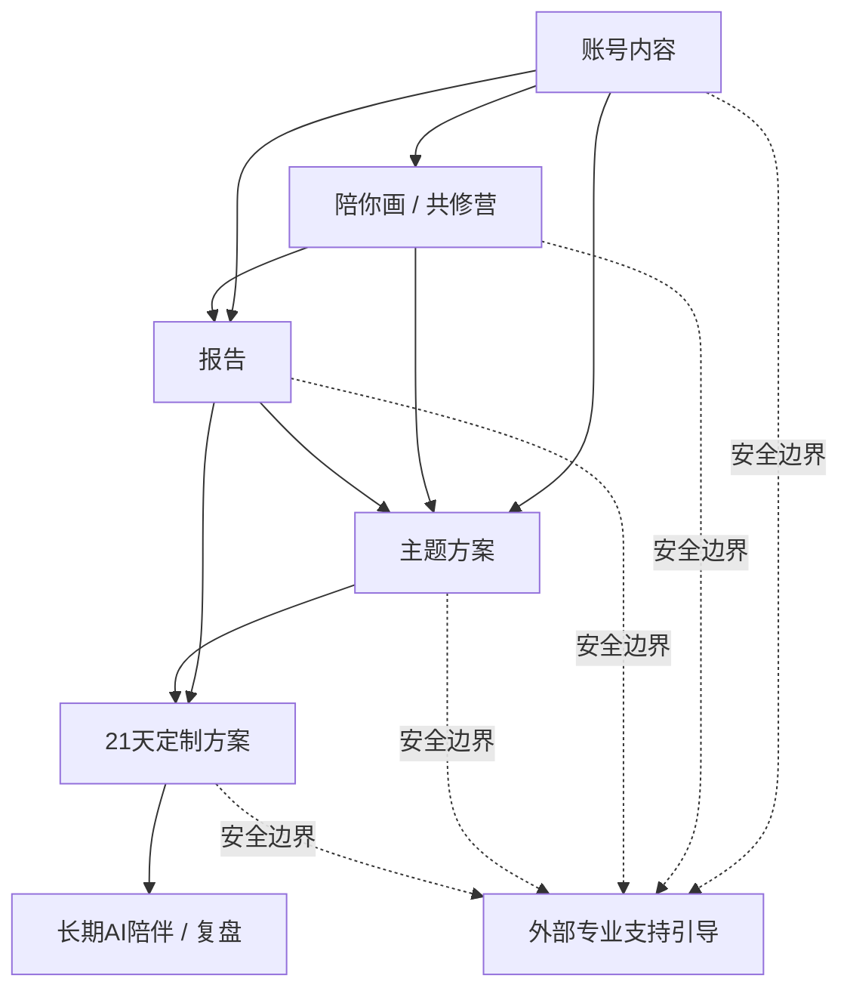

# 一镜一梳：用户分群与产品矩阵决策

> 状态：in_review
> 版本：0.1.0
> owner：Product Spec Lead
> last_updated：2026-04-07
> source_of_truth：/Users/xinran/Downloads/dev/mindsync/projects/aimandala/docs/decisions/2026-04-06-用户分群与产品矩阵决策.md
> 项目：aimandala
> 阶段：decision
> depends_on：/Users/xinran/Downloads/dev/mindsync/projects/aimandala/docs/specs/2026-04-04-toc-mvp-spec.md, /Users/xinran/Downloads/dev/mindsync/projects/aimandala/docs/specs/2026-04-06-产品矩阵-目标用户与最小交付单元.md
> reviewers：CEO / Orchestrator, Architect, Engineer, Test / QA

## 0. 当前作用范围

本决策当前作为 `aimandala` 后续产品矩阵设计的结构性审阅稿。

它当前负责：

- 为后续用户分群与产品矩阵提供统一判断基线
- 解释为什么产品不应长期只以 `Lite / Pro` 两档理解
- 为后续 `报告 / 主题方案 / 21天定制方案` 等扩展提供边界输入

它当前不直接改写：

- `/Users/xinran/Downloads/dev/mindsync/projects/aimandala/docs/specs/2026-04-04-toc-mvp-spec.md` 中的当前 To C MVP 交付范围
- 当前 `To C + V2 + mobile-web` 的实现主线
- 当前 `Lite / Pro` 在本轮迁移中的最小正式交付口径

如果后续要让本决策直接影响当前 MVP 交付范围，必须同步更新对应 `spec / architecture / qa`，而不是只在本决策中静默改写。

## 1. 目标

本决策用于统一 `一镜一梳` 后续的产品设计基线，回答以下问题：

1. 我们的用户应该按什么方式分群
2. 我们的产品不应被限制为 `Lite / Pro` 两档
3. 曼陀罗产品与星座/泛解读产品的结构差异是什么
4. `账号内容 / 陪你画 / 报告 / 主题方案 / 21天定制方案` 五类产品之间应如何分工
5. AI 能力如何尽量做大，同时保持清晰安全边界

## 2. 背景判断

### 2.1 曼陀罗产品不同于纯解读产品

曼陀罗不是“输入一个标签，输出一份解释”的产品。

它天然包含一个前置行为：

- 用户要先画
- 绘制本身就是表达
- 表达过程本身具有价值

因此，用户进入产品的动机不只一种：

- 有人是为了被解读而来
- 有人是为了理解自己的某个议题而来
- 有人是为了被陪伴、一起画而来
- 有人单纯因为喜欢曼陀罗的创作体验而来

这意味着产品矩阵必须同时包含：

- 内容入口
- 创作/陪伴入口
- 解读产品
- 行动与成长产品

### 2.2 不先以价格或 Lite / Pro 档位定义产品

当前阶段不宜先以既有价格或 `Lite / Pro` 档位约束产品设计。

优先级应为：

1. 先分析用户属于哪几类
2. 再看不同用户各自的需求
3. 再决定需要几类产品
4. 最后再反推命名、组合关系与定价

### 2.3 AI 能力要做大，但边界要清晰

当前倾向不是把真人疗愈师做成平台内核心业务，而是：

- 承认真人专业支持的必要性
- 让 AI 能力在安全前提下尽量做大
- 对复杂/高风险情况保留明确的外部支持引导

因此：

- `长期陪伴` 可以是 AI 的强项
- `高复杂度、高风险、专业责任型支持` 不应由 AI 主承接

## 3. 用户分群决策

### 3.1 主分群原则

用户分群以“她为什么来、她希望获得什么”为主轴，而不是以“积累程度高低”为主轴。

`积累程度` 可以作为辅助标签，但不应作为主分类标准。

### 3.2 当前采用的 6 类主用户

| 用户类型 | 她为什么来 | 她真正想得到什么 | 最适合的第一入口 |
|---|---|---|---|
| 审美探索型 | 先被气质、画面、仪式感吸引 | 好体验、轻启发、进入状态 | 账号内容 / 陪你画 |
| 情绪安放型 | 最近情绪乱、想找出口 | 被接住、被理解、被安抚 | 账号内容 / 陪你画 / 轻解读 |
| 自我理解型 | 对自己有感受，但说不清 | 命名状态、理解模式、看懂自己 | 报告 |
| 议题解决型 | 卡在关系、情绪、事业、边界、阶段转折 | 围绕具体问题获得解释与方向 | 报告 / 主题方案 |
| 成长深化型 | 已做过一定自我探索，想继续深挖 | 机制、成因、长期路径 | 报告 / 21天定制方案 |
| 高复杂度支持型 | 情况更重、更复杂、更需要专业承接 | 稳定支持、专业判断、外部真人帮助 | 不应由 AI 主承接 |

### 3.3 用户辅助标签

在 6 类主用户之外，可再用以下标签做细分：

- 问题紧迫度：低 / 中 / 高
- 进入动机：好奇 / 共鸣 / 解决问题 / 长期成长
- 对结构化解释的偏好：低 / 中 / 高
- 对持续陪伴的偏好：低 / 中 / 高
- 是否适合由 AI 主承接：适合 / 需监测 / 不适合

## 4. 产品矩阵决策

### 4.1 当前确认的五类产品

| 产品 | 产品类型 | 核心任务 | 典型用户动机 | 主价值 |
|---|---|---|---|---|
| 账号内容 | 内容产品 | 建立信任、教育用户、引流 | 我先看看这是什么 | 信任、启发、低门槛价值 |
| 陪你画 / 共修营 | 陪伴产品 | 带用户进入创作过程与场域 | 我想画、想有人一起画 | 参与感、仪式感、陪伴感 |
| 报告 | 解读产品 | 帮用户看懂自己 | 我想知道这张画在说什么 | 被看见、被解释、被命名 |
| 主题方案 | 标准化成长产品 | 围绕一个问题开始改变 | 我知道我卡在哪，想开始练 | 路径、练习、节奏 |
| 21天定制方案 | 个体化成长产品 | 持续推进个体化改变 | 我不只想懂，我想真正变 | 个体路径、连续陪伴、进展感 |

另有一层贯穿全链路的基础机制：

| 模块 | 类型 | 核心任务 |
|---|---|---|
| 安全边界与外部转介 | 风险控制机制 | 明确 AI 不做什么，并对复杂/高风险情况给出外部专业支持引导 |

### 4.2 五类产品的边界

#### 账号内容

负责：

- 建立专业信任
- 提供低门槛价值
- 教育用户理解曼陀罗方法论
- 激发后续产品需求

不负责：

- 完整个体价值交付
- 深度个体化分析
- 高强度连续陪伴

#### 陪你画 / 共修营

负责：

- 陪伴式创作
- 共修场域
- 节奏感与仪式感
- 降低进入门槛

不负责：

- 深度个体解读
- 高密度分析
- 高个体化路径设计

#### 报告

负责：

- 解释这张画在表达什么
- 命名用户状态
- 梳理用户模式
- 连接现实议题

不负责：

- 连续训练
- 长周期改变
- 替代方案产品

#### 主题方案

负责：

- 围绕一个议题开始改变
- 提供标准化练习路径
- 提供阶段节奏

不负责：

- 深度个体分析
- 高度定制化承接
- 替代 21 天定制方案

#### 21天定制方案

负责：

- 基于用户本人情况生成连续路径
- 排定优先级
- 提供更强的连续陪伴与进展反馈

不负责：

- 高风险心理支持
- 专业治疗替代
- 标准化大规模引流

### 4.3 五类产品的关系

三种关系同时存在：

#### 并列关系

- `账号内容` 与 `陪你画 / 共修营` 都可以作为入口
- `报告` 与 `主题方案` 对部分用户也可以是并列入口

#### 递进关系

- `报告 -> 主题方案`
- `报告 -> 21天定制方案`
- `主题方案 -> 21天定制方案`

#### 交叉关系

标准化 `主题方案` 可同时提供两种形态：

1. 个人版：App 内自助使用
2. 社群版：活动群 / 训练营 / 共修营

因此，`主题方案` 与 `陪你画 / 共修营` 会在“社群形态”上出现交叉，但核心任务仍然不同：

- `陪你画 / 共修营`：进入过程与场域
- `主题方案`：围绕问题推进改变

## 5. 推荐用户旅程

## 6. AI 与外部专业支持边界

### 6.1 AI 当前可重点承担的能力

- 个体化报告
- 长期陪伴
- 日常反思
- 主题方案
- 21 天定制路径
- 低风险成长支持
- 周期复盘与进展提醒

### 6.2 AI 当前不应主承接的情况

- 高风险危机
- 明显超出自助成长范畴的复杂个案
- 需要专业判断与高责任承接的情况

### 6.3 当前决策

当前不把“真人疗愈师服务”设为平台核心产品线之一，但必须保留：

- 清晰边界说明
- 风险识别
- 外部专业支持引导

## 7. 阶段性推进建议

### Phase 1

优先建立：

1. 账号内容
2. 报告
3. 陪你画 / 小型共修活动

目标：

- 建立品牌信任
- 验证报告价值
- 放大曼陀罗区别于泛解读产品的独特性

### Phase 2

建立：

4. 主题方案

目标：

- 从“理解”过渡到“开始改变”
- 验证标准化成长产品

### Phase 3

建立：

5. 21天定制方案

目标：

- 承接高意愿用户
- 建立更高价值的个体化成长产品层

## 8. 后续文档任务

基于本决策，后续应继续补齐以下文档：

1. 五类产品的目标用户与核心卖点
2. 报告 / 主题方案 / 21天定制方案 的用户任务定义
3. 陪你画 / 共修营 的最小活动模型
4. AI 安全边界与转介机制说明
5. 账号内容与应用产品的协同路径
