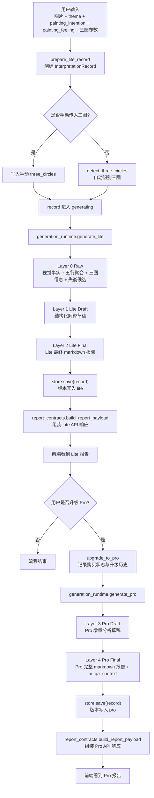

# 一镜一梳：报告生成分层与信息流说明

> 状态：draft
> 版本：0.1.0
> owner：Architect
> last_updated：2026-04-11
> 项目：aimandala
> 阶段：architecture
> source_of_truth：/Users/xinran/Downloads/dev/mindsync/projects/aimandala/docs/specs/2026-04-11-报告生成分层与信息流说明.md
> depends_on：/Users/xinran/Downloads/dev/mindsync/projects/aimandala/docs/specs/2026-04-04-toc-mvp-architecture.md
> depends_on：/Users/xinran/Downloads/dev/mindsync/projects/aimandala/toC/app/backend/app/core/pipeline/data_models.py
> depends_on：/Users/xinran/Downloads/dev/mindsync/projects/aimandala/toC/app/backend/app/core/pipeline/orchestrator_v2.py
> depends_on：/Users/xinran/Downloads/dev/mindsync/projects/aimandala/toC/app/backend/app/core/pipeline/generation_runtime.py
> depends_on：/Users/xinran/Downloads/dev/mindsync/projects/aimandala/toC/app/backend/app/core/pipeline/report_contracts.py

## 1. 目的

这份文档专门回答下面 3 个问题：

1. 当前系统到底是不是 `Layer 0 / 1 / 2 / 3` 四层
2. 每一层分别是什么
3. 从用户上传作品到最终返回 `Lite / Pro` 报告，整条信息流是怎么走的

## 2. 先说结论

当前代码里的正式分层不是 4 层，而是 5 层：

1. `Layer 0`
2. `Layer 1`
3. `Layer 2`
4. `Layer 3`
5. `Layer 4`

其中：

- `Lite`
  - 主要走到 `Layer 2`
- `Pro`
  - 在 `Lite` 基础上继续走到 `Layer 4`

最外层还有一个不叫 `Layer`、但很重要的容器：

- `InterpretationRecord`

它负责把：

1. 用户输入
2. 图片与三圈信息
3. `Layer 0-4`
4. 购买状态
5. 生成进度

统一装在同一条解读记录里。

## 3. 整体流程图

## 4. 顶层容器：InterpretationRecord

`InterpretationRecord` 定义在 [data_models.py](/Users/xinran/Downloads/dev/mindsync/projects/aimandala/toC/app/backend/app/core/pipeline/data_models.py#L435)。

它不是某一层，而是整条链路的总容器。

它内部主要有 5 组数据：

1. 基础上下文
   - `interpretation_id`
   - `user_id`
   - `image_hash`
   - `theme`
   - `created_at`
2. 用户输入
   - `painting_intention`
   - `painting_feeling`
3. 图片与三圈相关信息
   - `image_url`
   - `image_local_path`
   - `three_circles`
   - `three_circles_auto_detect`
   - `three_circles_user_adjusted`
   - `three_circles_adjust_history`
4. 分层结果
   - `layer_0_raw`
   - `layer_1_lite_draft`
   - `layer_2_lite_final`
   - `layer_3_pro_draft`
   - `layer_4_pro_final`
5. 业务状态
   - `version_purchased`
   - `upgrade_history`
   - `status`
   - `generation_progress`
   - `generation_stage`

你可以把它理解成：

- 一条解读记录的“总账本”

## 5. 五层分别是什么

### 5.1 Layer 0：原始解释证据层

定义位置：

- [data_models.py](/Users/xinran/Downloads/dev/mindsync/projects/aimandala/toC/app/backend/app/core/pipeline/data_models.py#L58)

它的职责是：

- 把图片分析结果和知识库命中结果，整理成最底层的结构化解释原料

主要字段组成：

1. `five_elements`
   - 五行聚合结果
2. `three_circles`
   - 内圈 / 中圈 / 外圈的结构化信息
3. `micro_analysis`
   - 相邻关系、包裹关系、流动阻滞等微观分析
4. `imbalance_candidates`
   - 失衡候选
5. `color_analysis`
   - 颜色分析摘要
6. `circle_colors`
   - 三圈颜色切分后的原始结果

这一层回答的问题是：

- 这张图在结构和知识上，底层发生了什么

### 5.2 Layer 1：Lite 结构化草稿层

定义位置：

- [data_models.py](/Users/xinran/Downloads/dev/mindsync/projects/aimandala/toC/app/backend/app/core/pipeline/data_models.py#L183)

它的职责是：

- 把 `Layer 0` 的原始解释原料，组织成 Lite 报告骨架

主要字段组成：

1. `title`
2. `overall_impression`
3. `visual_elements`
4. `emotion_portrait`
5. `story`
6. `theme_insights`
7. `three_awareness`
8. `pro_teaser`
9. `experiment`
10. `prompt_preview`

这一层回答的问题是：

- 如果要生成一份 Lite 报告，结构化草稿长什么样

### 5.3 Layer 2：Lite 最终报告层

定义位置：

- [data_models.py](/Users/xinran/Downloads/dev/mindsync/projects/aimandala/toC/app/backend/app/core/pipeline/data_models.py#L265)

它的职责是：

- 把 `Layer 1` 渲染成用户真正读到的 Lite 报告

主要字段组成：

1. `title`
2. `overall_impression`
3. `visual_elements_rendered`
4. `emotion_portrait_rendered`
5. `story`
6. `theme_insights`
7. `three_awareness`
8. `pro_teaser`
9. `six_insights_rendered`
10. `experiment_rendered`
11. `full_report_markdown`

这一层回答的问题是：

- 最终 Lite 版报告是什么文本

### 5.4 Layer 3：Pro 增量草稿层

定义位置：

- [data_models.py](/Users/xinran/Downloads/dev/mindsync/projects/aimandala/toC/app/backend/app/core/pipeline/data_models.py#L339)

它的职责是：

- 在 Lite 已有结果的基础上，补出 Pro 独有的更深层分析

主要字段组成：

1. `first_impression`
2. `core_insight_table`
3. `three_circles_detailed`
4. `micro_analysis_detailed`
5. `imbalance_confirmed`
6. `root_cause`
7. `healing_suggestions`
8. `prompt_preview`

这一层回答的问题是：

- Pro 比 Lite 多出来的专业增量内容是什么

### 5.5 Layer 4：Pro 最终报告层

定义位置：

- [data_models.py](/Users/xinran/Downloads/dev/mindsync/projects/aimandala/toC/app/backend/app/core/pipeline/data_models.py#L389)

它的职责是：

- 把 `Layer 2` 和 `Layer 3` 合成一份完整 Pro 报告

主要字段组成：

1. `full_report_markdown`
2. `ai_qa_context`

这一层回答的问题是：

- 用户最终看到的 Pro 完整报告是什么
- 后续问答机器人应该基于什么上下文继续回答

## 6. 信息流分阶段说明

### 6.1 阶段 A：接输入，创建记录

入口位置：

- [orchestrator_v2.py](/Users/xinran/Downloads/dev/mindsync/projects/aimandala/toC/app/backend/app/core/pipeline/orchestrator_v2.py#L265)
- [orchestrator_v2.py](/Users/xinran/Downloads/dev/mindsync/projects/aimandala/toC/app/backend/app/core/pipeline/orchestrator_v2.py#L292)

此阶段输入数据：

1. 图片路径
2. `user_id`
3. `theme`
4. `painting_intention`
5. `painting_feeling`
6. 可选的手动三圈参数

此阶段产物：

- 一个初始 `InterpretationRecord`

此时还没有真正的报告层数据，只是先把上下文准备好。

### 6.2 阶段 B：确定三圈

逻辑位置：

- [orchestrator_v2.py](/Users/xinran/Downloads/dev/mindsync/projects/aimandala/toC/app/backend/app/core/pipeline/orchestrator_v2.py#L227)
- [orchestrator_v2.py](/Users/xinran/Downloads/dev/mindsync/projects/aimandala/toC/app/backend/app/core/pipeline/orchestrator_v2.py#L239)

这一阶段分两种情况：

1. 前端已经给了手动三圈
   - 直接写入 `three_circles`
2. 前端没给
   - 调 `detect_three_circles`
   - 写入 `three_circles_auto_detect`
   - 同时归一化出当前使用的 `three_circles`

此阶段新增数据：

1. `three_circles`
2. `three_circles_auto_detect`
3. `three_circles_adjust_history`

### 6.3 阶段 C：生成 Lite 的三层 bundle

位置：

- [generation_runtime.py](/Users/xinran/Downloads/dev/mindsync/projects/aimandala/toC/app/backend/app/core/pipeline/generation_runtime.py#L61)

当前 runtime 默认顺序固定为：

1. `Layer 0`
2. `Layer 1`
3. `Layer 2`

也就是：

- 先拿到底层解释证据
- 再变成结构化草稿
- 再变成最终 Lite 报告

### 6.4 阶段 D：构建 Layer 0

位置：

- [orchestrator_v2.py](/Users/xinran/Downloads/dev/mindsync/projects/aimandala/toC/app/backend/app/core/pipeline/orchestrator_v2.py#L1201)
- [orchestrator_v2.py](/Users/xinran/Downloads/dev/mindsync/projects/aimandala/toC/app/backend/app/core/pipeline/orchestrator_v2.py#L1241)

当前逻辑是：

1. 优先尝试 `_build_layer0_from_knowledge`
2. 如果失败，再走 `_build_layer0_fallback`

真实知识路径里发生的事：

1. 按三圈切颜色
2. 聚合五行分布
3. 计算颜色风险指标
4. 写入三圈主导元素、颜色、知识解读
5. 计算微观关系
6. 推断失衡候选

所以 `Layer 0` 的数据构成，实际来自三类来源：

1. 图片视觉事实
2. `V2 knowledge` 查询结果
3. 编排器里的聚合与推断逻辑

### 6.5 阶段 E：构建 Layer 1

位置：

- [orchestrator_v2.py](/Users/xinran/Downloads/dev/mindsync/projects/aimandala/toC/app/backend/app/core/pipeline/orchestrator_v2.py#L1525)

这一层会把下列输入拼起来：

1. `Layer 0`
2. `theme`
3. `painting_intention`
4. `painting_feeling`
5. blueprint 模板
6. 一些当前阶段的 narrative helper

最终生成 Lite 的结构化草稿字段。

这时数据已经开始“像报告”，但还不是最终文本。

### 6.6 阶段 F：构建 Layer 2

位置：

- [orchestrator_v2.py](/Users/xinran/Downloads/dev/mindsync/projects/aimandala/toC/app/backend/app/core/pipeline/orchestrator_v2.py#L1107)

这一层的动作是：

1. 读取 `Layer 1`
2. 把各段结构化字段渲染成完整文本
3. 拼成最终 `full_report_markdown`
4. 形成 Lite 用户可读报告

所以：

- `Layer 1` 更像结构化草稿
- `Layer 2` 才是最终 Lite 成品

### 6.7 阶段 G：如果用户升级 Pro

入口位置：

- [orchestrator_v2.py](/Users/xinran/Downloads/dev/mindsync/projects/aimandala/toC/app/backend/app/core/pipeline/orchestrator_v2.py#L919)
- [orchestrator_v2.py](/Users/xinran/Downloads/dev/mindsync/projects/aimandala/toC/app/backend/app/core/pipeline/orchestrator_v2.py#L969)
- [store.py](/Users/xinran/Downloads/dev/mindsync/projects/aimandala/toC/app/backend/app/core/pipeline/store.py#L277)

升级阶段会先做业务动作：

1. 检查是否可以从 Lite 升 Pro
2. 写入 `version_purchased`
3. 写入 `upgrade_history`
4. 更新生成状态

然后才进入 Pro 的生成层。

### 6.8 阶段 H：构建 Layer 3

位置：

- [generation_runtime.py](/Users/xinran/Downloads/dev/mindsync/projects/aimandala/toC/app/backend/app/core/pipeline/generation_runtime.py#L77)
- [orchestrator_v2.py](/Users/xinran/Downloads/dev/mindsync/projects/aimandala/toC/app/backend/app/core/pipeline/orchestrator_v2.py#L1585)

`Layer 3` 是基于下面这些数据继续往深处挖：

1. `Layer 0`
2. Lite 已有结果
3. 当前主题
4. 三圈配置

然后生成：

1. 第一眼直觉
2. 核心洞察表
3. 三圈详细解读
4. 微观关系详细解读
5. 失衡确认
6. 根源分析
7. 疗愈建议

所以它本质上是：

- Pro 的“深挖草稿层”

### 6.9 阶段 I：构建 Layer 4

位置：

- [generation_runtime.py](/Users/xinran/Downloads/dev/mindsync/projects/aimandala/toC/app/backend/app/core/pipeline/generation_runtime.py#L82)
- [orchestrator_v2.py](/Users/xinran/Downloads/dev/mindsync/projects/aimandala/toC/app/backend/app/core/pipeline/orchestrator_v2.py#L1651)

这一层会做的事：

1. 先拿 `Layer 2` 的 Lite 完整报告
2. 再拿 `Layer 3` 的 Pro 增量部分
3. 把两者合成一份完整 Pro markdown
4. 再生成 `ai_qa_context`

所以 `Layer 4` 的数据构成很简单，但语义很强：

- 它是 Pro 面向用户和后续问答的最终交付层

## 7. Prompt runtime 在哪里介入

位置：

- [generation_runtime.py](/Users/xinran/Downloads/dev/mindsync/projects/aimandala/toC/app/backend/app/core/pipeline/generation_runtime.py#L91)

当前系统不是“所有层都直接由模型生成”。

更准确地说，当前有两种 runtime：

1. `DeterministicReportGenerationRuntime`
   - 先用现有 placeholder / 规则逻辑把层建出来
2. `PromptBackedReportGenerationRuntime`
   - 先用 deterministic 结果打底
   - 再调用 prompt runtime 输出 payload
   - 覆盖 `Layer 1` 或 `Layer 3` 的字段
   - 最后重新渲染 `Layer 2` 或 `Layer 4`

所以当前真实策略是：

- 先有结构化保底，再让 prompt 去增强草稿字段

## 8. API 最后看到的不是 layer，而是 contract

位置：

- [report_contracts.py](/Users/xinran/Downloads/dev/mindsync/projects/aimandala/toC/app/backend/app/core/pipeline/report_contracts.py#L94)

也就是说，前端最终拿到的不是原始 layer 对象，而是 contract assembler 装配后的响应。

### 8.1 Lite 响应主要来自哪里

位置：

- [report_contracts.py](/Users/xinran/Downloads/dev/mindsync/projects/aimandala/toC/app/backend/app/core/pipeline/report_contracts.py#L153)

Lite API 响应主要读取：

1. `Layer 2`
   - 最终展示文本
2. `Layer 1`
   - prompt preview
   - schema validation

也就是说：

- Lite 对外展示主体看 `Layer 2`
- Lite 调试和结构化校验辅助看 `Layer 1`

### 8.2 Pro 响应主要来自哪里

位置：

- [report_contracts.py](/Users/xinran/Downloads/dev/mindsync/projects/aimandala/toC/app/backend/app/core/pipeline/report_contracts.py#L118)

Pro API 响应主要读取：

1. `Layer 4`
   - 最终完整报告
2. `Layer 3`
   - structured 字段
   - prompt preview
   - schema validation

也就是说：

- Pro 对外展示主体看 `Layer 4`
- Pro 的结构化细节看 `Layer 3`

## 9. 用一句话记每一层

如果只想快速记忆，可以记成下面这 6 句：

1. `InterpretationRecord`
   - 整条解读记录的总容器
2. `Layer 0`
   - 解释证据原料
3. `Layer 1`
   - Lite 结构化草稿
4. `Layer 2`
   - Lite 最终成品
5. `Layer 3`
   - Pro 增量草稿
6. `Layer 4`
   - Pro 最终成品

## 10. 当前这套分层的实际意义

这套设计的核心价值有 3 个：

1. `Lite` 和 `Pro` 可以共享底层分析
2. `Pro` 不需要从头重做，而是在 Lite 之上继续往深处生成
3. 系统可以把“原始证据”和“最终文本”分开存，便于升级、验证和调试

但它当前也有一个现实限制：

- `Layer 0-4` 的边界虽然已经在模型上存在，但知识层、叙事层和 fallback 现在仍有不少耦合

这也是为什么后面仍需要继续做：

- `Layer 0` 合同收清
- knowledge 装配层拆分
- report generation 与 knowledge runtime 解耦

## 11. 一句话结论

当前一镜一梳的报告生成，不是“图片直接一步生成最终报告”，而是：

- 先把输入和三圈信息写进 `InterpretationRecord`
- 再生成 `Layer 0` 解释证据
- 再生成 `Layer 1` / `Layer 2` 的 Lite 草稿与成品
- 如果升级 Pro，再继续生成 `Layer 3` / `Layer 4`
- 最后由 report contract 层把内部层数据装成 API 响应

也就是说，当前真正的主链路是：

- `Record -> Layer 0 -> Layer 1 -> Layer 2 -> Layer 3 -> Layer 4 -> API Contract`
