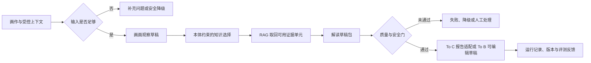

# 共用曼陀罗解读引擎：产品规格讨论稿

> 状态：draft
> 版本：0.1.0
> owner：Product Spec Lead / CEO
> last_updated：2026-07-31
> source_of_truth：projects/aimandala/docs/specs/2026-07-31-共用曼陀罗解读引擎-产品规格讨论稿.md
> 项目：aimandala
> 阶段：spec
> 任务级别：局部产品定义；定义未来 To C 与 To B 可共用的解读能力，不改变当前项目正式范围。
> depends_on：[项目入口](../../PROJECT.md)、[课程设计输入](../../../research-center/research/2026-07-30-曼陀罗ToC-ToB-课程设计输入.md)、[测试与 CI/CD 课程输入](../../../research-center/research/2026-07-30-曼陀罗测试与CICD课程赋能输入.md)、[疗愈体系知识库](../疗愈体系知识库/README.md)
> reviewers：CEO / Orchestrator, Product Spec Lead, Architect, Test / QA, Knowledge Base

## 1. 本规格要解决什么

现有 To C 解读已经有画面观察、知识包、报告生成和质量门，但产品能力仍偏向“一次生成一份报告”。下一阶段希望把它收束成一个可复用、可追溯、能适配不同用户工作方式的**共用曼陀罗解读引擎**。

它服务两条未来产品线：

- To C：用户围绕自己的画作进行自我觉察，按 `Lite` 与 `Pro` 获得不同深度的交付。
- To B：疗愈师围绕来访者个案进行准备、解读和复盘；按“新进疗愈师”与“稳定执业疗愈师”的工作方式提供不同支持。

本引擎不替代疗愈师，也不承担诊断、治疗、危机干预、财务建议或重大人生决策。它要交付的是一份带有画面依据、知识依据、不确定性和安全结果的**解读草稿包**；各产品再决定谁能阅读、谁能审核、如何交付。

## 2. 当前范围与不改变的边界

### 2.1 本轮定义的范围

本规格定义：

1. 共用引擎的用户问题、输入、输出和运行边界。
2. To C `Lite / Pro` 与 To B 两类疗愈师的适配差异。
3. 本体论（Ontology）和 RAG（检索增强生成）在知识系统中的产品职责。
4. 人工审核、证据追溯、安全降级和评测的产品要求。
5. 进入架构阶段前需要确认的验收标准和未决事项。

### 2.2 本轮不做

- 不实施 To B 工作台、账户、个案管理、支付、权限系统或疗愈师审核界面。
- 不修改现有 To C 线上范围、定价、Lite 到 Pro 的升级关系或当前上线判断。
- 不决定 Java / Python、向量数据库、图数据库、模型供应商或 Agent 框架。
- 不把知识库中的草稿条款、课程观点或模型输出直接视为疗愈专业结论。
- 不把 AI 输出自动发送给来访者，也不让 AI 修改个案事实。

当前 `projects/aimandala` 的正式范围仍是 To C。本规格为后续 To B 产品开出能力边界，不能被当成“To B 已上线”或“当前项目已接纳 To B”的证明。

## 3. 用户分层：两条独立维度

`Lite / Pro` 是 To C 的交付深度；疗愈师阶段是 To B 的工作方式。两者不能混成同一个等级字段。

| 产品线 | 用户层级 | 用户正在完成的任务 | 引擎应提供的价值 | 人工边界 |
| --- | --- | --- | --- | --- |
| To C | Lite | 第一次围绕一张画自我觉察 | 清晰画面带读、有限且安全的解释、一个低风险下一步 | 用户只阅读自己的报告；引擎不替其作现实决策 |
| To C | Pro | 希望继续理解同一张画和议题 | 在 Lite 基础上展开更多可追溯的机制、问题和练习方向 | 仍是自我觉察产品，不变成长期陪伴或治疗 |
| To B | 新进疗愈师 | 准备个案、学习如何从观察走向提问 | 观察清单、可追问点、解释假设、表达边界和可编辑草稿 | 疗愈师必须独立判断，不将 AI 草稿直接作为对来访者结论 |
| To B | 稳定执业疗愈师 | 提高个案准备、整理、复盘和交付效率 | 基于已有个案材料生成可编辑草稿、版本对照与追溯线索 | 疗愈师确认后才能形成交付；个案权限和审计由 To B 工作台负责 |

两条附加维度必须显式传入，而不是由模型猜测：

```text
交付模式：lite | pro | therapist_draft
工作角色：toc_user | novice_practitioner | established_practitioner
```

`therapist_draft` 只表示“面向疗愈师的草稿”，不等于可以对来访者交付。

## 4. 产品定义

### 4.1 共用引擎的职责

引擎接收一张画作及其受控上下文，完成五件事：

1. **检查输入**：确认画面、三圈边界、议题和必要上下文是否足够；不足时返回需要补充什么。
2. **形成观察**：生成可审阅的画面观察，先描述再解释，保留不确定项。
3. **取回受控知识**：按画面信号、议题、交付模式和风险边界选择可用知识单元。
4. **生成解读草稿包**：把观察、知识依据、解释假设、可追问点和低风险建议组织成可被产品消费的结果。
5. **执行质量与安全门**：拦截无依据、越界、权限不匹配、证据不足或运行失败的结果。

它不负责：身份认证、收费权益、个案共享、向来访者发送内容、疗愈师的专业判断、长期记忆是否保留。

### 4.2 共同主链



图中的“适配”由产品线负责：To C 把通过自动门的结果组织成用户可读报告；To B 只能组织成疗愈师可审核草稿。

## 5. 输入、输出与状态

### 5.1 最小输入合同

| 输入组 | 必填内容 | 目的 |
| --- | --- | --- |
| 运行范围 | `run_id`、产品线、交付模式、工作角色 | 限定本次任务可读取的规则和输出形态 |
| 画作材料 | 原画、三圈边界或明确的边界缺失状态 | 形成画面观察；不把推测当作图像事实 |
| 议题与意图 | 当前议题、用户 / 疗愈师希望理解的问题、必要补充说明 | 决定知识选择和表达重心 |
| 访问上下文 | To C 的用户归属，或 To B 的组织 / 疗愈师 / 个案 / 会谈范围 | 由宿主产品在调用前校验；引擎只接收已授权材料 |
| 知识策略 | 知识包版本、可用主题、风险规则版本 | 保证同一结果可追溯、可回归 |

输入不足时，引擎返回 `needs_clarification`、缺失项和建议问题；不得为了完成报告而补写画面、议题或个案事实。

### 5.2 解读草稿包

每次成功运行都应输出以下逻辑部分。它们可以由不同格式承载，架构阶段再决定 JSON、数据库记录或文件的具体形态。

| 部分 | 内容 | 可否直接给普通用户 |
| --- | --- | --- |
| 画面观察 | 整体、三圈、视觉单元、留白与不确定项 | 可转译后展示 |
| 证据轨迹 | 画面信号、知识单元、来源状态、版本和置信度 | 以用户可理解的方式选择性展示；完整轨迹供审核与排错 |
| 解读假设 | 观察如何连接到议题的多种可能解释 | 需降级表达，避免确定性结论 |
| 可追问点 | 为缩小歧义而建议补充的问题 | To C 可展示为自我觉察问题；To B 只作疗愈师参考 |
| 低风险建议 | 经知识边界筛选的轻量练习或下一步 | 只可作为低风险方向，不能代替方案或治疗 |
| 质量与安全结果 | 通过 / 拦截 / 降级原因、可交付状态 | 不展示内部实现细节 |
| 运行追踪 | 输入脱敏引用、模型与知识版本、耗时、成本、失败类型 | 仅内部可见 |

### 5.3 引擎状态

```text
received
  -> needs_clarification | blocked_input | observing
  -> retrieving_knowledge
  -> drafting
  -> passed_quality_gate | blocked_quality_gate | failed_runtime
```

引擎的 `passed_quality_gate` 只表示“可以交给宿主产品继续处理”：

- To C：宿主产品还要核验用户权益、报告归属与展示状态。
- To B：宿主产品必须进入 `待疗愈师审核`，不能直接进入 `已交付`。

## 6. 本体论与 RAG 的分工

### 6.1 本体论：定义什么可以连接

本体论在这里不是为了先搭图数据库，而是把解读链条中的对象、关系、状态与禁止关系写清。

一期至少承认这些对象：

| 对象 | 说明 |
| --- | --- |
| `painting` | 一张画作及其受控归属 |
| `visual_observation` | 对画面可见内容的描述，不含议题结论 |
| `visual_signal` | 可复用的画面信号 |
| `issue_clause` | 某个议题下可追溯的解释条款 |
| `knowledge_source` | 上游来源、原子知识、案例或来源索引 |
| `practice` | 低风险的练习或行动方向 |
| `interpretation_run` | 一次引擎运行及其版本、状态和追踪 |
| `report_draft` | 引擎草稿或 To C 用户报告的可审阅版本 |
| `case` | To B 个案；仅 To B 宿主产品拥有其访问和交付规则 |

一期必须支持的关系包括：

```text
painting -> has_observation -> visual_observation
visual_observation -> supports -> visual_signal
visual_signal -> maps_to -> issue_clause
issue_clause -> supported_by -> knowledge_source
issue_clause -> may_offer -> practice
interpretation_run -> uses -> knowledge_source / knowledge_pack_version
interpretation_run -> produces -> report_draft
report_draft -> belongs_to -> painting (或 To B case)
```

以下关系被禁止或必须经过宿主产品验证：

- 一张画作不能默认关联到另一位用户或另一个 To B 个案。
- 未审核的 `report_draft` 不能关联为“已向来访者交付”。
- `ai_draft` 或 `block` 状态知识不能成为用户可见结论的唯一依据。

### 6.2 RAG：在许可范围内取回证据

RAG 负责在本体允许的范围内，从知识单元中找到本次运行需要的证据；它不自行创造对象关系，也不绕过来源和风险状态。

一期采用以下产品规则：

1. 先按主题、适用场景、交付模式、来源状态和风险等级过滤。
2. 再按画面信号、用户问题和语义相近性检索候选单元。
3. 再用本体关系验证候选是否能从 `visual_signal` 连到 `issue_clause`，并取得允许的 `practice`。
4. 把选中的单元、未选原因、版本和来源状态写入证据轨迹。
5. 无充分证据时，返回低置信观察、补充问题或安全降级；不得用通用话术填满空白。

一期可以继续使用受控 Markdown、元数据过滤与关键词 / 向量混合检索。是否使用向量数据库或图数据库属于架构决策，不能提前视为产品验收条件。

## 7. 人机边界与安全

### 7.1 To C

- 引擎可以给出自我觉察式解释和低风险练习方向。
- 不输出诊断、治疗承诺、危机干预、财务预测、投资建议或确定性人生判断。
- 证据不足时返回观察不足或提问，不以“专业口吻”伪装确定性。
- Lite 与 Pro 都是完整、可读的交付；Pro 不是用焦虑迫使用户购买的“缺口填补”。

### 7.2 To B

- 引擎只生成疗愈师可编辑的草稿、观察、追问和依据。
- 疗愈师的确认、修改、退回或拒绝是不可绕过的交付门。
- AI 不得新增、修改或掩盖来访者事实；疗愈师对事实记录和专业判断负责。
- 高风险材料应停止常规解读，按后续明确的专业支持 / 转介规则处理；本规格不定义危机处理方案。

### 7.3 共同安全要求

- 每次运行都限制在一个明确的用户画作或 To B 个案范围内；不默认载入历史内容。
- 短期运行上下文、长期业务记录和评测样本必须分开；评测只使用得到授权或不可逆脱敏材料。
- 运行记录应保存足以排错的脱敏引用与版本，不将原始个案内容复制到日志、评测或开发环境。

## 8. 本期最小能力与验收

### 8.1 P0：进入架构与实施计划的最低能力

| 编号 | 能力 | 验收标准 |
| --- | --- | --- |
| E-01 | 输入检查与澄清 | 缺少画面 / 议题 / 边界信息时，不生成正式报告；返回明确补充项 |
| E-02 | 受控观察与解释 | 每个重要解释能回到至少一个画面观察和一个允许的知识单元；不确定项明确标记 |
| E-03 | 本体约束 RAG | 检索只使用运行时允许的知识；输出保留知识单元、来源状态和版本轨迹 |
| E-04 | 分层输出适配 | 同一引擎能按 Lite、Pro、疗愈师草稿生成不同交付形态；不混淆角色与报告模式 |
| E-05 | 安全与交付门 | 越界、证据不足或质量门失败时停止或降级；To B 草稿没有疗愈师确认不能被标记为已交付 |
| E-06 | 可回归评测 | 以授权 / 脱敏样例评测画面依据、知识匹配、边界和分层差异；变更后可与基线比较 |
| E-07 | 可追踪运行 | 能关联输入脱敏引用、知识包 / 提示词版本、模型版本、耗时、成本、质量结果和失败类型 |

### 8.2 不以此为本期验收

- 不以“回答像疗愈师”作为唯一或自动化通过条件。
- 不以总覆盖率、单一模型评分或单次成功生成作为上线证据。
- 不以完成图数据库、复杂多 Agent 编排或全量知识向量化作为完成条件。
- 不以 To B 演示稿当作真实疗愈师试点或企业交付证据。

## 9. 方案选择与取舍

| 选择 | 本规格结论 | 原因 |
| --- | --- | --- |
| 一套共用引擎，两个产品适配层 | 采用 | 画面观察、证据链、质量门、评测和运行记录可以复用；权限、审核和 UI 不可混用 |
| 纯“把资料塞进提示词”的 RAG | 不采用 | 无法稳定表达画面信号、条款、来源、风险与可输出范围的关系 |
| 本体约束 + RAG 取证 | 采用 | 先约束能连接什么，再在许可范围内找到证据，适合可追溯解读 |
| 一期直接引入图数据库 | 暂不决定 | 只有关系查询、版本影响分析或跨对象追溯成为维护瓶颈时才有价值 |
| AI 自动交付 To B 报告 | 不采用 | 与疗愈师审核、个案事实和专业责任边界冲突 |
| 重写现有 To C 后端作为起点 | 不采用 | 先用规格和特征测试锁住需要保留的行为，再决定模块演进路径 |

## 10. 与现有资产的关系

- 当前 `visual_draft -> prompt_pack -> final_report -> quality_gate` 是共用引擎的起点，不因本规格立即废弃或改写。
- 当前 Lite 后升级 Pro 的权益关系继续由 To C 宿主产品负责，共用引擎只接收已经被允许的交付模式。
- 当前受控 Markdown 运行时知识包仍是有效的第一期知识载体；本规格要求逐步补足知识单元元数据和可追溯关系，不要求一次性迁移。
- 现有报告样例回归、质量门、前后端测试和 CI/CD 是基础资产；后续需按本规格补充共享引擎和 To B 的 P0 测试矩阵。

## 11. 进入架构前的待决事项

以下问题会影响架构与实施范围，必须在本规格评审中确认：

1. **第一个主题**：是否继续只以“财富关系”作为共享引擎的第一个可对外验证主题，其余主题仅用于内部评测？
2. **To C Pro 的差异**：Pro 首期优先增加“机制与追问深度”、还是“练习与后续路径”，以及哪些内容仍不能进入报告？
3. **新进疗愈师的支持边界**：首期只提供观察 / 追问 / 草稿结构，还是允许提供明确的练习建议候选？
4. **稳定执业疗愈师的试点链路**：首个设计伙伴试点是否固定为“会谈前材料准备 -> 草稿 -> 疗愈师修改 -> 会谈材料”，暂不涉及对来访者导出？
5. **人工审核角色**：谁负责审核知识条款、评测样例和 To B 交付草稿；哪些高风险情况必须停止普通生成？
6. **数据授权与保留**：To B 设计伙伴的个案材料是否可用于评测，采用何种授权、脱敏、保留和删除规则？

## 12. 下一阶段 handoff

本规格经 CEO 确认后，进入两个并行但不能越序的正式 artifact：

1. **架构方案**：定义本体最小 Schema、知识单元 / 检索协议、引擎模块、宿主产品边界、数据隔离与版本策略。
2. **QA 基线**：按 E-01 至 E-07 写 P0 行为、特征测试、替身集成、真实模型评测与 smoke 的具体场景。

在这两份 artifact 完成前，不开始重写现有 To C 后端，也不新建 To B 应用。

## 13. 来源与依据

### 上游课程输入

- [曼陀罗 To C / To B 课程设计输入](../../../research-center/research/2026-07-30-曼陀罗ToC-ToB-课程设计输入.md)：输入合同、隔离、证据、人工审批、安全、评测与 FDE 试点输入。
- [曼陀罗测试与 CI/CD 课程赋能输入](../../../research-center/research/2026-07-30-曼陀罗测试与CICD课程赋能输入.md)：核心链路、测试分层、特征测试、评测与部署质量门。

### 现有产品与知识资产

- [项目入口](../../PROJECT.md)：当前 To C 范围和 Lite / Pro 现状。
- [Lite / Pro 版本关系决策](../decisions/2026-05-29-Lite-Pro版本关系与内容边界决策.md)：当前 To C 权益与升级边界。
- [曼陀罗解读智能体现有规格](2026-05-11-曼陀罗解读智能体-MVP实施规格.md)：现有视觉草稿、提示词包、质量门和运行产物。
- [知识库数据结构与运行架构](../疗愈体系知识库/00-知识库治理/03-知识库数据结构与运行架构.md)：知识对象、受控运行时包、证据链和检索顺序。
- [知识库建设决策记录](../疗愈体系知识库/00-知识库治理/01-知识库建设决策记录.md)：按知识单元切块与 RAG 边界。
