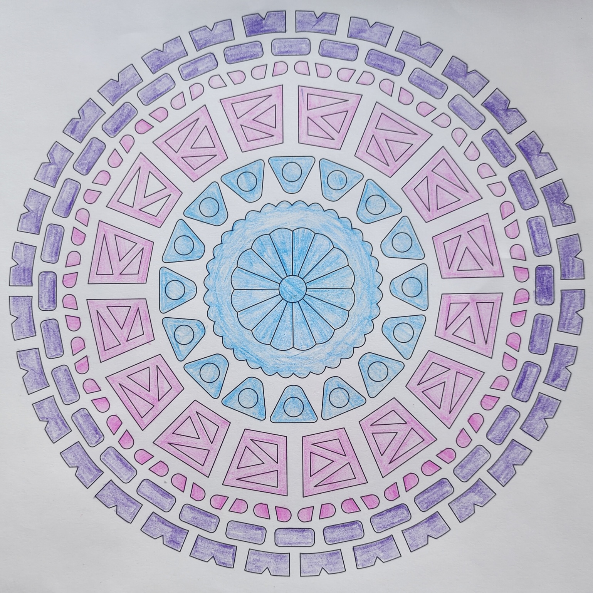
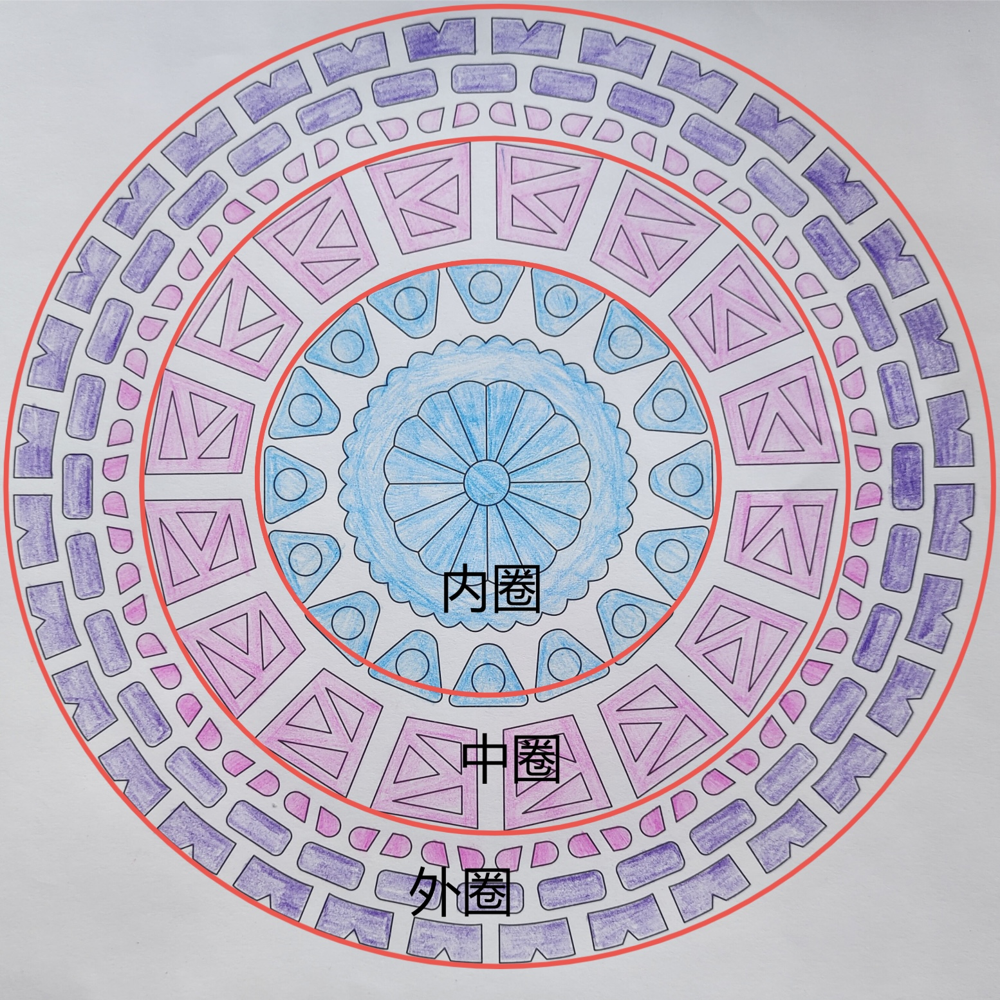

# case-001 【案例1】用五行感知法剖析个人成长（完整解读）

## 元数据

- 案例编号：case-001
- 案例类型：完整解读案例
- 主题标签：个人成长, 五行感知
- 原画作：`../assets/case-001-mandala.jpg`
- 三圈设定标记图：`../assets/case-001-mandala-3q.jpg`
- 文本来源：`01-完整解读案例11例合并原文.md`
- 原文位置：第 45-96 行
- 当前状态：已提取文本，已补图，已生成审核草稿，待 CEO 确认

## 图片

原画作：

疗愈师三圈设定标记图：

## 原始解读文本

### 【案例1】用五行感知法剖析个人成长（完整解读）

第一步：确定绘画者的曼陀罗主题：我是值得的，我是配得的。这是关于个人内在成长的课题。单从这个主题来看，就可以读出案主内在一直有较深的不值得感、不配得感，最近意识到了这部分课题，想要得到改变。

第二步：然后确定三圈，以我的神为准，我划分出来的三圈是这样的：

第三步：运用三圈结构法+五行感知法进行解读。

首先看内圈。内圈代表过去、意识、内在渴望、自己内心的想法、童年伤痛等。

内圈有蓝色、白色，分别为水属性和金属性，水的占比更大。水代表智慧、滋养、才华、沟通，也代表恐惧、不安全感、情绪等。

从内圈可以看出，水的占比更大，绘画者近期开始向内探索，向内疗愈，不停学习，在给自己补充知识，内在的智慧在提升，内心有了更多滋养。同时内圈的水笔触不均匀，有的深有的浅，心里还有一些湿寒或者不安全感在，这份不安全感可能源于童年时期没有得到足够的呵护或保护。

内圈的金比重不大，环绕着水。同时金生水。金代表价值、标准、要求、性价比、委屈等。

金能生出水，说明绘画者的值得感已经在提升，但固有模式还很深，内在价值感仍然不高，对自己不是很认可，经常还会觉得自己不够好，所以会不停地去学习智慧让自己变得更好，但始终认为自己智慧不够。

其次看中圈。中圈代表当下、能量、情感、情绪、和家人的关系、财富能量等。

中圈有粉红色和白色，粉红色占比大。粉红色是暖昧色，五行属火，且是弱火；白色是金属性。

弱火代表温暖、美好，也代表讨好，对爱和情感的渴望，爱的匮乏，情感伤痛等。

从中圈可以看出，火占比大，且火是一块一块，被金截断，没有连在一起，说明绘画者近期能量忽高忽低，有时候感觉很好，有时候会很低落或者发脾气。

平时她对家人很温暖，很愿意付出，甚至有一些讨好，希望得到家人更多认可和爱，容易背负他人的课题，会牺牲自己来讨好家人，而如果得不到回应会产生很多委屈和悲伤。

中圈的金包围着火，让火发不出来，同时火又克金。

说明近期绘画者对家人有要求，当对方没有达到TA标准时，可能会有出现矛盾或吵架，案主会感到愤怒和委屈，但她更多是把这些情绪压抑在心里。

最后看外圈。外圈代表未来、物质、财富、行动力、别人怎么看待Ta等。

外圈有白色、紫色和粉色，分别代表金、木、火。紫色可解读为木，东方震木，有紫气东来之意，但紫色的木不是正宗绿的木，而是经过调和的颜色。

紫色代表贵气、直觉、高贵、高冷、疏离、郁闷、孤独等。

从外圈来看，紫色比较多，且呈现条状、几何形状，被金一个个隔断开来。说明绘画者表面上看着是一个不爱说话的人，比较高冷，别人觉得会和Ta有距离感。而且Ta喜欢一个人默默地把事情做好，但是Ta的计划经常会被外界的事情和标准打乱，Ta经常感觉自己被打扰，没法好好专注做事情，就会很郁闷，整个人也比较累，行动力不够。从粉色一小块一小块被白色隔断开，也可以看出来绘画者热情和行动力不够。

结合以上信息，可以给案主调频建议：

1、把心神收回来 减少对他人的讨好，多爱自己，多吸收智慧，多关注自己的成长；

2、把自己的开心喜悦和个人成长放在第一位，而不是把获得他人认可放在第一位；

3、建立人际关系中的界限感，不要过度付出，不要背负他人的业力。

4、做有益的事情，从小事开始做起，从5分钟做起，不苛求自己太多。比如每天做5分钟冥想，每天学习

10分钟等等。每次完成都给自己点赞，学会自己认可自己。

## 人工审核区

### 画面事实

- 三圈边界：疗愈师标记图将蓝色中心花形和蓝色三角环划为内圈；粉色方块/三角组合划为中圈；外侧粉色小块、紫色圆角长方块和紫色外缘块划为外圈。
- 内圈：中心为浅蓝色花形和放射状分瓣，外围有一圈蓝色波浪边；再外侧是一圈浅蓝色三角形，每个三角形内部有一个浅蓝色圆形。整体以浅蓝为主，黑色线条分隔明显，局部有纸面留白。
- 中圈：主体是粉色方形或近似方形块，每个块内部有黑色三角形线条。粉色块之间留有明显白色间隔，整体呈环状重复。
- 外圈：靠近中圈外侧有一圈粉色半圆/小块；更外侧有紫色圆角长方块；最外缘是紫色类似齿状或城墙状的重复块。外圈白色留白较多，紫色和粉色都被分割成独立单元。
- 整体结构：画面规整、对称、重复度高，三圈边界清晰；颜色以浅蓝、粉色、紫色为主，没有大面积深黑或脏色。

### 画面信号标注

- 事实：内圈蓝色占比高，且有圆形、三角形和线条分隔。信号：内在有向内探索、滋养、学习或情绪流动的倾向，同时这份流动受到一定结构、边界或自我要求的组织。置信度：高。
- 事实：内圈蓝色笔触深浅不完全均匀。信号：内在状态并非完全稳定，可能存在情绪波动、安全感起伏或滋养感不均。置信度：中。
- 事实：中圈粉色块重复出现，但被白色留白和黑色线条分割成多个独立单元。信号：关系/情绪层有温暖、付出、渴望连接的能量，但表达不连续，容易被标准、委屈、边界或自我控制切断。置信度：高。
- 事实：外圈紫色块重复、规整，但每个块彼此独立，外缘呈齿状。信号：现实层有形象感、距离感和自我保护，也可能呈现“想保持体面/秩序，但不太容易自然靠近”的外在状态。置信度：中。
- 事实：三圈整体对称规整，边界清楚。信号：此案例不是能量完全失控型，更像是内在、关系和现实层都有结构，但结构中存在分割和自我约束。置信度：高。

### 五行元素与圈内生克

- 内圈元素：浅蓝色可归为水；圆形边界和线条分隔可作为金性候选。
- 内圈关系：金生水。圆形边界和线条结构嵌在蓝色三角及蓝色中心区域中，支持“金性结构生出/组织水性滋养”的解读。但这里的金性主要来自形状和结构，不来自白色填充。
- 中圈元素：粉色可归为弱火；白色留白和黑色线条分隔可作为金性/边界性候选。
- 中圈关系：金克火或金切火。粉色块被白色间隔与内部线条切开，支持“火性表达被边界、标准、委屈或控制切断”的候选解读。
- 外圈元素：紫色可作为木性候选，也可保留暧昧色属性；粉色为弱火候选；白色留白和规整边界为金性候选。
- 外圈关系：金切木/火的候选关系。紫色和粉色都呈独立块状，被白色间隔分开，支持“外在表达、行动力或关系热度不连续”的候选解读。紫色的五行归属需在审核时确认是否按木处理。

### 议题映射

- 原始主题：我是值得的，我是配得的。
- 主要议题：个人成长、内在价值感、自我认可、关系中的认可需求。
- 浮现议题：家庭关系、讨好/过度付出、情绪压抑、行动力不足、外在距离感。
- 财富可用部分：可用于财富报告中的“配得感/价值感影响财富承接”“关系认可需求消耗财富能量”“行动力被自我标准切断”三个位置。
- 财富不可直接使用部分：不能直接从本案例推出用户财富结果、收入变化或具体财务建议；“童年伤痛”等判断需要用户主题或更多证据支持，不能仅凭画面直接定论。

### 可沉淀规则

- 规则候选 1：内圈水性颜色占比高，同时有金性圆形/线条结构时，可提示内在正在通过学习、觉察或自我整理获得滋养；若笔触不均，可补充安全感或情绪稳定度仍有起伏。
- 规则候选 2：中圈弱火色块被金性线条、留白或边界反复切断时，可提示关系/情绪表达有温暖和付出，但表达不连续，容易被标准、委屈、边界或自我控制压住。
- 规则候选 3：外圈紫色/粉色块重复且彼此分离时，可提示外在表达、行动力或社交连接存在距离感和不连续性；用于财富议题时，可翻译为“想做好、想保持体面，但行动和外界交换不够顺畅”。

### 不应泛化内容

- 不应把“蓝色多”直接泛化为所有人都在学习或疗愈；必须结合主题、圈层和其他元素。
- 不应把“粉色多”直接泛化为讨好型人格；只能作为关系/情绪层温暖、渴望连接或弱火能量的候选。
- 不应仅凭画面断定童年伤痛、家庭具体矛盾或身体问题。
- 不应把本案例的“我是值得的，我是配得的”主题直接迁移为所有财富报告的固定结论。
- 不应把紫色固定等同于木；紫色属于暧昧色，需结合形状、位置和原文流派规则确认。
