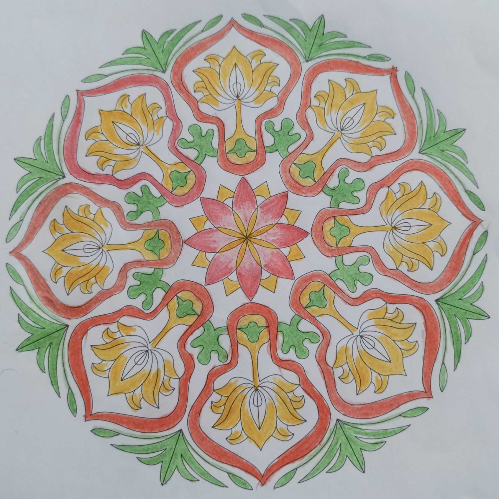

# case-002 【案例2】用五行感知-相生相克法解读财富和个人成长（完整解读）

## 元数据

- 案例编号：case-002
- 案例类型：完整解读案例
- 主题标签：个人成长, 财富, 五行感知, 相生相克
- 图片占位：`assets/case-002-mandala.jpg`
- 文本来源：`原始解读案例篇11例.md（已提取入当前案例库）`
- 原文位置：第 97-152 行
- 当前状态：已提取文本，待补图，待人工审核

## 图片占位

后续请按编号放入：`assets/case-002-mandala.jpg`。

## 原始解读文本

### 【案例2】用五行感知-相生相克法解读财富和个人成长（完整解读）

第一步：确定绘画者的曼陀罗主题。这是我曾经解读过的曼陀罗，它的主题是个人成长和财富，也是关于个人成长课题。

第二步：然后确定三圈，以我的神为准，我划分出来的三圈是这样的：

第三步：运用三圈结构法+五行感知法进行解读，这里我会加入咱们得三阶技术五行相生相克法，大家可以体会一下。

来看一下这张曼陀罗里，颜色都有哪几种？红色，黄色，绿色，白色，分别代表火，土，木，金。我们先把这些颜色代表的属性弄清楚。

火代表什么？正向有：热情，勇气，爱，给予，快乐，付出，欢喜心；负向有：自我牺牲，善变，三分钟热度，虎头蛇尾，半途而废，心累，愤怒，反复无常，索取等。

土代表什么？正向代表：承载，接纳，包容，积极阳光，开朗，务实，脚踏实地；负向代表抱怨，木讷，自卑。

木代表什么？正向代表：独立，成长，精进，自信，付出，分享果实；负向代表固执，侵占，郁闷。

金代表什么？正向代表标准、规则、逻辑、决心、聪明、努力、挑战；负向代表：挑剔、委屈、苛刻、心累。

首先来看第一圈。第一圈代表过去、意识、情感、自己内心的想法，自己与自己的关系。

第一圈有火、土、金，火最多，土次之，金最少，并且火有渐变色，渐变色代表什么？代表正在调整、正在转变或试探着做出改变（点击查看一新手解读6式：渐变色）

第一圈相生相克关系是：火生土，土生金，火克金。

第一圈是莲花形状，且说明绘画者是一个有灵性、有自己的宗教信仰的人，内心世界是积极热情的，很愿意付出，对别人很好。最近能量有提升，内在生起了欢喜心，有了更多对自己的欣赏，自己会觉得最近做的一些事情能有比较好的反馈，认为自己还是有价值的（火能生土，土能生金）。并且她最近有了更多的内观和反思，并且处在一个不断调整频率、不断自我淬炼的过程中（火渐变，火克金）。

但她的正向意识还不稳定（火的跳跃性以及五行在第一圈未能形成循环），还会有对自我的怀疑和不笃定（往里的火是弱火，且火呈现花瓣状，不稳定），对于得到的结果不是特别满意，想要有更好的呈现和更大的承载力，导致有时候急躁、抓取，建议绘画者在做事和决策时把沉下心来，对目标持续锚定，打磨自己的心性。

第二圈代表现在、能量、财富和亲人之间的情感关系，属性有木，火，土，金。

相生相克关系是怎样的？木生火、木克土，金克木，火克金，火生土。

第二圈里，颜色比较多，绘画者最近能量变化比较大，但主基调是要成长，对成长很有热情，积极向上，内在有一个小宇宙即将爆发，有了新的生机（中圈绿色的小人是积极向上的），但她还会觉得自己的成长达不到满意的标准，心情会有点郁闷和焦躁，这方面对自己不够接纳（绿色小人周围是白色，金克木，会觉得成长没达到标准，有点郁闷）。

大胆猜测一下，案主最近可能在观望一个新项目或新机会，但她对这个机会还是有比较多顾虑的，主要是求安全和稳妥（经案主反馈，这个猜测是对的。因为绿色的小人看起来像观望和等待，而且它对着的方向是最外圈绿色的小草，外圈绿色小草代表机会）。财富方面能赚钱，但也存不住钱，花钱比较多，为情绪买单，或者为个人成长买单（木克土，财富承载力被木削弱；火克金，且火不稳定，呈现条状，绘画者情绪会比较多，火要聚堆才能产生正向热能）。

和亲人的关系上，是个很重感情的宝宝（内圈颜色多，火多，偏感觉型，倾向于用心轮的能量），赚钱很大部分原因就是为了家里人，能够对家人付出，但会觉得他们对自己不理解，会委屈郁闷，有求认可求温暖的模式（中圈代表和亲人的关系，金克木，家人对她有蛮多要求的，她会委屈，火的力量也比较弱，

第三圈代表未来、身体、物质、财富、行动力，别人怎么看她。属性有木，火，土，金。木生火，木克土，金克木，火克金，火生土。

第三圈里，外人看她是能够独当一面的，能力强，独立女性，做事风风火火，很努力很精进，也愿意分享自己学到的知识，同时她也能将自己学到的一些东西落地。但第三圈的木是无根之木（第三圈缺水，木没有水的滋养，称为无根之木），金克木，她会觉得自己智慧不够，对自己的要求比较高，需要不断鞭策自己，也不敢放松。自己能力不错，做事也踏实，想要拿到更大的成果，但是发现心有余而力不足（火克金），有些疲惫，容易急躁，情绪不稳定，经常对结果不满意。

财富方面有进账，最近会为自己的情绪买单，在事业和成长上也有投资，需要进一步扩容自己的承载力，稳定自己的能量，财富才会越来越好。

结合以上信息，给案主的调频建议：

1、及时叫停自己的急躁，深呼吸，把心火降下来，多内观，多静心—心态能趋定后，做事效果会大大增强。

2、也可以通过画蓝色曼陀罗让自己安静下来，每天

3-7张，给到自己一份滋养，在静中生发智慧。

3、多练习腹式呼吸，多站桩让自己的气息沉稳下来，稳下来以后，直觉和判断力自然会出现。

4、接纳自己不完美的地方，接纳当下所有的能量波动，与它们和平共处，在这个基础上，每天进步一点点。

## 人工审核区

### 画面事实

待补图后标注。

### 画面信号标注

待补图后标注。

### 五行元素与圈内生克

待补图后标注。

### 议题映射

待审核。

### 可沉淀规则

待审核。

### 不应泛化内容

待审核。
