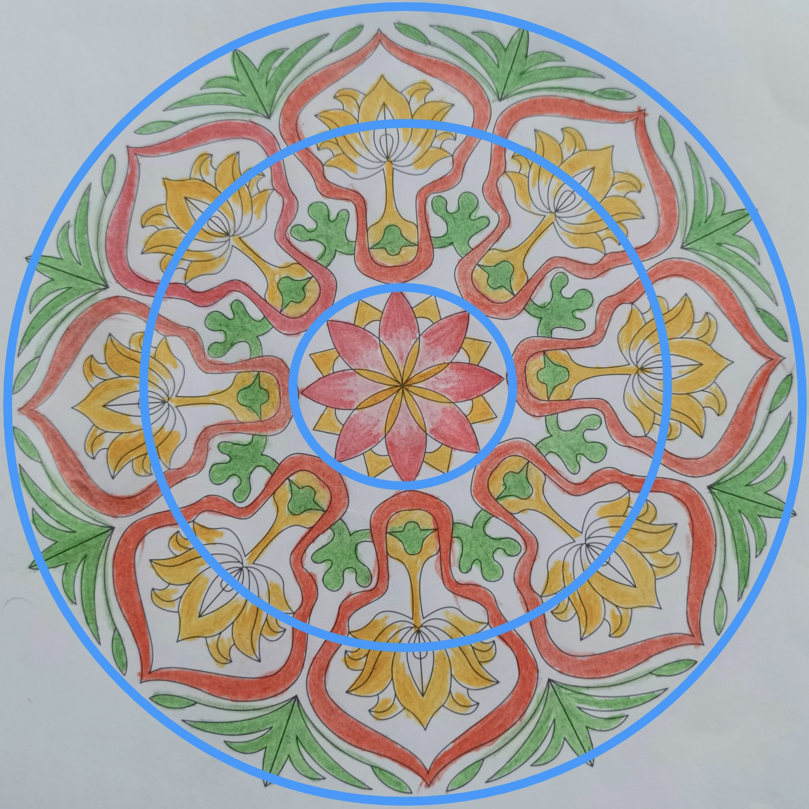

# case-002 【案例2】用五行感知-相生相克法解读财富和个人成长（完整解读）

## 元数据

- 案例编号：case-002
- 案例类型：完整解读案例
- 主题标签：个人成长, 财富, 五行感知, 相生相克
- 原画作：`../assets/case-002-mandala.jpg`
- 三圈设定标记图：`../assets/case-002-mandala-3q.jpg`
- 文本来源：`01-完整解读案例11例合并原文.md`
- 原文位置：第 97-152 行
- 当前状态：已提取文本，已补图，已审核确认，已登记正式候选

## 图片

原画作：

疗愈师三圈设定标记图：

## 原始解读文本

### 【案例2】用五行感知-相生相克法解读财富和个人成长（完整解读）

第一步：确定绘画者的曼陀罗主题。这是我曾经解读过的曼陀罗，它的主题是个人成长和财富，也是关于个人成长课题。

第二步：然后确定三圈，以我的神为准，我划分出来的三圈是这样的：

第三步：运用三圈结构法+五行感知法进行解读，这里我会加入咱们得三阶技术五行相生相克法，大家可以体会一下。

来看一下这张曼陀罗里，颜色都有哪几种？红色，黄色，绿色，白色，分别代表火，土，木，金。我们先把这些颜色代表的属性弄清楚。

火代表什么？正向有：热情，勇气，爱，给予，快乐，付出，欢喜心；负向有：自我牺牲，善变，三分钟热度，虎头蛇尾，半途而废，心累，愤怒，反复无常，索取等。

土代表什么？正向代表：承载，接纳，包容，积极阳光，开朗，务实，脚踏实地；负向代表抱怨，木讷，自卑。

木代表什么？正向代表：独立，成长，精进，自信，付出，分享果实；负向代表固执，侵占，郁闷。

金代表什么？正向代表标准、规则、逻辑、决心、聪明、努力、挑战；负向代表：挑剔、委屈、苛刻、心累。

首先来看第一圈。第一圈代表过去、意识、情感、自己内心的想法，自己与自己的关系。

第一圈有火、土、金，火最多，土次之，金最少，并且火有渐变色，渐变色代表什么？代表正在调整、正在转变或试探着做出改变（点击查看一新手解读6式：渐变色）

第一圈相生相克关系是：火生土，土生金，火克金。

第一圈是莲花形状，且说明绘画者是一个有灵性、有自己的宗教信仰的人，内心世界是积极热情的，很愿意付出，对别人很好。最近能量有提升，内在生起了欢喜心，有了更多对自己的欣赏，自己会觉得最近做的一些事情能有比较好的反馈，认为自己还是有价值的（火能生土，土能生金）。并且她最近有了更多的内观和反思，并且处在一个不断调整频率、不断自我淬炼的过程中（火渐变，火克金）。

但她的正向意识还不稳定（火的跳跃性以及五行在第一圈未能形成循环），还会有对自我的怀疑和不笃定（往里的火是弱火，且火呈现花瓣状，不稳定），对于得到的结果不是特别满意，想要有更好的呈现和更大的承载力，导致有时候急躁、抓取，建议绘画者在做事和决策时把沉下心来，对目标持续锚定，打磨自己的心性。

第二圈代表现在、能量、财富和亲人之间的情感关系，属性有木，火，土，金。

相生相克关系是怎样的？木生火、木克土，金克木，火克金，火生土。

第二圈里，颜色比较多，绘画者最近能量变化比较大，但主基调是要成长，对成长很有热情，积极向上，内在有一个小宇宙即将爆发，有了新的生机（中圈绿色的小人是积极向上的），但她还会觉得自己的成长达不到满意的标准，心情会有点郁闷和焦躁，这方面对自己不够接纳（绿色小人周围是白色，金克木，会觉得成长没达到标准，有点郁闷）。

大胆猜测一下，案主最近可能在观望一个新项目或新机会，但她对这个机会还是有比较多顾虑的，主要是求安全和稳妥（经案主反馈，这个猜测是对的。因为绿色的小人看起来像观望和等待，而且它对着的方向是最外圈绿色的小草，外圈绿色小草代表机会）。财富方面能赚钱，但也存不住钱，花钱比较多，为情绪买单，或者为个人成长买单（木克土，财富承载力被木削弱；火克金，且火不稳定，呈现条状，绘画者情绪会比较多，火要聚堆才能产生正向热能）。

和亲人的关系上，是个很重感情的宝宝（内圈颜色多，火多，偏感觉型，倾向于用心轮的能量），赚钱很大部分原因就是为了家里人，能够对家人付出，但会觉得他们对自己不理解，会委屈郁闷，有求认可求温暖的模式（中圈代表和亲人的关系，金克木，家人对她有蛮多要求的，她会委屈，火的力量也比较弱，

第三圈代表未来、身体、物质、财富、行动力，别人怎么看她。属性有木，火，土，金。木生火，木克土，金克木，火克金，火生土。

第三圈里，外人看她是能够独当一面的，能力强，独立女性，做事风风火火，很努力很精进，也愿意分享自己学到的知识，同时她也能将自己学到的一些东西落地。但第三圈的木是无根之木（第三圈缺水，木没有水的滋养，称为无根之木），金克木，她会觉得自己智慧不够，对自己的要求比较高，需要不断鞭策自己，也不敢放松。自己能力不错，做事也踏实，想要拿到更大的成果，但是发现心有余而力不足（火克金），有些疲惫，容易急躁，情绪不稳定，经常对结果不满意。

财富方面有进账，最近会为自己的情绪买单，在事业和成长上也有投资，需要进一步扩容自己的承载力，稳定自己的能量，财富才会越来越好。

结合以上信息，给案主的调频建议：

1、及时叫停自己的急躁，深呼吸，把心火降下来，多内观，多静心—心态能趋定后，做事效果会大大增强。

2、也可以通过画蓝色曼陀罗让自己安静下来，每天

3-7张，给到自己一份滋养，在静中生发智慧。

3、多练习腹式呼吸，多站桩让自己的气息沉稳下来，稳下来以后，直觉和判断力自然会出现。

4、接纳自己不完美的地方，接纳当下所有的能量波动，与它们和平共处，在这个基础上，每天进步一点点。

## 人工审核区

### 画面事实

- 本次重审只用疗愈师标记图确认三圈边界；颜色、形状、五行元素全部以原画作判断，不读取标记线颜色。
- 三圈边界：内圈为中心莲花；中圈为围绕中心的黄花、绿色块状叶片、红色粗轮廓和相邻元素；外圈为更外围的绿色叶片、红色粗轮廓外缘和外侧黄花延伸部分。
- 内圈：中心为莲花状结构，主要由红色渐变花瓣和黄色花瓣组成。红色渐变花瓣在外层更醒目，黄色花瓣在内侧和花瓣间穿插，整体呈放射状向外展开。
- 中圈：有多组黄色花朵或花茎状结构，绿色块状叶片，以及红色粗轮廓。红色粗轮廓包住或连接部分黄色花形，绿色块状叶片穿插在花茎和红色轮廓之间；不同颜色图案之间有明显留白。
- 外圈：外围绿色叶片数量较多，呈向外伸展状态；红色粗轮廓延伸到外圈，形成多个大块外轮廓；部分黄色花形也延伸到外圈边缘；不同颜色图案之间同样有留白。
- 画面上外圈的外边以内，只要有留白，都可被认定为金能量；内圈花瓣间留白也属于画作金性。
- 中圈和外圈里，不同颜色图案之间形成的留白可识别为金能量。
- AI 视觉识别边界：模板黑色线稿只用于识别形状边界，不计入画作元素、颜色或五行证据；三圈标记线也不计入画作元素。这是 AI 识别规则，不用于反向否定疗愈师原文判断。

### 画面信号标注

- 事实：内圈红色渐变和黄色共同构成中心莲花，红色渐变向外打开，黄色在内侧支撑。信号：内在有热情、动力、愿意付出和自我价值启动的倾向，同时需要土性承载让这份火性稳定下来。置信度：高。
- 事实：内圈红色呈渐变，而不是单一稳定红色。信号：内在动力和热情处在调整、试探或转变过程中，不是完全稳定的持续火力。置信度：高。
- 事实：中圈绿色、红色、黄色同时出现，绿色块状叶片与黄色花茎、红色粗轮廓相邻或穿插，颜色图案之间有留白。信号：当下能量层有成长冲动、行动热度、承载需求和金性能量同时存在，容易出现一边想推进、一边评估标准、安全感和承载边界的状态。置信度：高。
- 事实：红色粗轮廓在中圈多次包住黄色花形，绿色块状叶片在轮廓附近穿插，并被留白分开。信号：行动热度较强，成长/机会感也存在，但金性能量会带来标准、顾虑、判断和收束，需要观察承载是否跟得上。置信度：中。
- 事实：外圈绿色叶片明显向外伸展，红色粗轮廓延伸到外侧，绿色、红色、黄色图案之间有留白。信号：现实层有扩张、对外行动和抓机会的倾向，同时也有边界、筛选和标准感，适合映射到事业推进、机会观察和财富行动力。置信度：高。

### 五行元素与圈内生克

- 内圈元素：红色渐变可归为火；黄色可归为土；花瓣间留白属于金。
- 内圈关系：火生土、土生金、火克金。红色渐变花瓣与黄色花瓣交错，支持“热情、欢喜心或行动力正在生出承载、价值感和落地感”；黄色与花瓣间留白相邻，支持土生金；红色火与留白金相邻，支持火克金，可对应自我欣赏、内观调整、自我淬炼、自我怀疑、不笃定和急躁抓取。红色渐变提示这份火性仍在调整和转变中。
- 中圈元素：绿色为木，红色为火，黄色为土；不同颜色图案之间的留白可识别为金。
- 中圈关系：木生火、火生土、木克土、金克木、火克金均可作为候选，需按局部相邻关系判断。绿色块状叶片靠近红色粗轮廓，支持“成长意愿带动行动热度”；红色粗轮廓包住或连接黄色花形，支持“行动热度推动承载/落地”；绿色靠近黄色花茎时，可观察“成长冲动是否压迫承载节奏”的木克土候选；留白隔在绿色、红色、黄色图案之间时，可观察金性能量对木火土的边界、标准、筛选和切分作用。
- 中圈关系边界：模板黑线和三圈标记线不作为金性证据；只有图案之间的实际留白计入金能量。
- 外圈元素：绿色叶片为木，红色粗轮廓为火，黄色花形为土；外圈外边以内的留白均可识别为金。
- 外圈关系：木生火、火生土、土生金、木克土、金克木、火克金均可作为候选。土生金代表财富有进账，但如果土的承载较辛苦、不成片，进账会偏辛苦；外圈红色火与金形成火克金，提示情绪化漏财、为情绪或成长买单。外圈木若没有水滋养，或圈内有水但木没有挨着水，属于无根之木，提示成长/机会有生机但力量不够扎根。

### 议题映射

- 原始主题：个人成长和财富。
- 主要议题：成长动力、财富承载、机会观察、行动力、价值感提升。
- 浮现议题：亲人关系、被理解/被认可、情绪性消费或成长性投入、结果不满意、自我要求。
- 财富可用部分：可用于财富报告的“财富能量正在被激活”“成长冲动与财富承载之间的拉扯”“机会观察与行动落地”“热情需要稳定承载”“能赚钱但存不住钱”“情绪化漏财或成长性投入”“无根之木导致机会/成长难扎根”。
- 财富不可直接使用部分：不能直接断定具体项目成败或收入数额；“案主反馈这个猜测是对的”属于个案验证，不能泛化成规则。

### 可沉淀规则

- 规则候选 1：内圈火、土、金同时出现，且火色有渐变时，可提示内在动力、欢喜心和价值感正在启动，同时存在自我淬炼、自我怀疑、不笃定和急躁抓取；若呈莲花状，可用于灵性、宗教信仰或高维连接的候选解读。
- 规则候选 2：中圈木火土混合，且不同颜色图案之间有留白时，可提示成长欲望、行动热度、承载需求和金性边界同时存在；财富关系议题中可翻译为“有机会和动力，但也有标准、顾虑和筛选，需要稳定节奏，否则容易行动很热、承接不稳”。
- 规则候选 3：外圈绿色叶片向外展开，同时有红色粗轮廓延伸，且图案之间有留白时，可提示现实层有扩张、行动和对外呈现力量，同时存在标准、边界和收束；财富关系议题中可翻译为“有对外推进和抓机会的能力，但需要让行动服务于稳定承载，并筛选真正适合的机会”。
- 规则候选 4：同一圈层中，木没有水滋养，或圈内有水但木没有挨着水，可判断为无根之木；财富关系议题中可翻译为“机会、成长或行动有生机，但缺少滋养、根基和持续支持”。
- 规则候选 5：外圈土生金且外圈有红色火克金时，可提示能赚钱、有进账，但进账偏辛苦，同时容易因情绪、热度或成长投入而漏财，表现为能赚钱但存不住钱。
- AI 视觉识别规则：模板黑线、印刷线稿和三圈标记线不计入画作颜色或五行证据；画作本身的白色、纸面留白和图案间空隙可识别为金能量。

### 不应泛化内容

- 不应把绿色外展直接等同于一定有新项目或新机会，只能作为机会感/成长感候选。
- 不应把火色多直接写成财富一定会提升；火需要结合土性承载和整体稳定度判断。
- 不应把模板黑线或三圈标记线当作金性证据；黑色线稿只用于识别模板形状，三圈标记线只用于确认圈层边界。中圈和外圈不同颜色图案之间的留白可以识别为金能量。
- 不应把“存不住钱”“为情绪买单”写成绝对事实；但当外圈土生金与火克金同时出现时，可以作为财富报告候选解读。
- 不应把原文中的个案反馈泛化成规则。

### 与原始解读文本对照

| 编号 | 对照项 | 原始解读文本要点 | 人工审核区当前处理 | 审阅状态 | 说明 |
| --- | --- | --- | --- | --- | --- |
| C002-01 | 主题 | 原文主题是个人成长和财富，并偏向个人成长课题。 | 保留为“个人成长和财富”，财富报告可用在财富承接、成长投入和机会行动。 | 一致 | 主题层可直接保留。 |
| C002-02 | 颜色归属 | 原文识别红色、黄色、绿色、白色，对应火、土、木、金。 | 保留火、土、木、金；金来自画作真实白色/留白。模板黑线和三圈标记线排除另作为 AI 视觉识别规则。 | 一致并明确证据 | 疗愈师原文不存在模板线误读问题；AI 需要单独区分真实留白与辅助线。 |
| C002-03 | 内圈颜色 | 原文说第一圈火最多，土次之，金最少，火有渐变色。 | 同意原文；内圈红色渐变为火，黄色为土，花瓣间留白属于画作金性。 | 一致 | 内圈金性证据来自真实留白，不来自模板线或标记线。 |
| C002-04 | 内圈关系 | 原文写火生土、土生金、火克金，并解释为能量提升、自我欣赏、内观调整和自我淬炼。 | 同意原文；保留火生土、土生金、火克金及其心理/灵性解释。 | 一致 | 所有报告解读都是可能性表达，不代表定论。 |
| C002-05 | 内圈心理判断 | 原文提到有灵性、宗教信仰、对别人好、自我怀疑、不笃定、急躁抓取。 | 同意原文；莲花状结构可支持灵性、宗教信仰或高维连接的候选解读，同时保留自我怀疑、不笃定和急躁抓取。 | 一致 | 这些内容可进入报告旁支解释，但仍用“可能/倾向”表达。 |
| C002-06 | 中圈元素 | 原文说中圈有木、火、土、金，颜色多，能量变化大。 | 保留木火土金，其中金来自不同颜色图案之间的留白。 | 一致并明确证据 | 当前审核区补清楚了金能量来源。 |
| C002-07 | 中圈关系 | 原文写木生火、木克土、金克木、火克金、火生土。 | 全部作为候选，但要求按局部相邻关系判断。 | 保留为候选 | 不再把整圈关系一口气定论，需要在图上逐组标注。 |
| C002-08 | 新项目/机会 | 原文大胆猜测案主可能观望新项目或新机会，并说经案主反馈正确。 | 保留为机会感/成长感候选；报告中用“可能正在观察新机会/新方向”表达。 | 保留为候选 | 个案反馈可以辅助理解，但不能成为通用规则。 |
| C002-09 | 财富判断 | 原文写能赚钱但存不住钱，花钱多，为情绪或成长买单。 | 同意原文判断逻辑：外圈土生金代表有进账，但进账偏辛苦；外圈红色火克金代表情绪化漏财或为成长投入。 | 一致 | 报告仍用“可能/倾向”表达，不写成确定财务事实。 |
| C002-10 | 家人关系 | 原文写赚钱很大部分为了家人，家人不理解，有委屈和求认可模式。 | 保留为浮现议题和财富报告旁支解释：亲人关系、被理解/被认可、赚钱动机与家庭牵连。 | 保留为旁支 | 浮现议题不等于不能作为画面结论，报告中以可能性表达。 |
| C002-11 | 外圈元素 | 原文说外圈有木、火、土、金，并涉及行动力、别人怎么看她。 | 保留木火土金；金来自图案间留白；外圈用于现实层、行动力、对外呈现。 | 一致并明确证据 | 当前审核区更强调“金的证据来自留白”。 |
| C002-12 | 外圈关系 | 原文写木生火、木克土、金克木、火克金、火生土。 | 保留木生火、火生土为较明显候选；金克木、火克金作为留白介入后的候选。 | 保留为候选 | 需要后续人工在图上确认相邻关系，不直接整圈定论。 |
| C002-13 | 无根之木 | 原文说第三圈缺水，木无根。 | 同意原文，并补充规则：同一圈层中没有水的木是无根之木；圈内有水但木没有挨着水，这个木也是无根之木。 | 一致 | 可参照 case-005 中圈区分“挨着水的木”和“没有挨着水的木”。 |
| C002-14 | 调频建议 | 原文建议降心火、画蓝色曼陀罗、腹式呼吸、站桩、接纳能量波动。 | 当前审核区未沉淀建议，只保留“火需要稳定承载”的报告方向。 | 待后续处理 | 建议类内容应进入疗愈方案候选，不直接进入画面规则。 |

### 待 CEO 重点确认

- 后续审核 case-005 时，重点标注中圈“挨着水的木”和“没有挨着水的木”，用于校准无根之木规则。
- 后续可把“外圈土生金 + 外圈火克金 = 有进账但存不住钱/情绪化漏财”沉淀到财富关系议题手册。
