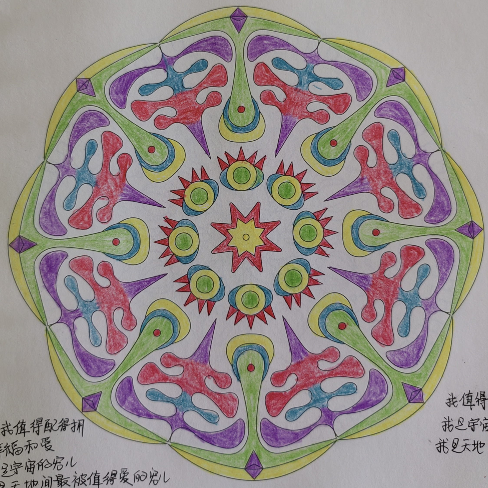
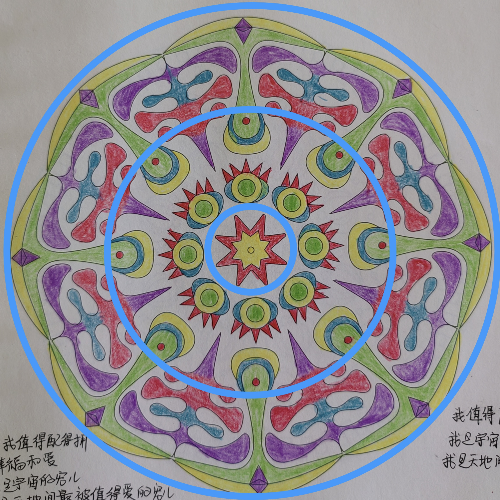

# case-003 【案例3】用五行感知＋相生相克法解读个人成长（完整解读）

## 元数据

- 案例编号：case-003
- 案例类型：完整解读案例
- 主题标签：个人成长, 五行感知, 相生相克
- 原画作：`../assets/case-003-mandala.jpg`
- 三圈设定标记图：`../assets/case-003-mandala-3q.jpg`
- 文本来源：`01-完整解读案例11例合并原文.md`
- 原文位置：第 153-222 行
- 当前状态：已提取文本，已补图，已审核确认，已登记正式候选

## 图片

原画作：

疗愈师三圈设定标记图：

## 原始解读文本

### 【案例3】用五行感知＋相生相克法解读个人成长（完整解读）

第一步：确定绘画者的曼陀罗主题。主题是我值得拥有幸福和爱，也是关于个人成长的课题。

第二步：然后确定三圈，以我的神为准，我划分出来的三圈是这样的：

今天这幅曼陀罗，很漂亮，有比较多颜色，整体判断出这是绘画者是感觉型，心轮的感受、情绪相对比较多，重情重义，同时也会渴求外在的温暖和爱。

这幅曼陀罗里有什么颜色？红，绿，黄，白，蓝，紫，绿；金木水火土，五行属性俱全。

红色为火属性，火代表什么？正向有：热情，勇气，爱，给予，快乐，付出，欢喜心；负向有：自我牺牲，善变，三分钟热度，虎头蛇尾，半途而废，心累，愤怒，反复无常，索取等。

黄色为土属性，土代表什么？正向代表：承载，接纳，包容，积极阳光，开朗，务实，脚踏实地；负向

代表抱怨，木讷，自卑。

绿色为木属性，木代表什么？正向代表：独立，成长，精进，自信，付出，分享果实；负向代表固执，侵占，郁闷。

白色为金属性，金代表什么？正向代表标准、规则、逻辑、决心、聪明、努力、挑战；负向代表：挑剔、委屈、苛刻、心累。

蓝色是水属性，水代表什么？正向代表：智慧，温暖，滋养他人，善良，愿意帮助他人，与人沟通合作，人脉，口才，财富。负向代表：善变，自我牺牲和怨气，不安全感，摧毁，湿寒。

最后，紫色代表什么？代表高贵、神秘、直觉、距离感、稳重，也代表暧昧色，动力不足，求而不得，对爱或认可的渴望。可以看成火或者木。在这里我把它看成木。

首先来看第一圈，第一圈代表意识、情感、过去、自己内心的想法，自己与自己的关系。

它的属性有火、土、金。它们的面积比例、形状和相生相克关系是怎样的？

第一圈土最多，颜色纯净，火是突出三角形，然后是金。相生相克关系为火生土，火克金。

说明案主是受过身心灵教育的，有灵性（内圈为土且颜色纯净，偏金色的灵性），做事情也是脚踏实地，很务实的宝宝，在身心灵领域她有热情有动力，最近也能将自己的一些想法落地（火生土，内心的热情和想法能落地），但有时候会显得有些着急：明明我努力做了，明明我努力学了，怎么还没得到我想要的？

（为什么会着急？因为红色三角形太突出，有尖角，显得急躁，不稳定）

案主也经常会觉得：我好像怎么努力也达不到别人的标准。绘画者比较在意外界的标准和要求，她的热情容易被别人影响和打击，也会因为一些暂时的困难退缩（内圈火克金，意识里就比较在意外界的标准，且这种在意会打击自己的热情）。这些想法影响了内心的自信和喜悦，也影响了自己对目标的笃定。这里建议宝宝多嘉许自己，多做事，每做一件事就夸奖自己，而不是要看到结果才去认可自己。

再来看第二圈，第二圈代表能量、财富，现在和亲人之间的情感关系，属性有木，火，土，金。

颜色比例和相生相克关系是怎样的？第二圈里，颜色比较多，白色把其他颜色都割裂开了。

说明案主能量不稳定，经常感觉到急躁、委屈、郁闷等情绪。她想要变得更好，也愿意付出，但心力不足，容易急躁（火的形状是一个个小三角形发散开，没有聚堆，且三角形有尖角，说明心力不足，急躁），底层能量模式是想要证明自己和求认可，案主渴望更多爱和认可，但从家人自上收到的回流比较少，有求而不得的委屈、伤心和苦涩感（中圈金多，火克金克不动，心火受伤）。

同时她有着高标准高要求的一面，对自己要求挺高的，达不到的时候会自我苛责，觉得自己智慧不够，或学了很多东西用不出来，会不断地否定自己（金克木，紫色尖角怼向自己内在意识，说明自我苛责比较重）。也会评判身边的人，可能不会嘴上说出来，但心里是不满意的，承载力和接纳力不够（从中圈木克土和金多两个信息点看出来）。

其实绘画者内在是很有智慧和灵性的，直觉力也不错，她也想要成长摆脱现状，但是被自己设置的很多标准或执着的点困住了，很多时候她也很难觉察到自己的固有模式，即使觉察到了也没有力量走出来，导致反复钻牛角尖，在情绪里沉沦，智慧无法生发（木克土，金克木，说明成长和发展受阻）。

和家人的相处中容易着急发脾气，想要让家人看到自己的成长，但没有得到想象中的认可。

财富上会漏财，绘画者会认为自己不大能赚钱，在这方面也会有自我评判（漏财是为情绪买单，且能量不和财富对频。）

再来看第三圈，第三圈代表物质，财富，身体，未来，行动力，别人怎么看她，她如何对待外人。

五行和第二圈一样，也是有金木水火土。同样颜色被金截断，形状上更偏向于条状和圆润，第三圈的形状比第二圈圆润一些，没有那么多尖角。

说明绘画者面对外人会收敛情绪，更随和亲切一些，对别人也显得更包容接纳（外圈形状偏圆润，且最外层是一圈黄色，土属性代表接纳）。外人也觉得她很好，做事很踏实，很可靠，值得信任，也爱学习成长，但她自己不满意，行动力不足，总是容易被情绪带跑偏，且心力不够（行动力和心力不足是根据第一圈和第二圈能量分析，第三圈也是情绪偏多，五行相生循环不起来），想成长想突破但总是会自我设限，对于学到的东西不知道怎么落地（外圈木克土，土挡住了木的生发）。

她的成长也会被外在环境或标准克制（外圈金克木，木旁边有一圈金）。最近和外人的沟通中也会有些窝火和力不从心（水克火，情绪会比较大）。有一些灵感能够落地，但心神容易被情绪分散。

现在会适当控制花销，财富上是有进账的，但比较零星，她不是特别满意。（外圈土，土是相对稳定的，说明案主在控制花销，最近花销不大，财富上有进账是看外圈能量走势，有往里进一点点的趋势，但更多是往外走，说明案主漏财。）

#### 调整方案

1、把心神收回来放在自己身上，放在目标上，当目标笃定了，觉受就会少很多。

2、每天画14张绿色曼陀罗快画清理自己的急躁或愤怒，再画7张红色打圈画补充心力。

3、做爱自己、喜欢自己的冥想，每天对着镜子练习我爱你。

4、每天写感恩日记，感恩家人、自己、财富和工作。

## 人工审核区

### 画面事实

- 本次审核只用疗愈师标记图确认三圈边界；颜色、形状、五行元素以原画作判断，不读取标记线颜色。
- 三圈边界：内圈为中心红黄星形与附近小圆环；中圈为围绕中心的一圈黄绿蓝红组合图案和紫色尖角；外圈为更外围的红、蓝、紫、绿、黄重复图案。
- 内圈：中心有红色星形、黄色星形和绿色圆心，周边有一圈绿色圆形、黄色环、蓝色弧形和红色尖角。
- 中圈：绿色、黄色、蓝色、红色和紫色同时出现，图案之间有留白，颜色关系复杂，重复度较高。
- 外圈：绿色长条/叶形结构向外支撑，紫色弧形、红色块、蓝色水滴状元素和黄色外缘交替出现。
- 图案间留白可作为金能量候选。
- AI 视觉识别边界：模板黑色线稿只用于识别形状边界，不计入画作元素；三圈标记线不计入画作元素。

### 画面信号标注

- 事实：画面五色俱全，内中外三圈都有多种颜色。信号：能量面向丰富，议题并非单一情绪，而是成长、情感、价值、行动和承载共同出现。置信度：高。
- 事实：内圈红色尖角/星形与黄色、绿色圆形组合。信号：内在有火性动力和土性承载，同时有木性成长核心，适合解释为“想成长、想拥有幸福和爱”。置信度：中。
- 事实：中圈颜色复杂且有留白切分。信号：当下能量层容易多线并行，既想突破又有标准、边界或评判切分。置信度：高。
- 事实：外圈绿色长条向外支撑，紫色和红蓝元素重复。信号：现实层有成长/扩张愿望，但行动、情绪和关系能量容易被多种力量牵动。置信度：中。

### 五行元素与圈内生克

- 内圈元素：红色为火，黄色为土，绿色为木，蓝色为水，留白为金候选。
- 内圈关系：火生土、木生火、水生木、土生金均可作为候选，但需按局部相邻关系确认。当前可优先保留火土木的内在启动关系。
- 中圈元素：红火、黄土、绿木、蓝水、紫色按 AI 暧昧色辅助判定规则处理，留白金。
- 中圈关系：五行俱全，可观察金对其他元素的切分，以及木火土之间的生发与承载。中圈留白金切分可作为正式规则，但具体生克仍需按局部相邻关系判断。
- 外圈元素：绿色木、紫色按 AI 暧昧色辅助判定规则处理、红色火、蓝色水、黄色土、留白金。
- 外圈关系：外圈更适合观察成长扩张、情绪流动、外在行动和边界切分如何共同影响现实层。

### 议题映射

- 原始主题：我值得拥有幸福和爱。
- 主要议题：个人成长、亲密关系中的价值感、情绪承接、行动力。
- 浮现议题：自我设限、漏财/财富承载、被情绪带跑偏、外在落地能力。
- 财富可用部分：可作为“价值感和幸福感影响财富承接”“多种能量同时出现导致承接分散”“情绪切分影响稳定进账”的旁支样本。
- 财富不可直接使用部分：不能直接断定漏财、进账多少或具体财务状态。

### 可沉淀规则

- 规则候选 1：五色俱全且三圈都有复杂组合时，报告应避免单一结论，优先写多议题并行和需要排序整合。
- 规则候选 2：多色图案之间有明显留白时，留白可作为金性能量，提示标准、边界、切分和评判可能影响能量连续性。本条已确认可升为正式规则。
- 规则候选 3：外圈木性结构外展但被多色元素牵动时，可提示现实行动有成长愿望，但落地路径容易分散。

### 不应泛化内容

- 不应把“五行俱全”直接写成状态一定好；五行俱全也可能代表能量复杂、难以循环。
- 不应把原文的漏财判断直接泛化为财务事实。
- 不应把紫色机械固定为木，需按 AI 暧昧色辅助判定规则，结合阴阳特征、形状和语境确认。
- 不应把模板黑线和三圈标记线作为五行证据。

### 与原始解读文本对照

| 编号 | 对照项 | 原始解读文本要点 | 人工审核区当前处理 | 审阅状态 | 说明 |
| --- | --- | --- | --- | --- | --- |
| C003-01 | 主题 | 原文主题是“我值得拥有幸福和爱”，归入个人成长。 | 保留为个人成长和价值感主题。 | 一致 | 可用于财富报告的配得感旁支。 |
| C003-02 | 颜色归属 | 原文说红、绿、黄、白、蓝、紫，五行俱全。 | 保留五行俱全，白色/留白作为金；模板线排除另作为 AI 视觉识别规则。 | 一致并明确证据 | 金的证据来自真实留白，不来自辅助线。 |
| C003-03 | 内圈关系 | 原文写火生土、火克金。 | 保留火生土、火克金为候选，需人工按局部相邻关系确认。 | 保留为候选 | 不一口气整圈定论，但原文关系可作为审核候选。 |
| C003-04 | 中圈关系 | 原文说白色割裂其他颜色。 | 保留为留白金切分多色能量，并升为正式规则。 | 一致 | 中圈留白金切分是可沉淀规则。 |
| C003-05 | 财富判断 | 原文提到漏财、为情绪买单。 | 同意原文，同时保留“财富承接/情绪影响候选，报告中用可能/倾向表达”的说明。 | 一致 | 原文判断和保守表达不矛盾；可进入财富旁支解释。 |
| C003-06 | 外圈判断 | 原文说外人觉得踏实可靠但行动力不足。 | 保留为现实层承载、外在可靠感与行动分散候选。 | 保留为候选 | 人际评价可进入报告旁支，但不写成绝对定性。 |
| C003-07 | 调整建议 | 原文建议感恩日记等。 | 暂不沉淀到画面规则。 | 待后续处理 | 进入疗愈方案候选。 |

### 待 CEO 重点确认

- 紫色按 AI 暧昧色辅助判定规则处理，后续审核只需确认具体视觉特征偏木阳还是火阴。
- 中圈留白金切分已确认可作为正式规则。
- 原文“漏财/为情绪买单”已确认可作为财富旁支候选，报告表达保持“可能/倾向”。
