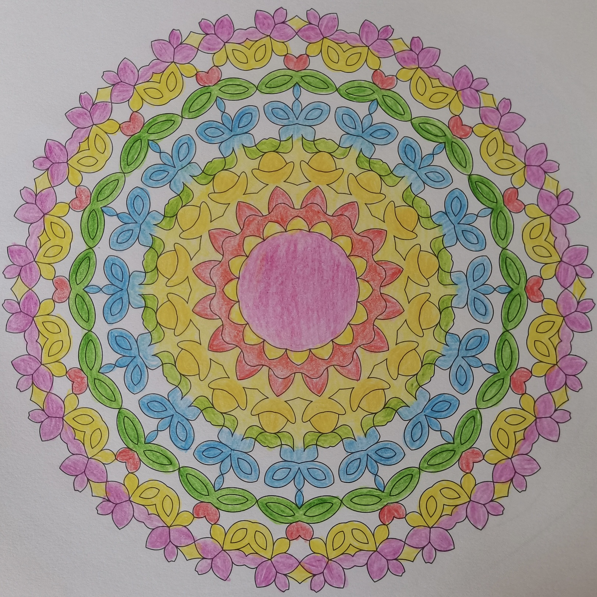
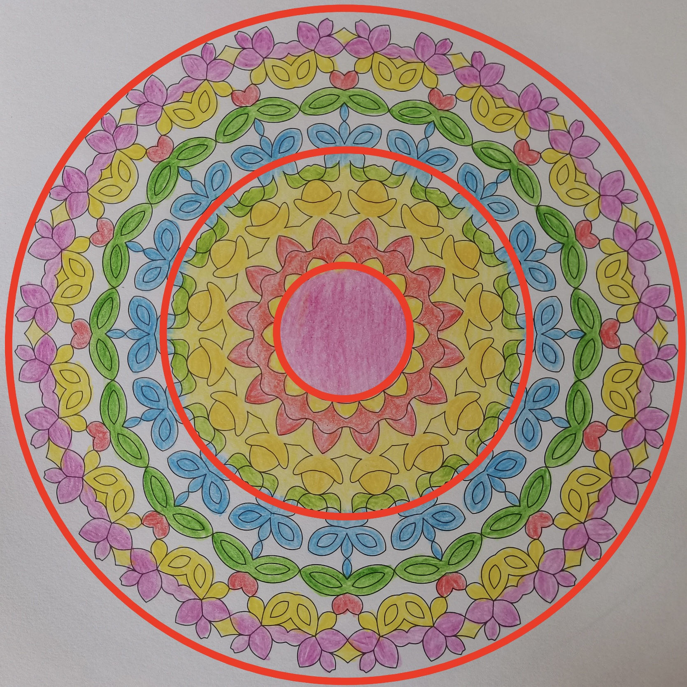

# case-004 【案例4】用五行感知+相生相克法解读情感和财富课题（完整解读）

## 元数据

- 案例编号：case-004
- 案例类型：完整解读案例
- 主题标签：财富, 情感, 五行感知, 相生相克
- 原画作：`../assets/case-004-mandala.jpg`
- 三圈设定标记图：`../assets/case-004-mandala-3q.jpg`
- 文本来源：`01-完整解读案例11例合并原文.md`
- 原文位置：第 223-276 行
- 当前状态：已提取文本，已补图，待人工审核

## 图片

原画作：

疗愈师三圈设定标记图：

## 原始解读文本

### 【案例4】用五行感知+相生相克法解读情感和财富课题（完整解读）

今天解析的曼陀罗是这样的，大家可以凭借直觉来描绘一下整体看到的画面。

我的直觉是：像花圈，漂亮，情感丰富，情绪多，渴望被看见。

接下来，我们进入正式解析的过程。

第一步：确定绘画者的曼陀罗主题。这幅曼陀罗主题是我值得被爱，我值得成为有钱人。

第二步：然后确定三圈，以我的神为准，我划分出来的三圈是这样的，大家是怎么分的？你可以画出来你的三圈定位。

1、首先看第一圈。第一圈代表意识、渴望、过去、自己内心的想法，自己与自己的关系。

它的颜色有粉色，属于弱火。弱火属性代表恋爱或美好，喜欢撒娇，渴望爱和温暖，对爱有很多幻想，有依赖情节，像小女人一样渴望被呵护，希望你懂我，希望你保护我。（其他弱火解读详见一曼陀罗中橙色

怎么解读）

第一圈粉色，笔触有些不均匀，有重有轻，说明案主宝宝下笔时内心有些急躁，气息有些不稳。从第一圈来看，她其实是一个内心温柔的人，最近开始更多地爱自己，对自己、对生活都有了美好的感觉。

但她底层想要被呵护、被看见的渴望一直存在，做事情也是基于好感觉才去做的，感觉好的时候很愿意付出，感觉不好的时候，就没有动力去做。内在是一个小女生的状态，对感情有一定的依赖性，想要对方给予更多的疼爱和认可。由此可看出绘画者在童年时期，父母给予的陪伴不够。

2、其次看第二圈。第二圈代表能量、财富，现在和亲人之间的情感关系。

有什么颜色？黄色，红色，绿色，分别属土、火、木。

相生相克关系是怎样的？火生土，木克土。木和火没连在一起。

第二圈里，案主宝宝是个比较努力的姑娘，最近她的能量还不错，做事有热情，也很脚踏实地，有规划有落地，也能拿到不错的结果（火生土，做事情能有结果）。

案主虽然内心渴望爱，但她也有比较强的独立自主的意识，表面是个要强的宝宝。重感情，对家人很好，也愿意付出，但是付出后会暗搓搓地希望对方有更多反馈和看见。

在感情中她会希望对方多呵护多关爱自己，但这种需求她一般不说出来、也不表达，而是等对方主动关心自己。假如对方没有达到她的期望，她会独自郁闷、生闷气。她的成长可能会受到家里人的阻挠，也会受到自身思维定势的影响，难以改变自身一些习气，尽管这部分她自己可能意识到（木克土，又处在第二圈，判断她的成长可能家人不同意，她自身要成长，但还会受到旧有能量的）。

3、最后看第三圈。第三圈代表物质，财富，身体，未来，行动力，别人怎么看她

颜色有白、绿、蓝、粉红、黄，分别属于有金、木、水、弱火和土。

第三圈里，外人觉得绘画者的生活很美好，觉得她是一个内心柔软也挺有边界的人，别人对绘画者的评价会有两极分化，有些人会觉得该案主宝宝有个性，有时候会比较情绪化，和她有距离感（粉色情绪多，黄色尖叫向外怼），有些人觉得她为人很好，很愿意付出，做事情很靠谱又有结果（火生土，做事靠谱有结果）。实际上案主宝宝是分人的，她感觉好的、有链接的人，她会愿意付出；感觉一般般的就会保持距离。

目前在做的事情是她自己喜欢的，做得很投入，凭借自己的智慧和能力能够赚到钱（金生水，水生木，木生火，形成一个正向循环）。她成长得很开心，但也会觉得还不够，没有达到外界的标准，比不上身边其他人（金克木，会觉得自己的成长造到集体意识的标准）。未来她希望自己独立，智慧，能够继续为喜欢的事业奋斗。

现在财富上是有显化进账的，能赚钱，但也漏财（粉色多，情绪多，容易漏财），属于那种冲动型消费，只要自己开心就好。会为自己的喜欢的东西和成长花钱，最近能存下一点钱了（火生土，土生金，金生水，水为财，最近能存下一些钱）。

#### 调整方案

1、案主宝宝其实很有能力，且是典型的感觉型宝宝，在人际关系、事业上都是以好感觉为动力，但觉受是不稳定的，会波动，建议案主宝宝把焦点放在自己的目标上：我的目标是什么？我要成为什么样的人？慢慢减少觉受对自己的影响，这样做事和显化财富的持续性才能够提升。

2、建议曼陀罗多画黄色卸掉无意义的情绪，提升自己的承载力，每天7张；画正红色打圈调整求爱求认可的模式，每天14张。

3、做爱自己的冥想。

4、站桩或八段锦练起来，把身体的一些情绪浊气排出。

## 人工审核区

### 画面事实

待人工标注。

### 画面信号标注

待人工标注。

### 五行元素与圈内生克

待人工标注。

### 议题映射

待审核。

### 可沉淀规则

待审核。

### 不应泛化内容

待审核。
