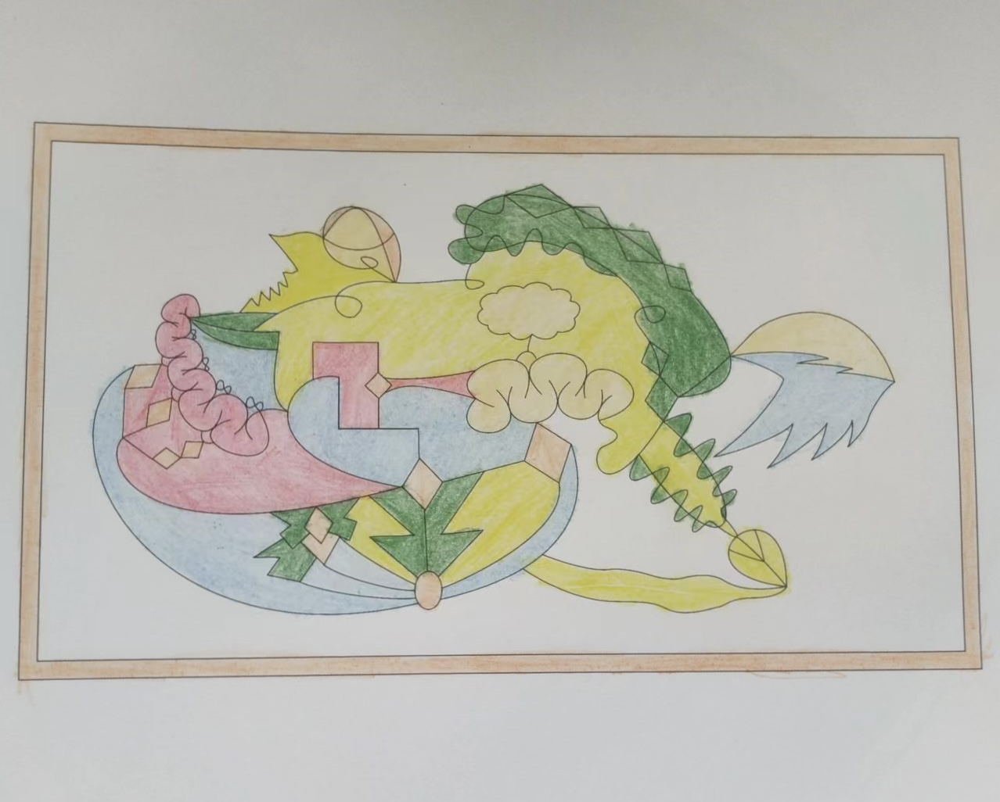

# case-006 【案例6】用五行感知+相生相克法解读两性情感关系（完整解读）

## 元数据

- 案例编号：case-006
- 案例类型：完整解读案例
- 主题标签：情感, 两性情感关系, 五行感知, 相生相克
- 图片占位：`assets/case-006-mandala.jpg`
- 文本来源：`原始解读案例篇11例.md（已提取入当前案例库）`
- 原文位置：第 341-392 行
- 当前状态：已提取文本，待补图，待人工审核

## 图片占位

后续请按编号放入：`assets/case-006-mandala.jpg`。

## 原始解读文本

### 【案例6】用五行感知+相生相克法解读两性情感关系（完整解读）

今天解析的曼陀罗是这样的，大家可以凭借直觉来捕捉一下整体看到的画面和特点。

我看到的特点是：外圈有棱有角，图案不规则，比较混乱，有很多曲线，也暗示着内心的混乱、矛盾和拉扯，绿色笔触不均匀、超出边界，说明绘画者有很多烦躁、郁闷、不开心。

接下来，我们进入正式解析的过程。

第一步：确定绘画者的曼陀罗主题。这幅曼陀罗主题是两性情感关系，案主是女生。

第二步：划分三圈。我们来分圈，这个曼陀罗不是对称的圆形，而是正方形，比较少见，但一样是用三圈法和五行感知和相生相克法来解读。我是这样分三个圈的，大家是怎么分的？

第三步：正式解读

1、首先看第一圈。第一圈代表意识、渴望、情感（偏向于内在的情感）、过去、自己内心的想法，自己与自己的关系。

第一圈有粉色、黄色、蓝色和白色，分别对应弱火、土、水和金。且水和火挨在一起，说明内心有冲突，土的形状是卷曲的，不通顺不通畅。

从第一圈可以看出，案主重新审视了现在的爱情，内心是比较冲突的，有舍不得，但有更多的伤心，过去的很多回忆都不太愉快，甚至有些冰冷，在经历一番内心的挣扎后，案主已经下了决心想要离开，断舍离这份不合适的感情，但这份决心穷竟能有多大，还不得而知，可能对方来找她的时候，她还会心软。（卷曲的土生出了金，说明案主经过一番挣扎后生出决心了，决心不大是因为白色金的区域形状比较圆滑，且这姑娘有很多弱火、水，这些都是容易摇摆不定的属性）

案主在感情中会有一份小女孩的心态，渴望另一半宠爱她，哄哄她，包容她，理解她，把爱和希望寄托在对方身上，但她的另一半似乎没有回应，或者比较冷淡，这也让她的寄托冷淡下来，不那么想继续花心力维系了。（粉色为弱火，也称为恋爱色或撒娇色，有小女孩的一面，弱火挨着水，且水的面积更大，说明伤心更多一点）

2、其次看第二圈。第二圈代表能量、财富，现在和亲人之间的情感关系。

第二圈颜色比较多，黄色土最多，其次是绿色木、白色金、蓝色水、粉色弱火。

金克木，木克土，土克水，水克火

土生金，金生水，水生木（木和水仅挨着一点点），木生火（没挨着，无需解读）

最近案主会有两种状态，一方面觉得既然你对我不够好，我想要的爱情你给不了我，我会慢慢远离你，我会慢慢不那么喜欢你，我们能各自冷静，同时我想要独立精进成长（中圈靠下边的木是往外圈方向走的，也就是想要向外突破），想要踏实地做一些事情，做出点成绩给你看（土生金，要实实在在地产出价值），让你看到我的价值，离开了你我也能活得很好。

而另一方面，心里面还是有很多闷闷不乐、烦躁、郁闷，要么压抑、隐忍，要么发脾气，处在一种求而不得的心态中（中圈靠上的木，没有水来生，为无根之木，为受伤了的木，所以是烦躁、郁闷，说不出口的不开心）。情绪消耗大量能量，经常会觉得累，心力不够。这段时期是案主的低谷期，基本很难赚到钱，甚至会因为情感带来的情绪而大量漏财。（有一个规律，通常过不了情关的女生都赚不到钱）

3、最后看第三圈。第三圈代表物质，财富，身体，未来，行动力，别人怎么看她。

案主目前可能处在感情空窗期，或者和另一半冷暴力（外圈或中圈有大片空白）。案主发现在情感中没有办法真正做自己，没法开心起来，被拖拽得很厉害，希望自己有一份果断和界限，能下定决心离开对方，但对方来找她的时候，她还是会心软，陷入拉扯和混乱。有时候她也会为此自责，说好了要分开，却还在拉扯，总是做得不够好。

#### 调整方案

1、用黑色画笔打圈去清理内在的郁闷和难受，每天

14张以上，再画一张细画来稳定能量。

2、每天给自己一段时间用来难过，比如2个小时，什么都不做，就用来难过。2个小时过后，就收拾好心情，好好爱自己，好好赚钱，生活还在继续。

3、锚定赚钱和成长的心念，出去找一份工作，让心神投入到忙碌中，慢慢从受伤的感情中抽离。

#### 案主反馈

说的很对，目前断联，感觉对方不够好了，不喜欢了，但其实对方来找我的时候，心里还是会有缓和的心态。

## 人工审核区

### 画面事实

待补图后标注。

### 画面信号标注

待补图后标注。

### 五行元素与圈内生克

待补图后标注。

### 议题映射

待审核。

### 可沉淀规则

待审核。

### 不应泛化内容

待审核。
