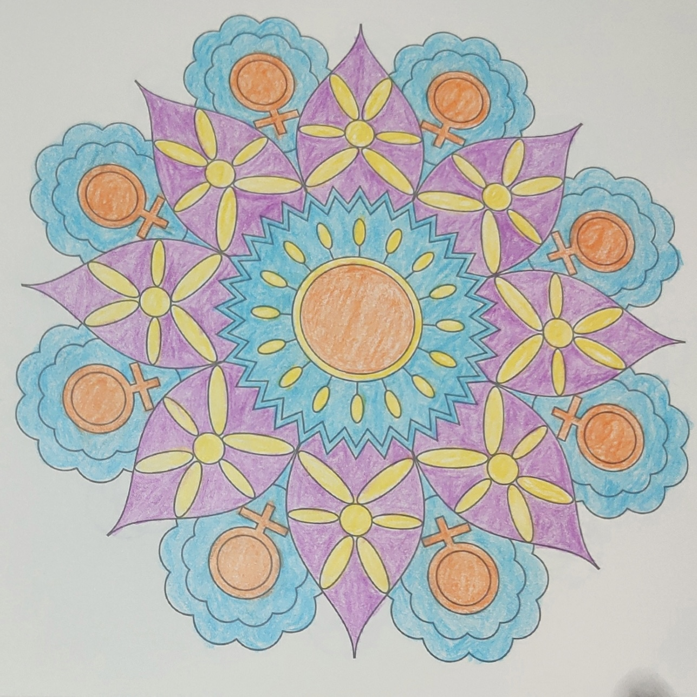
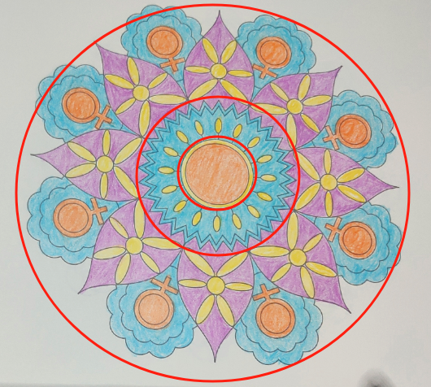

# case-007 【案例7】用五行感知法和相生相克解读事业发展（完整解读）

## 元数据

- 案例编号：case-007
- 案例类型：完整解读案例
- 主题标签：事业发展, 五行感知, 相生相克
- 原画作：`../assets/case-007-mandala.jpg`
- 三圈设定标记图：`../assets/case-007-mandala-3q.png`
- 文本来源：`01-完整解读案例11例合并原文.md`
- 原文位置：第 393-452 行
- 当前状态：已提取文本，已补图，待人工审核

## 图片

原画作：

疗愈师三圈设定标记图：

## 原始解读文本

### 【案例7】用五行感知法和相生相克解读事业发展（完整解读）

今天解析的曼陀罗是这样的，首先凭直觉来描绘一下整体看到的画面。

它的整体特征是：水火两重天，案主的脾气会容易被点着。

接下来，我们进入正式解析的过程。

第一步：确定绘画者的曼陀罗主题。这幅曼陀罗主题是事业发展。

以我神识为准，我是这样分三个圈的，你是怎么划分的呢？以你的神识为准就好。

1、首先看里圈。里圈代表意识、情感、过去、自己内心的想法，自己与自己的关系。

它的颜色有橙色，黄色。橙色可以定为火属性或土属性，在这里我把它定为火，且是弱火。黄色为土属性。二者关系是火生土，但橙色是弱火，生出来的土，不是正向的好土。

橙色是暧昧色，橙色涂满了一个圆，且笔触不均匀，说明案主相对比较积极，比较阳光开朗的，会不断给自己打气，平时内心也会相对自信、且这种自信是基于别人对她的认可、基于以前的一些成功经验，如果别人不能给她认可，对她有质疑，她也会陷入自我怀疑和评判中，不断反思自己的问题。

另外，从橙色笔触不均匀可看出，案主宝宝对自己的成长和事业耐心不足，有些急躁，着急要结果，对爱和温暖很渴望，容易向外抓取认可和赞美。

黄色的土只有一小圈，包裹着里面的橙色，说明案主想要更多地接纳自己，但现在还做不到，对于自己脆弱和缺点的部分还会有评判，而且不会轻易把自己的真实想法暴露出来。即便面对身边的亲人，也无法真实地袒露自己。

2、其次看中圈。中圈代表能量、财富能量，现在和亲人之间的情感关系。

中圈有蓝色、黄色和紫色，分别属水、土、火。

相生相克关系是什么？土克水，水克火（火生土没挨在一起，不用管）

第二圈的水是齿轮状，有波动，有尖角，说明案主能量不稳定，情绪反复无常，有时感觉还不错，说话情商会很高，有时又觉得自己付出了，却不讨好，另一半没有回报她想要的温暖和爱，就会产生怨气，如果有不如意的地方，脾气会一下子就会上头（水克火，火和水都受伤），和伴侣会有吵架或冷战，在感情里面患得患失。

中圈还有土克水，土是一个个小的椭圆的土，根本克不住水，反而会被水淹没，说明家里人的某些做法，案主觉得没法接纳，也听不进去他们的意见，和家人相处过程中会有抗拒和挑剔，心门没法打开。

情感关系在她做事业的过程中影响非常大，所以这一步的分析是很重要的。

因为在情感关系里能量消耗比较大，会进一步影响她的行动力，导致她经常在感受里打转，容易偏离目标，很多时候没有动力做事，腿部行动力起不来。

（结合中圈到外圈的能量状态来解读，外圈水湿比较重，行动力必定受影响）

3、最后看外圈。外圈代表物质，财富，身体，未来，行动力，别人怎么看她。

外圈有紫色、黄色、蓝色和橙色，分别对应弱火、土、水、弱火。

由里圈到中圈，案主的笔触由粗糙到细腻，说明案主尽管刚开始做事耐心不足，有些急躁，但是该做的工作和细节都会做到位。

从外圈可以看出，宋主待人按物圆融，情商比较高，说话让人如沐春风，在事业中有热情有动力，长袖善舞，沟通、表达、口才是她的天赋，在对外商务、外联、管理上应该是一把好手（外圈为水，且水的呈现形状是圆滑的花瓣状）。

大多数时候案主都是很和善的，别人和她商量事情也会看似认同，但她心里会有自己的想法和坚持，会有些心口不一。只是她会把自己的真实想法隐藏，因为她觉得如果把心里想法说出来，别人会不认可，这也是她自我保护的一种模式。（水里包着弱火，水克火，里面的火也是圆形的，说明她有自己的固执和想法，尽管有些观点她不认同你，她也会先附和，会先用尽量温柔的方式和你沟通）

案主做事情很努力，能够将一些灵感落地，但眉毛胡子一把抓，定位不清晰，分不清重点，能量和行动都有点分散和混乱，导致工作做了很多，但结果不理想，也偏离了当初的目标，事业发展受阻，心里面会有点憋闷，最近和同事或合伙人的沟通不顺，有点窝火，觉得不被理解，情绪被压抑下来。有时候案主也不是一味温柔和善，当别人意见不统一，她又特别想证明自己是对的，就会和别人硬杠或者理论（火生土，紫色代表灵感、直觉和贵气，也属于弱火，代表求证明求温暖，因为是弱火，它生的不是正向的好土，且土呈椭圆，指向6个方向，说明她能量和行动

#### 调整方案

1、重新梳理事业的定位，明确重点要耕耘的细分领域，在一个方向使劲儿，在一处地方打井。

2、多用红色画笔画曼陀罗，主题是无条件爱自己，每天7张以上；再用绿色画笔画曼陀罗，主题是欣赏自己、支持自己，每天3-7张；最后用黄色画曼陀罗，提升内在丰盛和承载力的能量，每天3-7张。这个绘画程序持续9天。

3、建议案主在进入做事和显化的频率时，不断提醒自己：把感受放在一边，集中心神达成目标。

4、求证明的模式需要深挖到6-12岁的童年经历，疗愈童年不被父母认可和支持的心理缺失，可以通过曼陀罗回溯到童年经历进行疗愈，这里通常要画3-5本曼陀罗，才能比较好地修复。

## 人工审核区

### 画面事实

待人工标注。

### 画面信号标注

待人工标注。

### 五行元素与圈内生克

待人工标注。

### 议题映射

待审核。

### 可沉淀规则

待审核。

### 不应泛化内容

待审核。
