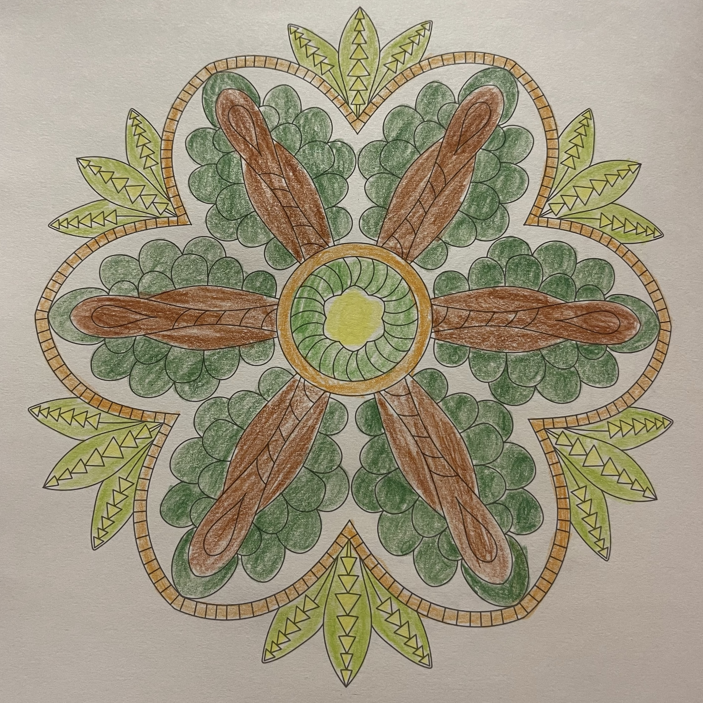
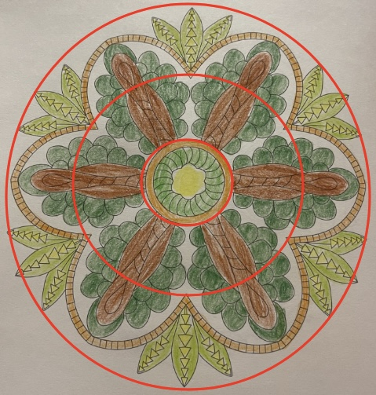

# case-008 【案例8】用五行感知法+相生相克发解读财富提升（完整解读）

## 元数据

- 案例编号：case-008
- 案例类型：完整解读案例
- 主题标签：财富, 财富提升, 五行感知, 相生相克
- 原画作：`../assets/case-008-mandala.jpg`
- 三圈设定标记图：`../assets/case-008-mandala-3q.jpg`
- 文本来源：`01-完整解读案例11例合并原文.md`
- 原文位置：第 453-510 行
- 当前状态：已提取文本，已补图，已审核确认，已登记正式候选

## 图片

原画作：

疗愈师三圈设定标记图：

## 原始解读文本

### 【案例8】用五行感知法+相生相克发解读财富提升（完整解读）

今天的曼陀罗是这样的，拿到图的瞬间，首先凭直觉来描绘一下整体看到的画面。

我的直觉是：绿色多，案主是非常上进的人，只是整体能量比较压抑，有灰蒙蒙的气息，说明案主经常郁闷，有肝淤。

接下来，我们进入正式解析的过程。

第一步：确定绘画者的曼陀罗主题。这幅曼陀罗主题是

第二步：划分三圈结构，以我神识为准，我是这样分三个圈的，你是怎么划分的呢？以你的神识为准。

1、首先看里圈。里圈代表意识、情感、过去、自己内心的想法，自己与自己的关系。

颜色有淡黄、绿、暗黄色，我把这三种颜色分别定义为：土属性、木属性和土属性

相生相克关系是：木克土

从里圈和整体来看，案主是一个上进心特别强的人，做很多事情都想要全力以赴，做到自己满意为止，内心里面很渴望在财富上有突破，渴望自己能够出人头地（案主木的能量比较多）。但现在对他来说，他会觉得自己在做事业和财富成长方面，还是有比较多阻碍，这份阻碍更多是来自于自己的限制性信念，没办法扩容自己的意识边界。尽管有一些新的想法，新的灵感，想要去落地实践，但还是很难突破自己原有的意识模式。（木克土，木想要往里去生长，去突破，土还在固守意识边界）

2、其次看中圈。中圈代表能量、财富能量，现在和亲人之间的情感关系。

中圈有深绿色，褐色，白色，分别属于木、土、金。相生相克属性是：木克土、金克木（土生金没挨在一起，可以忽略）

中圈里，木属性是偏黯淡偏深浓的，一块又一块不断堆叠起来，是压抑的、缺乏生机的、郁郁不得志的木，土属性为深褐色，是疲惫、压抑的土，被木所包围和克住。说明案主骨子里是非常要强的人，发心想成功，很想获得更多财富，不停地去叠加自己的努力，消耗了很多能量，得到的结果却还是不尽人如意，没有办法实现自己的抱负（金克木，他对结果是不满意的）。

所以当下他的能量会感觉到非常很心累，积压了很多疲惫，郁郁不得志，也没办法对别人诉说，身体方面

肝胆一定是有问题的，很可能会有肝淤，经常觉得累，只是他自己不是特别在意身体，更多心神都放在事业和财富上。

为什么没法诉说？因为案主是偏向于独立的人格，什么都自己扛，能靠自己就绝不靠别人，觉得其他人靠不上，别人的那一套对他来说是束缚；也不爱和别人沟通，更多是自己做事，在这个世界里孤军奋战，同时他又觉得很孤独，没人可以支持自己，觉得自己不被别人理解。（木属性，且是深绿色、黯淡的木）

3、最后看外圈。外圈代表物质，财富，身体，未来，行动力，别人怎么看她。

外圈有深绿色、褐色、白色和黄色、淡绿色，分别对应木、土、金、土、木。

相生相克关系是：木克土，土生金，金克木

外圈有一部分是中圈的延伸，外圈的留白的金克住深绿色的木，案主经常会感觉到身体疲惫，行动力会因为身体能量而受限，有进取心，有新想法，但是不能很好地落地，自己特别有主见，对外界的人和事会有评判，尤其是如果有地方不公平，他会很较真，忍不住说服别人，或者用自己的方式来争取更大的公平和自由。

木属性里的褐色土是淤堵或气滞，他经常会觉得胸口憋闷，开心不起来，做事没有一份滋养的感觉。条状的褐色土是自我保护或对安全感的固守，无法接纳外界的一些人和事，听不进去别人的想法和意见，也说明案主对财富的承载力到了一定瓶颈。

最外层的淡绿色的木，包裹着三角形的土，三角形属于火，说明现案主的周围还是存在一些新的机会或者贵人，他也在把握这些机会，去做一些落地工作，只是心里面会有些着急，以前的限制性信念还在阻碍他的成长，阻碍他进一步提升财富进账。财富能量的底层基础是爱自己、爱世界，欣赏世界，对这个世界有好感。它需要有一个和世界往来交流的过程，如果封闭心门，全凭自己努力，不去打开自己和这个世界的链接，不去和这个世界共振，一方面财富能量会被卡住，进账就不会顺畅，另一方面，能量消耗也会比较大，会感觉后背无人，身旁无人，身体容易出问题，这样财富的持续增长和稳定性也是受到影响的。

#### 调整方案

1、在能量上，案主少了滋养自己的能量，少了一些正向和喜悦的能量，导致能量消耗特别大，身体紧张不敢放松，财富承载力和持续增长受限，建议案主学会好好爱自己，让自己能放松下来，多做能滋养身心的活动，比如运动、冥想、瑜伽、阅读，培养内在沉静和滋养的力量；

2、在意识上，案主思维受限，一直以来都是靠自己，很少得到外界的支持，这样无形中会把一些贵人和财富推开。建议案主更多地打开自己人际方面沟通的能量，放下人际方面的紧张，试着多去和别人链接，接纳他人作为一个真实的人所具备的优点和缺点，从沟通去打开自己财富的新局面；

3、在曼陀罗上写下对自己、对这个世界欣赏和喜欢的部分，主题提升自己的欢喜心和欣赏的能力，用红色涂满曼陀罗，每天30分钟，持续3天以上。；

4、每天诵读和钱宝宝谈恋爱的肯定句，丰盛富足的肯定句，在财富和事业里能慢慢放松下来，扩容财富

承载力；

5、一般有肝淤的，脾胃也不好。站桩、八段锦排肝淤，调脾胃

## 人工审核区

### 画面事实

- 原画作整体以深浅绿色、棕色/褐色、黄色和留白为主。
- 内圈为黄色中心和绿色/棕色环状结构；中圈有大量深绿色叶片/圆瓣和棕色长条；外圈有浅绿色叶片和棕色边界。
- 三圈标记图只用于边界；标记线不计入颜色。
- 不同图案之间存在留白，可作为金能量候选。
- AI 视觉识别边界：模板线和三圈标记线不计入画作元素或五行证据。

### 画面信号标注

- 事实：绿色面积大，且部分绿色偏深。信号：成长、上进、扩张意愿强，但可能带有压抑、沉重或郁结。置信度：高。
- 事实：棕色长条在中外圈明显。信号：土性承载、现实压力、自我保护或固守结构较强。置信度：高。
- 事实：绿色与棕色交织。信号：成长冲动与承载/限制之间存在木克土候选。置信度：高。
- 事实：图案间留白切分绿色和棕色。信号：金性能量带来标准、结果评判和边界收束。置信度：中。

### 五行元素与圈内生克

- 内圈元素：黄色/棕色为土，绿色为木，留白为金候选。
- 内圈关系：木克土候选，提示成长欲望冲击既有意识边界。
- 中圈元素：深绿色木、褐色土、留白金。
- 中圈关系：木克土、金克木候选；土生金若相邻不足则暂不优先。
- 外圈元素：绿色木、褐色/棕色土、留白金、少量黄色土。
- 外圈关系：木克土、土生金、金克木均可作为局部候选。

### 议题映射

- 原始主题：财富提升。
- 主要议题：财富突破、成长欲望、限制性信念、财富承载、孤军奋战。
- 浮现议题：身体压力、沟通封闭、贵人/机会、放松和滋养。
- 财富可用部分：是财富关系主题重点案例，可用于“成长很强但承载和连接不足”“努力消耗大但进账不顺”的候选规则。
- 财富不可直接使用部分：不能直接写肝胆问题、肝淤、具体身体判断。

### 可沉淀规则

- 规则候选 1：深绿色木大量出现并与土交织时，可提示强成长/上进心与承载限制之间的拉扯。
- 规则候选 2：木克土在财富关系主题中可翻译为想突破财富边界，但既有信念或承载结构限制扩容。
- 规则候选 3：金克木可翻译为结果标准、评判或外界规则压住成长表达。

### 不应泛化内容

- 不应直接写肝胆疾病或肝淤。
- 不应把绿色多直接等同财富好。
- 不应直接断定有贵人或机会，只能作为外圈候选。

### 与原始解读文本对照

| 编号 | 对照项 | 原始解读文本要点 | 人工审核区当前处理 | 审阅状态 | 说明 |
| --- | --- | --- | --- | --- | --- |
| C008-01 | 主题 | 原文主题为财富提升。 | 保留为财富重点样本。 | 一致 | 可优先回写财富规则。 |
| C008-02 | 内圈 | 原文识别淡黄、绿、暗黄，关系木克土。 | 保留木克土候选。 | 一致 | 对应限制性信念。 |
| C008-03 | 中圈 | 原文识别深绿、褐色、白色，木克土、金克木。 | 保留木土金关系。 | 一致 | 白色/留白为金。 |
| C008-04 | 身体判断 | 原文写肝胆一定有问题、肝淤。 | 暂不采用为规则。 | 降级处理 | 医疗/身体判断不直接进入报告。 |
| C008-05 | 财富承载 | 原文说财富承载力到瓶颈。 | 保留为承载限制候选。 | 保留为候选 | 表述需保守，用“可能/倾向”表达。 |
| C008-06 | 机会贵人 | 原文说存在新机会或贵人。 | 保留为机会感候选。 | 保留为候选 | 不直接断定贵人，但可写可能有新机会感或外部助力感。 |

### 待 CEO 重点确认

- 深绿色是否按压抑木处理。
- 棕色/褐色土是否作为承载压力和固守边界。
- 身体相关内容是否全部排除出正式报告。
