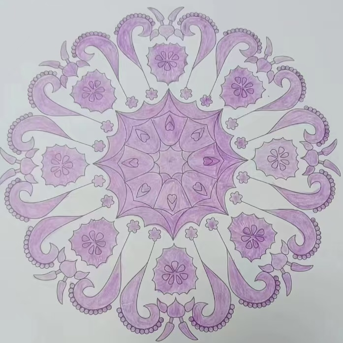

# case-009 【案例9】 用五行感知法+相生相克法解读自我提升（完整解读）

## 元数据

- 案例编号：case-009
- 案例类型：完整解读案例
- 主题标签：自我提升, 五行感知, 相生相克
- 图片占位：`assets/case-009-mandala.jpg`
- 文本来源：`原始解读案例篇11例.md（已提取入当前案例库）`
- 原文位置：第 511-604 行
- 当前状态：已提取文本，待补图，待人工审核

## 图片占位

后续请按编号放入：`assets/case-009-mandala.jpg`。

## 原始解读文本

### 【案例9】 用五行感知法+相生相克法解读自我提升（完整解读）

今天的曼陀罗是这样的，拿到图的时刻，首先来看一下整体的画面特征。

画面特征是：整张曼陀罗是单一紫色，中圈和外圈留白多，偏内圈的都用紫色涂满。

由此可以看出：这位案主目前正沉浸式地在学习或实践某个领域里，很可能与灵性或佛法等高维能量有关，很认真很专一，但不是特别落地，与现实会有断层。

接下来，我们进入正式解析的过程。

第一步：确定绘画者的曼陀罗主题，这幅曼陀罗主题是自我提升。

第二步：划分三圈结构，以我神识为准，我是这样分三个圈的。你的可以和我不一样，以你的神为准。

1、首先看里圈。里圈代表意识、情感、过去、自己内心的想法，自己与自己的关系。

颜色有紫色、白色，我把紫色定义为木属性，白色属金。紫色面积更大，白色较少。

相生相克关系是：金克木

内圈为紫色，颜色偏淡，不均匀，五行属木，但不是正木，是偏阴性的木能量，是缺乏生机和欣赏的木。

从内圈来看，绘画者目前更注重精神领域的修习和成长（从内圈涂满，外圈留白多也可知），内在有信仰，爱学习、爱成长，一直在努力地朝着目标精进，渴望成为理想中更高灵性的自己。

很需要自己的空间，喜欢独处，喜欢一份清净纯粹的感觉。如果在同一个群，她就是属于默默潜水、默默学习的那一个。

直觉很好，能接收到一些高维信息，但信息不纯净，掺杂了很多内在小我的解读（紫色不均匀，且偏淡），思想有点飘，执着于自己的信念，对自身信仰会有点小傲娇。

其实她在灵性成长中是能生出欢喜心，意识也在扩容（这一点从内圈是莲花状、面积比例大可以看出）。然而，她的底层伤痛模式没有变，还在求爱求认可，会有自我怀疑和评判（木能量偏淡，且紫色非正木，为阴性能量），一旦没有得到其他人的理解和认可，就会经常想得多，怀疑自己是不是不对，怀疑自己不够好，会经常性地自我否定。

2、其次看中圈。中圈代表能量、财富能量，现在和亲人之间的情感关系。

中圈也是紫色和白色，属木和金。

相生相克属性是：金克木

中圈里，金属性面积占比更大，紫色面积相对偏小。

紫色主要分布在多边形里，一块块的，被金隔断。

从中圈来看，案主虽然在学习灵性，但底层伤痛模式没有变，渴望得到更多理解和认可，渴望身边人给她按确认键，但一直处于求而不得的状态。

因为她执着于自我认知，少了换位思考，少了与家人的真实链接。从她的视角来看，只会觉得家人不理解她，不支持她，所以能量会比较低沉，常常感觉委屈和苦闷，心力不足。（金克木，且紫色非正木）

当她需要支持的时候，找不到人，只能独自消化，或寻求灵性的帮助。她链接到的信息不知道和谁分享，也不知道如何更好地分享。

自尊心比较强，听不得别人的评判，但内在力量又不足，所以在产生冲突时，会害怕，会隐藏真实的自己（紫色偏淡，阴性能量，且金克木，会逃避冲突，自我隐藏）

假如家里人评判她、否定她，比如觉得“她神神叨叨、不知道学什么、是不是被骗了”等等，那她会逃避，同时还会把那些话听进去，内在不可避免地自我冲突，很委屈，但又无外诉说（由圈金多，金是标准、要求、评判，在她心里，这个是家里人对她的评判）

3、最后看外圈。外圈代表物质，财富，身体，未来，行动力，别人怎么看她。

外圈也是紫色和白色，属木和金。

相生相克属性是：金克木

外圈里，紫色和白色面积差不多，且紫色被白色隔断。

案主始终用的是紫色，她是比较能在自己的认知里抱元守一的，能用高维的视角看待世界，但别人会觉得她一根筋和固执，有点飘，不落地，不干正事，和现实脱节。

紫色的形状里，比较突出的是角状（直的和弯的都有），弯角状的边上还有小圆。以我的用神来看，这些角状，像羊角。

羊在中国的集体意识里，是温顺的、善良的、需要被保护的。

这说明案主在对待他人时，会懂得示弱，不会发表太多自己的意见，相对比较顺从，但不代表她对别人的看法认同，因为她内心会有主见，且弯角状边上的小圆也说明了她对外界的评判。

实际上，案主对这个世界有比较强的疏离感，内心和行为都疏离，不喜欢别人触碰或者靠得太近。

不爱金钱，不爱赚钱，也不爱这个世界，只希望在自己的领域里钻研，无法和别人深入链接共振。

行动力会比较弱，有很多相法，但很难落地，理想和现实的差距比较大，经常会觉得很累（金克木，紫色也偏淡，力量感不足）

由此，也可以判断她的财富进账通道是被堵塞的，这段时间进的钱少。因为财富的本质是爱自己，爱世界，与这个世界的人群链接，给他人提供价值。既然你不爱这个世界，你没有行动力，那钱宝宝也不来找你了。

对于行为方式的层面，她比较喜欢一个人默默努力，想要做出点成绩，然后惊艳所有人。但由于自我封闭，一个人心力有限，她很难把事情做好，容易在自己的世界里钻牛角尖，无法打开更大的认知格局。

在21世纪九紫离火运，需要多方共振，需要合作共赢，否则很难拿结果。除非是大艺术家、科学家、手艺人等，愿意坐冷板凳，能安住清贫，此生使命笃定，就是为了钻研一样东西。

但很显然，案主并不是这样的人，她的理想和现实差距比较大，让她产生自我怀疑和否定。

#### 调整方案

**现在案主最大的卡点是：**有点飘，不落地，阴性力量太强，阳性力量偏少。

1、意识调频：不执着于法，不执着于灵性，重视知行合一，不管学什么都要落地，对现实世界有真实转化，那才是真本事。

其次，学会欣赏他人，欣赏这个世界，提升对世界的好感度，提升对赚钱的热爱，一手金钱，一手莲花，如此才能提升阳性力量，达到阴阳平衡。

2、绘画曼陀罗主题：我对这个世界充满了欣赏，我很爱这个世界。用绿色涂满曼陀罗，一次性画7张以上，坚持画5-7天，每次画完后，在曼陀罗的旁边写下他人的优点，自己遇到的美好；

3、每天听《财富从四面八方而来》的冥想，每天写感恩日记，坚持3个月以上。

4、死磕行动力，学会做计划，每天按照计划去行动，也可以通过站桩和八段锦提升腿部行动力。

## 人工审核区

### 画面事实

待补图后标注。

### 画面信号标注

待补图后标注。

### 五行元素与圈内生克

待补图后标注。

### 议题映射

待审核。

### 可沉淀规则

待审核。

### 不应泛化内容

待审核。
