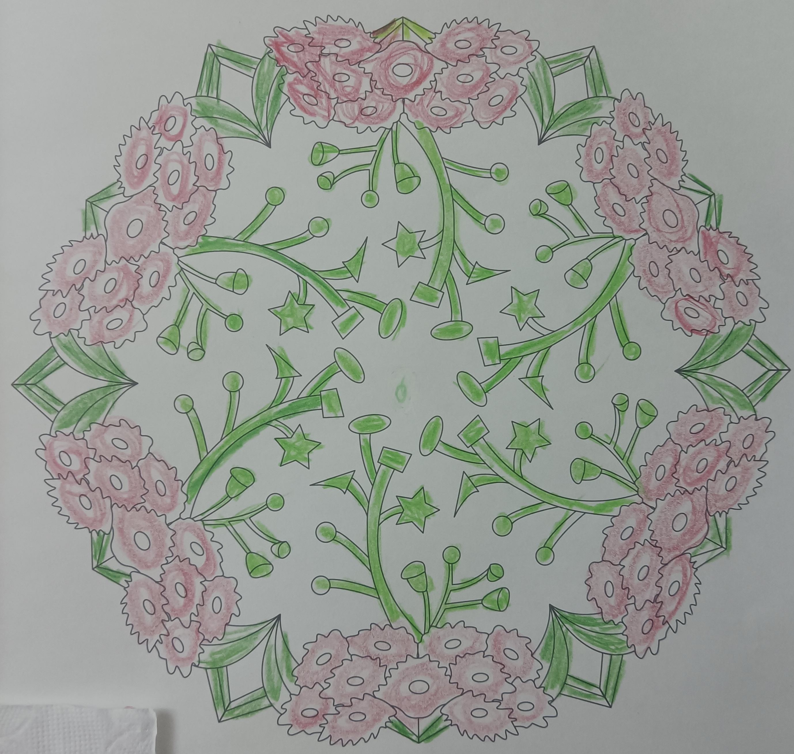
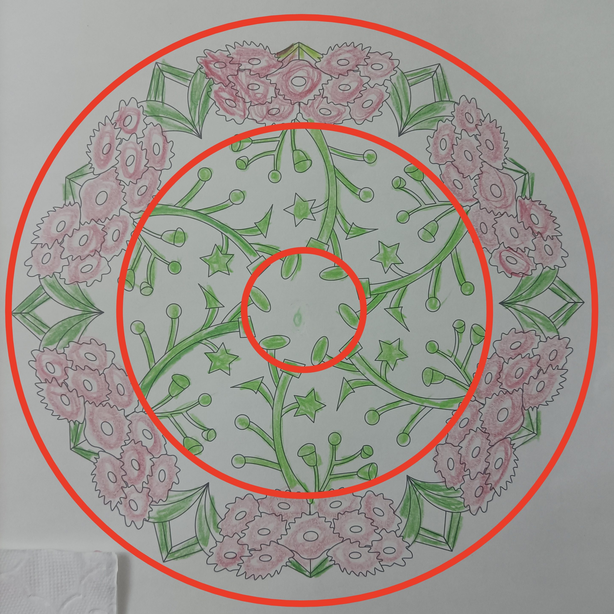

# case-010 【案例10】 用五行感知法+相生相克法解读财富提升（完整解读）

## 元数据

- 案例编号：case-010
- 案例类型：完整解读案例
- 主题标签：财富, 财富提升, 五行感知, 相生相克
- 原画作：`../assets/case-010-mandala.jpg`
- 三圈设定标记图：`../assets/case-010-mandala-3q.jpg`
- 文本来源：`01-完整解读案例11例合并原文.md`
- 原文位置：第 605-680 行
- 当前状态：已提取文本，已补图，已生成审核草稿，待 CEO 确认

## 图片

原画作：

疗愈师三圈设定标记图：

## 原始解读文本

### 【案例10】 用五行感知法+相生相克法解读财富提升（完整解读）

今天的曼陀罗是这样的，拿到图的时刻，首先来看一下整体的画面特征。

画面特征是：整张曼陀罗是颜色画得比较粗糙，很多线条是画出线了，整体看着偏凌乱。

由此可以看出：这位案主在绘画这张曼陀罗时，心神不宁，思绪乱糟糟的，完全静不下来，要么是最近遇到了一些事情，要么是她着急想解决某个问题，她的主题是提升财富，那她遇到的事或想解决的问题就是跟钱有关，也说明她最近可能急需用钱，在钱上遇到了困难。

大家一定要重视整体画面特征的解读，拿到图的第一眼就去判断，这里给到你的信息都非常准，能快速打开案主的心防！

接下来，我们进入正式解析的过程。

第一步：再次确定绘画者的曼陀罗主题，这幅曼陀罗主题是财富提升。

第二步：划分三圈结构，以我神识为准，我是这样分三个圈的。你的可以和我不一样，以你的神为准。

1、首先看里圈。里圈代表意识、情感、过去、自己内心的想法，自己与自己的关系。

它的属性有木和金，金克木。

第一圈里，金多，木少，金克木，木被克制得比较多，说明：案主宝宝遵守规则，内心有一套做事做人的标准，极其看重自我的价值，内在有目标，很努力想要突破，但始终会有一份有心无力的感觉。

为什么说有心无力？因为金没有生出水，金属性也没有土来给到她支撑，内在金属性太多，也说明她安全感不足，对自己要求很高，一旦达不到自己设定的要求和程度，她很容易自我评判、自我攻击，总是有一份“我不够好””、“我不值得”的感觉深深地影响她。

另外：第一圈出现绿色木属性，木属性涂得乱，涂出圈，也没有涂满，说明：她面对现状，会有点着急，着急想要更多进账，但目前又没有太多办法，还是寄希望于自我成长来达成财富目标（木代表成长、精进、学习等），在成长过程中会急躁，时不时会想：

什么时候我才能成长起来？什么时候我才能显化金钱呢？

还可以看到：第一圈金属性里有椭圆形的绿色，这些椭圆形的绿色有点像种子，且绿色相对比较嫩，说明什么？

说明：尽管她对金钱没有安全感，经常评判自己，觉得自己吸引不到钱，但她没有自暴自弃，仍然愿意去面对财富这个课题，想要种下一个财富种子，在财富里有一份持续成长。

虽然种子还很弱小，她需要更多地呵护和培植，但这也是她的勇气和生机所在。这是非常值得赞扬的，也是曼陀罗解读师要给到案主的生机。

2、其次看中圈。中圈代表能量、财富能量，现在和亲人之间的情感关系。

也是金和木，金克木。木的形状呈现条状的像枝桠、五角星星、圆圈和三角形等。

第二圈也是金的比例更大，木被金隔断和克制，说明：她的成长会受到家里人的干扰，很可能家里有人不支持她成长，不理解她正在做的事情，对她有言语上的评判，他们经常会因为这些事产生小冲突。

虽然案主很想要成长，但是难免会受到家人的影响，心情会暗自郁闷和委屈：“明明我去成长，是为了变得更好，是为了未来能进账更多，现在不理解我就算了，还说我，反对我，我其实很难过”。（木被克住了，心情不会好）

还可以看到：木的形状呈现有条状的像枝桠，从外向里延伸，说明她遇到问题和冲突时，更多是向内反思自我、成长自我，看看自己有哪些地方还做得不够好，她也在努力地调整频率，但反思的时候杂念比较多，容易掉入情绪的幻相。

同时看到：这些绿色的枝桠上海有小圆圈、五角星、三角形等，相当王她成长的果实，说明她的自我成长并非全无效果，还是能收获一些成果的，只是她现在还不满意，还会挑剔自己得到的不够多，不够应付现实以及她安全感的需要，心态还是急躁的（小圆圈代表金属性，说明挑剔自己的结果；三角形代表火属性，有着急，同时涂色乱也说明他着急）

3、最后看外圈。外圈代表物质，财富，身体，未来，行动力，别人怎么看她。

第三圈有红色、绿色和白色，分别是火、木、金。

相生相克关系是：金克木，火克金，木生火

第二圈的木延伸出第三圈的火，木生火，能量共振出物质，说明：她在成长中能有一些行动力，去帮自己赚取到一定的财富，她自己也会产生一些对财富的好感觉。但是，这个火的颜色相对比较淡，属于弱火，且中间包裹着金属性，金又克木，说明她的行动力会经常受到情绪的拉扯，心力不够，做事很难坚持。面对外界总是有一份如影随形的匮乏感，经常觉得自己成长得不够，赚得不够多，比不上别人，在这方面对自己有评判。

还可以看到：外圈的木和火属性，木是要自由向上生长的，火也是想要自由去蔓延的，但现在木被金克制住了，火又被金所泻，她会感觉到被束缚、压力大。

解读到第三圈的时候，可以问问案主现在是否在上班工作。如果在工作的话，说明当下她对工作是有点厌烦和抗拒的，觉得压力大，经常感觉很疲惫。

她热爱自由，不喜欢上班的各种条规，但是现在为了钱财迫不得已上班，她也会讨厌这种状态，这也导致了她的财富进账始终被卡住，无法主动创造和吸引更多钱宝宝到来，因为金钱是阳性力量，它看的就是你对工作的热爱和主动性

同时留意到：外圈是火和木，木生火，且繁花似锦，别人看她过得还可以，但她看自己不满意。外人都觉得她努力上进，人缘也好，财富也好，会说话，能让人感觉到温暖，就是最近做事可能有点心不在焉，状态有点不在线，只是她一直都觉得对自己不满意，不管是财富还是情感，目前来说，都不是她理想的状态。

#### 调整方案

**现在案主最大的卡点是：**着急，自我评判太多，导致匮乏感严重，同时在财富里过于被动，没有活出创造者和主角的姿态

1、意识调频：案主对自我要求高，容易产生自我攻击，建议她在做事上可以高标准高要求，但一定要学会放过自己，学会认怂，断舍离对自我的评判，否则财富会一直被卡住，无法向上提升！

除了断舍离自我评判，还建议案主多夸奖自己，欣赏自己，每天鸡蛋里挑骨头地夸自己，夸自己的时候，你的内在生命会得到鼓舞，不知不觉就变得欢喜，与财富合一。

2、能量调频：把心沉稳下来，财不入急门。现在案主能在意识空间里种下财富种子，这非常好，但滋养财富种子成长的绝对不是着急，而是耐心、从容、欢喜和感恩的频率。

每当着急的时候，要保持觉察，记得要提醒自己慢下来，也可以通过每天练习腹式呼吸，让气息沉入丹田，让自己稳定和喜悦。

3、画曼陀罗多用蓝色，让自己放松下来，现在太紧绷了；画一周蓝色，再画一周红色，提升内在的丰盛感。

## 人工审核区

### 画面事实

- 原画作以绿色枝干/叶片、粉色花团、绿色几何块、黄色/绿色小星点和大量留白为主。
- 中心和中圈有多方向绿色枝条，外圈粉色花团围绕，部分枝条向外伸展。
- 画面整体线性、分散，方向较多。
- 留白可作为金能量；模板线和标记线不计入画作元素。

### 画面信号标注

- 事实：绿色枝条很多且方向分散。信号：成长、学习、想法和行动路径多，但聚焦不足。置信度：高。
- 事实：粉色花团围绕外圈。信号：外在呈现有人缘、温暖或好感觉，但也可能受情绪/关系感受影响。置信度：中。
- 事实：大量留白切分绿色枝条和粉色花团。信号：金性能量强，标准、评判、安全感和现实规则会切分行动力。置信度：高。

### 五行元素与圈内生克

- 元素：绿色为木，粉色为弱火，黄色为土，留白为金。
- 内圈/中圈关系：金克木、木生火、火生土候选。
- 外圈关系：木生火、火克金、金克木候选，需按局部相邻关系确认。

### 议题映射

- 原始主题：财富提升。
- 主要议题：财富焦虑、自我评判、成长种子、行动分散、上班/规则束缚。
- 浮现议题：工作热爱、被动赚钱、匮乏感、外人评价。
- 财富可用部分：财富报告中可写“成长意愿强但金性评判切分行动”“财富种子需要耐心滋养”。
- 财富不可直接使用部分：不能直接断定急需用钱、上班状态或具体工作处境。

### 可沉淀规则

- 规则候选 1：木性枝条多且方向散时，可提示成长路径多、行动分散。
- 规则候选 2：木被大量留白切分时，可提示自我评判、现实规则或安全感压住成长行动。
- 规则候选 3：财富主题中弱火外显但金性强时，可提示好感觉不足以稳定财富行动。

### 不应泛化内容

- 不应直接断定急需用钱。
- 不应把绿色多写成成长一定有效。
- 不应将上班厌恶作为画面直接结论。

### 与原始解读文本对照

| 编号 | 对照项 | 原始解读文本要点 | 人工审核区当前处理 | 审阅状态 | 说明 |
| --- | --- | --- | --- | --- | --- |
| C010-01 | 主题 | 原文主题是财富提升。 | 保留。 | 一致 | 财富重点样本。 |
| C010-02 | 整体状态 | 原文说心神不宁、思绪乱。 | 保留为方向分散候选。 | 部分保留 | 不直接判断现实事件。 |
| C010-03 | 内圈 | 原文说木和金，金克木。 | 保留金克木候选。 | 一致 | 留白金切分木。 |
| C010-04 | 财富种子 | 原文说绿色椭圆像财富种子。 | 保留为成长种子候选。 | 部分保留 | 需 CEO 确认形状。 |
| C010-05 | 外圈 | 原文说木生火、火克金、金克木。 | 保留为候选。 | 部分保留 | 局部确认后回写。 |
| C010-06 | 工作状态 | 原文说为了钱被动上班、讨厌状态。 | 暂不采用为规则。 | 降级处理 | 需用户自述支持。 |

### 待 CEO 重点确认

- 绿色椭圆/点是否按财富种子处理。
- “急需用钱”是否完全排除出规则。
- 金克木是否作为本案例主规则。
