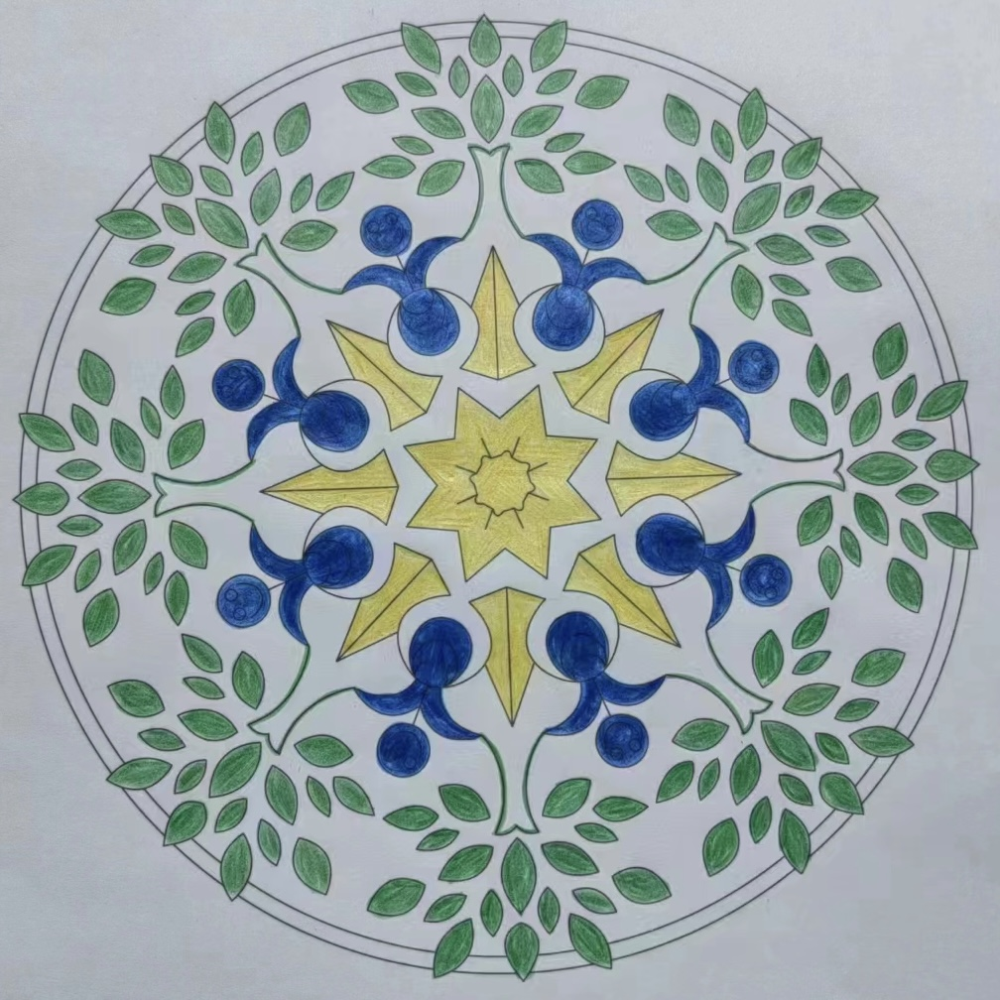
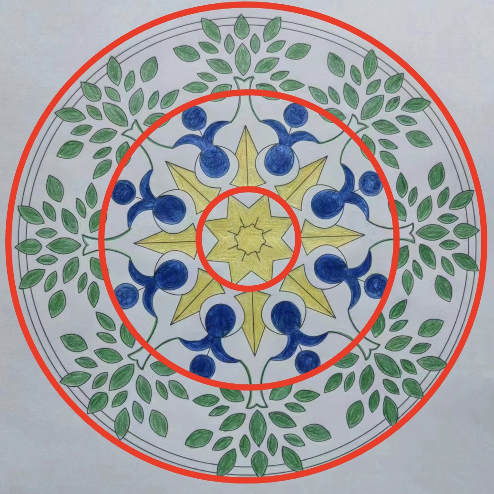

# case-011 【案例11】用五行感知法+相生相克法解读财富成长（完整解读）

## 元数据

- 案例编号：case-011
- 案例类型：完整解读案例
- 主题标签：财富, 财富成长, 五行感知, 相生相克
- 原画作：`../assets/case-011-mandala.jpg`
- 三圈设定标记图：`../assets/case-011-mandala-3q.jpg`
- 文本来源：`01-完整解读案例11例合并原文.md`
- 原文位置：第 681-747 行
- 当前状态：已提取文本，已补图，待人工审核

## 图片

原画作：

疗愈师三圈设定标记图：

## 原始解读文本

### 【案例11】用五行感知法+相生相克法解读财富成长（完整解读）

今天的曼陀罗是这样的，拿到图的时刻，首先来看一下整体的画面特征。

画面特征是：整张曼陀罗的色调都偏冷色调，涂色相对比较均匀，说明案主的理性思维是相对比较发达的，自我控制力相对比较好，能够有条有理地去分析问题，也能安住当下，耐心地做精细活（PS：案主是位男性）。

接下来，我们进入正式解析的过程。

第一步：再次确定绘画者的曼陀罗主题，这幅曼陀罗主题是我是有钱人，即为财富成长相关的主题。

我里有钱人

第二步：划分三圈结构，以我神识为准，我是这样分三个圈的。你的可以和我不一样，以你的神为准。

1、首先看里圈。里圈代表意识、情感、过去、自己内心的想法，自己与自己的关系。

第一圈是黄色、白色，分别为土和金，相生相克关系是：土生金

从第一圈可以看到：土的面积更大，向外扩展，能生出金，说明近期他在财富上比以往有了更大的意识扩容和承载，对自己也有了更多接纳和认可，能看到自己更多的可能性，开始觉得自己是有价值的。

同时可以看到：这个黄色的土涂得比较均匀，但是只生出来一点金，二者的比例不平衡，说明尽管他在努力地扩容财富认知，更多地打开了对于财富的逻辑认识，也很渴望能积累更多的财富资源，但还没有确定下来要怎么做，也不确定自己能否做到。

另外：黄色的土属性有一些条纹感和灰暗的色彩，说明他会在头脑上不断地告诉自己：“我就是有钱人，我是可以的”。但是，他的潜意识会跟他唱反调，旧日有习性所产生的怀疑会让他处在纠结的状态，很可能他刚有一个新的想法，很快又会出现否定的念头：

“我真的可以吗？”“这行得通吗？”“我不太确定”。

2、其次看中圈。中圈代表能量、财富能量，现在和亲人之间的情感关系。

中圈有蓝色、黄色、白色，分别属水、土、金。相生相克关系是：金生水，土生金，土克水（土和水没挨着，可以不理会）

可以看到：中圈有非常突出的深蓝色，蓝色涂的不均匀，大部分蓝色都很浓重，像深海，表面看着风平浪静，实际上暗流涌动。说明他和某个家人相处过程中，会激发他很多愤怒、不安全感和失望，要么他会将这些情绪压抑下来，要么控制不住会吵架，这会让他身心俱疲，情绪起伏非常大（水就是波动的，反复无常的）。

这种水属性给人很冰冷的感觉，也代表他内在很孤独，明明很渴望家人的温暖和支持，却无法获得对方的理解，也无法好好待在一起，在一起就会吵架。

同时看到：虽然金能生水，但这幅曼陀罗的水是阴性的水、是负向的水，因此生它的金也会偏向于负面，说明案主情绪的来源更多是在于家人对他的控制和挑剔，生活中很多事情他都感觉自己无法做主，总是被对方影响和干扰，尽管已经很努力地压抑和说服自己，但还是会被挑起很多情绪。

这种情感上的受伤，势必会造成他的能量漏洞，他需要花很多时间、精力来修补能量漏洞，那么他对于财富的那份纯粹和专注就会减弱，这股情绪也会被他带入人际关系和做事的状态里。

为什么说他对于财富不够纯粹了？我们看到：土是偏向于三角的形状，箭头指向外圈，这说明他现在很想通过扩容财富来逃离原生家庭、逃离这种压抑的环境，心态上是有些着急的。

也就是说，他赚钱的动力不是出于热爱，而是出于逃离，这也是为什么他财富始终难以提升的原因。一个人的初心不纯粹，他的财富显化之路就会容易掉坑、走弯路。

3、最后看外圈。外圈代表物质，财富，身体，未来，行动力，别人怎么看他。

外圈是绿色和白色，分别为木属性和金属性，相生相克关系是金克木。

我们看到：最外圈，木属性初步具有了树木的形状，但这些树叶没有枝干来支撑，往外散开，被白色的金所隔断。说明他希望未来自己能长成大树，独立、坚韧，能给予他人价值，现在他在为这个目标努力，持续成长，有了一些生机。

但是，这些生机断断续续的，说明他对财富进账还不满意，进账也相对比较零碎。做事会感觉到心力不足，力量无法凝聚起来，总会感觉压力很大。害怕犯错，仿佛别人的评判如影随形，经常觉得很累，对于工作和生活时常呈现出一种无力感。

同时也说明：他的生活中并不缺乏赚钱的机会，但他认为这些机会零零散散，他不知道怎么整合与把握，会担心自己不够优秀，根基不稳，智慧不够，达不到别人要求的标准，心情会为此郁闷。

虽然想成为有钱人，但赚钱的动力不足，对这个世界缺少热爱和欢喜。也会觉得自己成长得不够快，收获不理想，不够扎实落地。一些想法能够实施，但比较费劲，有时候能量不够就躺平了，自律性会被情绪和外界打断。

#### 调整方案

**现在案主最大的卡点是：**

在情感里压抑自己，情绪波动很大；缺少欢喜心和热爱，赚钱的动力不足，会很在意别人的眼光。

1、画曼陀罗用黑色扫画或打圈画，诚实地面对自己，对着曼陀罗表达自己对某位家人的愤怒、难过和失望，允许情绪真实地流淌出来，持续绘画3周以上，每天至少12张。

2、第1点做完后，还要做与家人链接的冥想，去看到对方的经历和认知层次，设身处地地站在ta的角度考虑，慢慢做到因懂得而慈悲。冥想过程中如果还有怨念，那就再画曼陀罗进行清理。最后一定要转念：自己从这段关系里，获得什么成长礼物？

3、写幸福日记，持续3个月以上。财富的基础是对红尘的热爱，如果刚开始没有，那就以假修真，先把自己放进幸福欢喜的状态，每天聚焦美好的事物，每天关注幸福的小事，可以建立一个幸福日记本，记录所发现的美好。

4、一周细画3次以上曼陀罗，多用红色或绿色，锚定一个主题：我是安全的、我是勇敢的。财富偏爱勇敢的人。害怕别人的眼光，害怕别人的评判，就永远被困在别人的唾沫里，你会失去自己的力量，也会丢失进入财富大门的钥匙。

## 人工审核区

### 画面事实

待人工标注。

### 画面信号标注

待人工标注。

### 五行元素与圈内生克

待人工标注。

### 议题映射

待审核。

### 可沉淀规则

待审核。

### 不应泛化内容

待审核。
