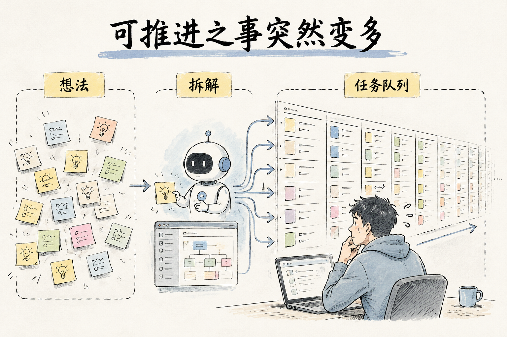
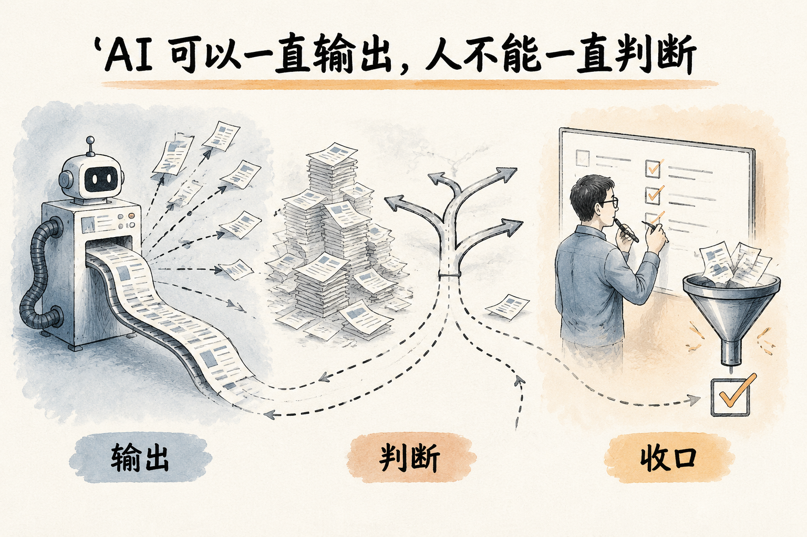
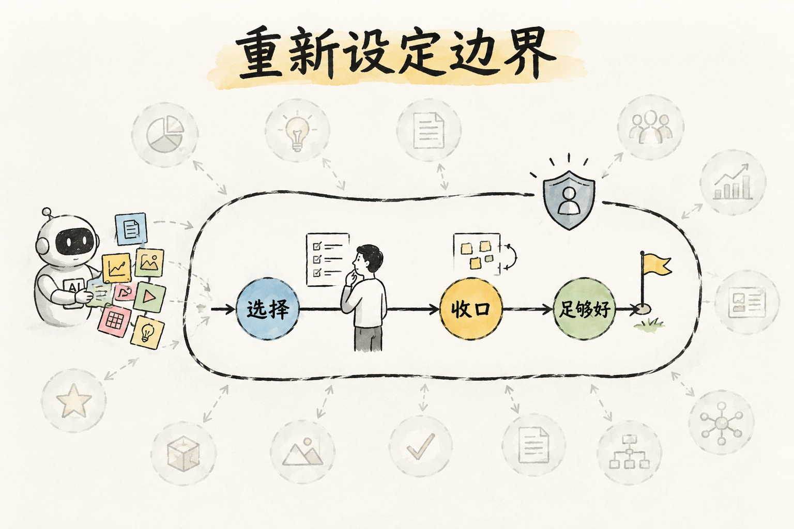

# 作为一个重度AI使用者，你有没有更累了？

> 状态：draft
> 版本：0.1.0
> owner：墨予镜
> last_updated：2026-06-06
> 内容类型：感受观点型 / 方法复盘型
> 目标账号：墨予镜个人号

### 写作定位

这篇不是 AI 疲劳科普，也不是研究报告。

这篇要写的是：一个重度 AI 使用者在真实使用后发现，AI 带来的疲惫不只来自信息变多，更来自“可推进之事”突然变多。文章重点是复盘这件事如何发生，以及后来如何通过判断、收口和闭环来调整。

核心判断：

```text
AI 提升了事情的可行性，但没有同步提升人的承载力。
```

### 正文草稿

这段时间我复盘自己的 AI 使用，有一个感受越来越清楚：

我曾经以为，AI 会让我更轻松。

但真正高频用起来以后，我先经历的不是“轻松”，而是另一种更隐蔽的累。

自从用了 AI，我总算是深刻领悟了什么叫：活儿是干不完的。

不是因为我突然变得更勤奋了。

而是因为以前很多只停在想法里的事，现在都开始具备了被推进的条件。

一个选题，以前可能只是一个提纲。

一个产品想法，以前可能只是一个念头。

一个技术问题，以前可能因为太久没碰，就暂时放在那里。

但有了 AI 之后，它们都不再只是“想法”了。

它们会变成可以继续讨论、继续拆解、继续尝试、继续推进的事情。

这才是重度使用 AI 之后，真正容易让人累的地方。




不是单个任务变得更难了。

而是能被推进的任务变多了。

AI 提升了事情的可行性，但没有同步提升人的承载力。

所以，它带来的第一个变化，不一定是“我终于轻松了”。

更可能是：

我突然发现，原来我可以做的事情，比我以为的多得多。

而这件事本身，既让人兴奋，也很消耗人。

### 以前很多事，不是不想做，是推进成本太高

以前我也会有很多想法。

比如做自媒体。

我不是完全没有观点，也不是没有结构。我经常能列出一些提纲，甚至这些提纲本身也是有逻辑的。

但问题是，我很难把这些提纲继续填充成一篇真正有质量的文章。

一篇文章不是只有观点就够了。

它还需要例子、结构、表达节奏、读者视角。还要判断哪些话现在能说，哪些话还没想清楚，哪些地方需要更谨慎。

所以很多时候，我不是没有想法，而是想法停在了提纲阶段。

再比如配图、视频、内容分发。

以前这些事理论上都能做，但对于一个人来说，每一项背后都有新的工具、新的流程、新的学习成本。很多事不是绝对做不到，而是做起来太重了。

还有编程。

我已经快十年没怎么写程序了。放在以前，我很难想象自己会重新开始写代码。

不是因为我完全不想，而是因为编程不是“会不会写几行代码”这么简单。它背后还有环境、框架、报错、工程结构、调试、部署。任何一个环节卡住，都可能让人直接放弃。

所以过去很多事情，并不是没有价值，也不是不值得做。

而是继续推进的成本太高。

### AI 让更多事情开始具备推进条件

AI 出现以后，这个边界变了。

一个问题想不明白，可以和 AI 讨论。

一个想法只有提纲，可以让 AI 帮我一起拆结构。

一篇文章不知道怎么展开，可以让 AI 帮我做不同角度的推演。

配图、视频、脚本、代码，也都不再像以前那样遥远。

甚至我现在又开始重新编程了。

这在以前是我很难想象的事情。

所以 AI 对我的影响，并不只是“让我做事更快”。

更大的变化是：它让我看见了更多可以被推进的事情。

以前很多事会停在想法阶段。

现在它们会变成一句话：

要不要再试试？

这句话很有力量。

但也正是这句话，让工作量开始变多。

### 可推进的事情变多以后，判断也变多了

以前很多事情因为成本太高，会自然停止。

现在不一样了。

一个问题可以继续问。

一个想法可以继续展开。

一个选题可以继续查资料。

一个项目可以继续拆任务。

一个功能可以继续优化。

每一个方向看起来都有道理。

但如果每个方向都继续往下走，人就会很累。

我还有一个很真实的感受：token 每天是定量的。

有时候如果没有用完，会有一种浪费的感觉。

这听起来有点好笑，但对重度 AI 使用者来说，可能并不陌生。

因为你知道它能帮你推进很多事情，所以你会自然想把它用起来。

不用，好像亏了。

用了，又会打开更多任务。

于是 AI 明明是来帮你提高效率的，但最后你的工作时间反而变长了。

你每天处理的信息也变多了。

### 真正累的，不只是执行，而是判断和收口

后来我发现，自己真正累的地方，不只是“做了更多事”。

而是要处理的信息量已经超过了肉身负荷。

AI 可以一直输出。

它不困，不累，也不会因为讨论太多而觉得烦。

但人会。

人要读，要判断，要比较，要决定哪些内容能用，哪些内容不能用。

状态好的时候，这个过程很有效。

我会认真读 AI 的输出，指出哪里没看懂，哪里不合理，哪里偏了。这个时候，AI 确实能帮我把事情往前推。

但如果我已经累了，情况就会变掉。

我会开始扫读。

我会觉得差不多。

我会更容易点继续。

这时候就很危险。

因为 AI 不会天然知道我已经失去判断力了。它还会继续往前跑。

然后我可能就在错误方向上转圈圈。

或者把一个本来很简单的问题，做成一个过度工程化的方案。

表面上看，我一直在推进。

但实际上，我可能只是在制造更多以后要清理的东西。




### 做内容也会遇到同样的问题

这件事在内容创作里也很明显。

比如我想到一个选题，原本只是想表达一个真实感受。

但很快，我会开始担心：

我的感受是不是太个人了？

这个观点有没有普遍价值？

别人是不是已经讲过？

有没有研究支持？

我要不要再搜一轮资料？

要不要把成因、数据、方法都补齐？

这些担心不是没有道理。

它们说明我希望内容有质量，不想只是发一点情绪。

但问题是，如果每个选题都这样处理，它就会从一篇文章，变成一个研究项目。

而研究项目是很重的。

它需要资料、结构、核查、论证，还需要判断边界。

这当然有价值。

但不是每一篇个人号文章都需要这样。

有些文章的价值，不是给出完整研究，而是把一个真实体验说清楚。

让读者看到：原来我也有类似的感受，只是以前没有说出来。

这本身就是价值。

### 我后来开始调整自己的 AI 使用方式

所以我后来开始有意识地调整自己的使用方式。

我不再只问：

AI 还能帮我做什么？

我会先问：

这是不是正确的事？

这件事现在该不该做？

它做到什么程度就够了？

能不能尽快形成一个闭环，获得一点真实反馈？

什么时候应该只关注当下，把眼前这一步做好？

什么时候又应该提前考虑长期架构，为以后积累？

这些问题，比“AI 还能帮我做什么”更重要。

因为 AI 总能继续帮你做点什么。

它可以继续扩写，继续分析，继续搜索，继续优化，继续生成新方案。

但一个人的注意力和身体不是无限的。

如果没有边界，AI 打开的可能性越多，人越容易被这些可能性拖着走。

### 不是少用 AI，而是重新设定边界

所以，我现在对自己的提醒不是“少用 AI”。

AI 当然还是很好用。

它让我重新开始做很多事，也让我有能力推进以前推不动的问题。

但我需要更清楚地知道：

不是所有可以做的事，都应该现在做。

不是所有可以展开的选题，都要展开成研究报告。

不是所有 AI 生成出来的方向，都值得进入主干。

有时候，一篇文章只需要讲清一个真实感受。

一个项目只需要先形成一个小闭环。

一个问题只需要先解决到当前阶段够用。

这不是降低标准。

这是保护自己的判断力。




也是保护自己不要在 AI 打开的无数可能性里，被一点点耗空。

所以，如果你也是一个重度 AI 使用者，我想问你：

你有没有发现，AI 确实让你变强了，但你也更累了？

如果有，也许问题不在于你用得不够熟。

问题可能在于：

AI 让你看见了太多可以推进的事情。

而你现在真正需要练习的，是选择、收口，以及允许自己停在一个足够好的地方。

### 可保留金句

- 自从用了 AI，我总算是深刻领悟了什么叫：活儿是干不完的。
- AI 提升了事情的可行性，但没有同步提升人的承载力。
- AI 带来的疲惫，不只来自信息变多，而是来自“可做之事”突然变多。
- AI 可以一直继续，但人不能一直判断。
- 不是所有可以展开的方向，都值得进入主干。
- 有些文章的价值，不是证明一个道理，而是把一种说不清的体验说清楚。
