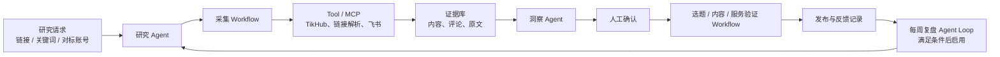

> 状态：current
> 版本：0.2.0
> owner：CEO / Product Spec Lead
> last_updated：2026-07-21
> source_of_truth：projects/content-matrix/specs/2026-07-21-AI营销获客系统组件化重构方案.md
> supersedes：以“博主日更追踪”为主入口的旧实现口径

# AI 营销获客系统组件化重构方案

## 1. 目标与判断

系统目标不变：从真实市场语言中形成可验证的内容选题和服务获客依据。

```text
市场证据 -> 人工确认的洞察 -> 内容与 CTA -> 外部反馈 -> 服务验证 -> 下一轮研究
```

重构原因是原设计将账号追踪、采集、下载、转写、洞察、选题、发布和复盘揉成一条大流水线。任何一个数据源不可用，都容易阻塞整个系统；同时它也难以复用到不同账号、行业或客户项目。

新的系统采用“可复用组件层 + 薄业务编排层”。端到端交付由编排实现，组件不彼此绑定。

## 2. 两层架构



### 2.1 可复用组件层

| 组件 | 输入 | 输出 | 运行形态 | 不负责 |
| --- | --- | --- | --- | --- |
| 内容入库 | 任意链接、手工文本、结构化内容 | 标准化内容记录 | Tool + Skill | 判断是否值得研究 |
| 平台数据采集 | 链接、关键词、账号标识 | 内容/评论原始样本 | Tool/MCP + Workflow | 选题结论 |
| 媒体提纯 | 视频、音频、字幕、逐字稿 | 可引用的清理稿与原文归档 | Workflow | 采集主页或账号 |
| 评论采样 | 内容标识、采样范围 | 去重评论与回复样本 | Workflow | 自动判定真实需求 |
| 洞察与选题整理 | 内容、评论、研究目标 | 证据卡、候选选题、待审核建议 | Agent | 自动发布、自动成交 |
| 飞书读写与去重 | 标准化记录 | 可筛选运营台账 | Tool | 采集策略和业务判断 |
| 发布与反馈记录 | 已发布内容、互动、私信、沟通结果 | 发布记录、反馈、线索状态 | Workflow | 自动销售判断 |

### 2.2 业务编排层

业务编排不复制组件，只定义目的、可调用组件、人工决策点和交付物。

| 编排 | 用户目标 | 默认组件组合 | 最小交付 |
| --- | --- | --- | --- |
| 企业 AI 服务市场调研 | 找到可服务的真实问题 | 关键词/对标采集 -> 评论采样 -> 洞察整理 | 研究简报 + 1-3 个候选选题 + 服务假设 |
| 墨予镜内容研究 | 找到个人表达可用的观察与案例 | 链接入库或内容采集 -> 媒体提纯 -> 洞察整理 | 原文依据 + 内容角度 |
| 一镜一梳内容研究 | 研究疗愈行业内容与表达 | 采集 -> 提纯 -> 洞察整理 | 匿名、非诊断性的内容观察 |
| 客户项目调研 | 为一个客户问题准备前置研究 | 关键词/账号采样 -> 证据归档 -> 研究简报 | 客户专属样本包与问题清单 |

## 3. 唯一主入口：研究请求

日常不再以“每天跑全部博主”为主入口，而是发起一条研究请求：

```text
输入：链接 / 关键词 / 对标账号
选择目的：收藏整理 / 评论挖需求 / 选题调研 / 账号拆解
选择服务方向或内容账号：企业 AI 服务 / 墨予镜 / 一镜一梳 / 客户项目
设置样本上限：默认 5-10 条
输出：研究结果 + 可追溯内容与评论样本
人工决定：进入选题、发布、样本沟通，或结束
```

研究请求是业务编排层的最小记录单位。本地先用 `research-requests.json` 台账和对应 Markdown 研究简报保存目标、范围、成本、状态、研究结论和下一步，并在人工决定时同步更新两者。飞书“研究请求”表已按同一合同建立，用于日常筛选和人工审核；候选详情、评论原文和 API 原始响应继续留在本地文件，不复制到飞书。

## 4. Tool、Workflow、Agent、Agent Loop 与 Skill 的边界

### Tool

输入输出可确定、需稳定测试的能力：TikHub 调用、短链解析、字段映射、内容唯一键、飞书写入、缓存读取和原文文件写入。

### Workflow

步骤基本固定的执行链：

```text
链接详情采集：链接 -> 平台详情 -> 一页评论 -> 去重入库
关键词调研：关键词 -> 最多 10 条样本 -> 必要详情 -> 证据包
账号拆解：账号 -> 最近 N 条 -> 抽样详情 -> 内容结构观察
媒体提纯：字幕优先 -> 转写兜底 -> 清理 -> 原文归档
发布反馈：发布链接 -> 反馈记录 -> 服务信号标记
```

### Agent

需要结合研究目标做判断的角色：选择适合的 Workflow、说明采样是否足够、区分好奇/痛点/购买信号、把同一证据转译到不同账号或服务方向。Agent 的输出必须带来源证据并进入待审核状态。

### Agent Loop

不作为当前 P0。只有当连续 3-5 次真实研究、发布和反馈已形成记录，且确实会用反馈调整下一轮关键词、样本或 CTA 时，才启用每周循环：

```text
读取本周证据与反馈
-> 归纳仍待验证的假设
-> 提出下周研究与发布建议
-> 人工确认
-> 执行并记录结果
-> 下周比较假设变化
```

### Skill

Skill 是跨 Agent 和 Workflow 的操作规范，不与上述运行形态竞争。首批需要沉淀：

- `内容入库规范`：字段、来源、去重、隐私边界。
- `市场调研规范`：小样本、成本记录、证据优先、结论等级。
- `需求洞察规范`：不把单条评论当市场结论；区分好奇、痛点、付费信号。
- `发布反馈规范`：记录服务信号、拒绝与反对意见，不只记录点赞数。

## 5. 证据与数据边界

| 数据 | 主库 | 原则 |
| --- | --- | --- |
| 研究请求、内容、评论、洞察、选题状态 | 飞书多维表格 | 日常筛选、协作和人工审核 |
| 原始 API 响应、字幕、转写稿、研究简报 | 本地项目文件 | 可追溯、可复跑、避免飞书承载大原文 |
| 正式草稿、成稿、视觉与发布资产 | `projects/content-matrix/accounts/` | 按账号治理 |
| 样本沟通、报价、交付、客户反馈 | `projects/ai-service-studio/` | 不混入公开内容素材 |

真实客户沟通只允许经同意、不可反向识别个人的聚合洞察进入内容系统。

## 6. 当前组件状态与取舍

| 组件 | 状态 | 当前动作 |
| --- | --- | --- |
| 飞书写入、去重、内容入库 | 已有基础 | 保留并抽成通用 Tool |
| TikHub 多平台采集 | 已实现代码骨架 | 等账户额度/接口权限后真实联调 |
| 媒体提纯 | 已独立实现字幕/逐字稿提纯 | 后续接入音频/视频转写前置步骤，不绑定平台 |
| 评论采样 | TikHub Workflow 已有基础 | 按平台真实响应补全评论/回复分页 |
| 洞察与选题 | 已有候选生成能力 | 改为显式接受研究目标与证据等级 |
| 草稿、成稿、发布反馈 | 已有下游能力 | 不重做，改为消费人工确认的选题 |
| 日更追踪、周报、复杂失败重试 | 冻结 | 不再作为主路径；有真实稳定需求再恢复 |

## 7. 阶段计划

### P0：纵向切片，验证研究请求

```text
企业 AI 服务关键词或小红书链接
-> TikHub 采集 Workflow
-> 内容、博主、评论写入飞书
-> 洞察 Agent 输出 3 个候选选题
-> 人工确认 1 个
-> 进入既有内容生产与发布反馈
```

验收不是代码完成，而是一条从研究到发布反馈的真实记录。

当前实现状态：研究请求 Workflow 已实现，能够调用 TikHub 采集、生成带评论证据的本地研究简报并产出最多 3 个待人工审核候选选题。真实采集尚待 TikHub 账户开通可用额度或接口权限；当前服务端返回 HTTP 402，因此“写入飞书到发布反馈”的真实验收尚未完成。

### P1：组件独立交付

- 已补本地台账、研究简报模板与飞书“研究请求”表：请求、样本/调用摘要、候选、人工决定和验证依据均可追溯；飞书按请求 ID 幂等创建或更新，简报只写项目内相对路径。
- 将媒体提纯独立为字幕、音频、视频均可输入的 Workflow。当前已完成字幕/逐字稿输入；音频/视频需在转写后传入该组件。
- 为 TikHub 四平台补真实响应 fixture 和分页策略。
- 已将洞察拆为“证据等级（线索/观察）”与“结论等级（假设/已验证）”；“已验证”只能由人工提供验证依据后写入。

### P2：业务编排复用

- 已为企业 AI 服务、墨予镜、一镜一梳、客户项目提供不同研究模板。模板只定义默认研究目标、样本范围、交付重点和安全约束。
- 已复用同一研究请求、TikHub、飞书和台账组件，不复制采集器或表结构。
- 已补人工交接：只有“已转选题”候选才能生成可追溯的内容简报和草稿种子；账号草稿、成稿和发布反馈仍需人工显式推进。
- 根据真实使用频率决定是否启用账号追踪和定时任务。

### P3：每周 Agent Loop

前置条件：至少完成 3-5 轮“研究 -> 内容/CTA -> 外部反馈”闭环，且存在可比较的假设变化。

## 8. 不做范围

- 不将“账号日更追踪”设为系统成功前提。
- 不让 Agent 自动发布、私信、评论、报价或成交。
- 不让数据源限制定义系统边界；TikHub 可替换，媒体提纯独立。
- 不把自动化报告数量当业务进展；只计入真实发布、外部反馈、样本沟通和服务验证。
