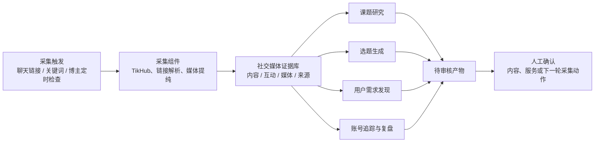

> 状态：proposed
> 版本：0.1.0
> owner：CEO / Product Spec Lead
> last_updated：2026-07-26
> source_of_truth：projects/content-matrix/specs/2026-07-26-社交媒体情报与运营系统重构方案.md
> supersedes：2026-07-21-AI营销获客系统组件化重构方案.md 中“采集后默认创建研究请求与候选选题”的口径

# 社交媒体情报与运营系统重构方案

## 1. 重新定义

“AI 营销获客系统”过早把系统目的限定为获客，也把采集后的内容默认导向评论、洞察和选题。实际系统围绕社交媒体证据运作，获客只是其中一个可能结果。

本系统更准确的名称是：**社交媒体情报与运营系统**。

它先稳定获得、保存和组织公开社交媒体证据，再由人或 Agent 按目标发起不同的加工任务。

```text
社交媒体采集
-> 社交媒体证据库
-> 按场景选择加工任务
-> 研究成果 / 候选选题 / 需求假设 / 内容行动
-> 人工确认与外部反馈
```

采集不等于研究，内容有评论不等于需要做需求分析，互动高不等于可以作为市场结论。

## 2. 系统边界

### 2.1 系统负责

- 采集公开内容、账号、文本、媒体、评论、回复和平台可获得的互动指标。
- 保留来源、采集时间、内容唯一键、原始响应与本地媒体工件，使样本可复查。
- 按明确任务筛选证据、提纯媒体、归纳模式、生成待审核结果。
- 为内容研究、选题、需求发现、账号追踪和发布复盘提供同一套证据基础。

### 2.2 系统不负责

- 不将任意内容自动升级为研究、选题或商机。
- 不把单条评论、一次高互动或模型推断当作真实需求结论。
- 不绕过平台权限，不承诺获取平台未公开的浏览、私信、成交或用户画像数据。
- 不自动发布、私信、报价、成交或替代人工业务判断。

## 3. 核心对象模型

系统的中心从“研究请求”调整为“社交媒体证据”。研究请求改为可选加工任务之一。

| 对象 | 含义 | 默认是否创建 | 主要载体 |
| --- | --- | --- | --- |
| 采集触发 | 一次需要获取数据的动作，例如聊天链接、关键词、已追踪博主 | 是 | 飞书聊天、链接收件箱、定时任务 |
| 社交媒体证据 | 已标准化的内容、账号、评论、回复、互动指标、媒体与原始来源 | 是 | 飞书内容/评论表 + 本地原始工件 |
| 证据集合 | 为一个目的选出的可复用内容与互动样本 | 仅按需 | 本地清单 + 飞书筛选视图 |
| 加工任务 | 对证据集合执行的明确工作，例如课题研究、选题、需求发现 | 仅按需 | “研究请求”表演进为“加工任务” |
| 洞察产物 | 带证据引用的研究结论、候选选题、需求假设或账号观察 | 仅加工任务产生 | 飞书洞察表 + 飞书文档/本地报告 |
| 行动与反馈 | 选题采用、内容发布、客户沟通、验证结果 | 人工确认后 | 内容项目与服务项目台账 |



## 4. 采集与加工解耦

### 4.1 采集阶段的统一动作

不同入口只决定“何时采、采什么”，不预设后续用途。

| 触发场景 | 触发方式 | 默认采集范围 | 默认输出 |
| --- | --- | --- | --- |
| 随机发现单条内容 | 飞书聊天贴链接 | 内容详情；视频则尝试文字稿；评论默认不采或只采少量 | 一条内容证据 |
| 明确要看评论 | 聊天指令或加工任务 | 内容详情 + 指定数量评论/回复 | 内容证据 + 互动证据 |
| 关键词探索 | 聊天指令或表格任务 | 小样本搜索结果，按需补详情 | 一组内容证据 |
| 对标账号拆解 | 人工确认账号与主题后发起 | 账号资料 + 最近 N 条内容 | 账号证据集合 |
| 每日博主追踪 | Creator Worker 定时运行 | 启用、每日检查且有有效主题路由的账号的近期内容 | 按主题路由的新增内容证据 |

默认规则：单条链接先只采内容本身。评论、回复、视频转写、账号扩展和跨平台搜索都必须由任务目的或明确指令启用。

### 4.2 加工阶段的共同规则

加工任务必须明确四项：目的、证据范围、方法、产物类型。

```text
加工任务 = 为什么处理 + 使用哪些证据 + 怎样处理 + 交付什么
```

例如“把所有内容都归纳洞察”不是有效任务；“针对企业 AI 服务落地障碍，比较近 30 天 20 条内容的标题、文字稿和高互动评论，形成待验证问题地图”才是有效任务。

## 5. 三类主场景

### 5.1 课题研究

**目的**：从已有证据库提出并回答一个可证伪、能服务当前业务的问题。

```text
已有内容与互动证据
-> 人工或 Agent 提出研究课题
-> 人工确认问题、范围与停止条件
-> 选择证据集合
-> 比较、归类、反例检查
-> 研究报告：发现、证据、反例、未决问题、建议行动
```

课题可以由系统辅助发掘，但必须由人工确认。课题候选的来源包括：重复出现的话题、内容与互动之间的矛盾、同类账号的稳定差异、已有服务假设缺少证据的位置。

| 研究课题示例 | 可用证据 | 产物 |
| --- | --- | --- |
| 企业在谈 AI 落地时，最常出现的具体阻塞点是什么 | 内容文字稿、评论、回复、互动高的表达片段 | 问题地图与待验证假设 |
| 哪些 AI 内容形式更容易被保存或转发 | 内容结构、发布时间、平台可提供的收藏/分享/点赞指标 | 表达模式观察，不直接等同因果 |
| 某类对标账号如何把抽象技术讲成可理解案例 | 账号近期作品、文字稿、标题、互动指标 | 内容结构拆解 |

### 5.2 选题功能

**目的**：为指定账号生成可写、可验证、能表达真实经验的候选选题。

选题不是内容库的自动副产物，而是一个有账号、受众、表达目标和约束的加工任务。

```text
选择账号与目标
-> 选择证据集合
-> 提取可表达的矛盾、问题、案例、反常识或方法
-> 生成候选选题
-> 人工挑选、补充自身经验与立场
-> 进入草稿流程
```

候选选题至少应带：适用账号、目标受众、证据链接、核心问题、独特角度、不可承诺的边界、建议内容形式。没有自身经验或可靠证据支撑的题目，只能标为“观察待验证”，不能直接进入发布。

### 5.3 用户真实需求发现

**目的**：形成可进一步验证的用户问题与服务假设，不是把评论按关键词聚类。

需求信号可以来自多类互动与内容关系：

| 信号来源 | 可观察内容 | 能说明什么 | 不能单独说明什么 |
| --- | --- | --- | --- |
| 评论与回复 | 具体问题、反复追问、抱怨、求资源、异议 | 用户语言和困惑线索 | 市场规模或付费意愿 |
| 互动指标 | 点赞、评论、收藏、转发/分享等平台可提供数据 | 内容或表达被关注的程度 | 互动者是谁、为什么互动、是否愿意购买 |
| 内容本身 | 创作者反复讲的问题、案例、产品演示、标题承诺 | 供给侧在回应什么问题 | 用户真实痛点已被证明 |
| 跨内容重复 | 多账号、多平台中持续出现的相似描述 | 问题可能具有普遍性 | 某个细分人群的优先级 |
| 互动与内容的组合 | 高保存内容中的具体步骤、引发长回复的争议点、同题不同表达的差异 | 下一轮访谈、内容测试或服务验证的假设 | 直接的成交结论 |

需求发现任务的产物是“需求假设卡”，最少包含：用户原话或内容片段、信号类型、证据数量与范围、反例、待验证问题、建议的下一步验证方式。只有真实访谈、咨询、表单、私信或购买行为等外部证据，才可将假设升级为验证结果。

## 6. 运行形态

| 能力 | 形态 | 触发方式 | 说明 |
| --- | --- | --- | --- |
| 链接解析、去重、字段映射、飞书写入 | Tool（工具） | 被工作流或 Agent 调用 | 确定性、可测试 |
| 平台详情、账号、评论、互动指标采集 | Tool / MCP | 按需或定时 | TikHub 是当前数据源，可替换 |
| 单条内容入库 | Workflow（工作流） | 飞书聊天或收件箱 | 默认不创建加工任务 |
| 每日博主追踪 | Workflow + 定时 Worker | 每天固定时间 | 只处理启用、每日检查且具有有效主题路由的追踪账号 |
| 媒体文字稿 | Workflow | 内容是视频且任务需要时 | 字幕优先，转写兜底 |
| 课题生成与研究报告 | Agent | 人工确认的课题任务 | 需要反例与证据范围 |
| 选题生成 | Agent | 人工选择账号与目标 | 输出候选，不自动成稿 |
| 需求发现 | Agent | 人工设定人群/问题/范围 | 输出假设卡，不判定成交 |
| 飞书聊天理解与任务路由 | Hermes Agent | 用户对话 | 选择工具与工作流，不保存第二套数据库 |
| 添加/更新博主追踪 | Hermes Agent + Workflow | 飞书聊天，人工确认后 | 解析主页、确认主题与频率，再写系统级追踪表 |

## 7. 飞书信息架构调整方向

现有“内容更新”“评论样本”“博主账号”表继续作为证据层；不因新设计立即重建。后续按真实通路逐步调整字段。

| 现有表 | 新角色 | 调整方向 |
| --- | --- | --- |
| 博主账号 | 追踪对象与对标样本 | 由飞书聊天创建或更新；增加或明确“关联主题”“检查频率”；一个博主可按多个主题路由到不同需求库 |
| 内容更新 | 内容证据目录 | 将“分析状态”改为“证据状态”或新增“可用加工场景”；增加文字稿、文字稿来源、内容提纯状态和互动快照时间 |
| 评论样本 | 互动证据目录 | 保留评论与回复关系；不预设每条都要标需求类型 |
| 研究请求 | 加工任务目录 | 改名为“加工任务”或增加任务类型：课题研究、选题、需求发现、账号拆解、收藏整理 |
| 洞察与选题 | 洞察产物目录 | 增加产物类型：研究发现、候选选题、需求假设、账号观察；所有产物必须关联证据 |
| 链接收件箱 | 异步采集备用队列 | 不再默认创建研究请求 |
| 文字稿字段 | 长文本阅读交付 | “内容更新”原行保存清理稿、来源与提纯状态；原始证据继续留在本地 |

字段迁移遵循：先在新样本上验证，再补 schema 和历史数据迁移；不因概念重构立即删除既有字段。

## 8. 现有实现的迁移边界

| 现有能力 | 保留方式 | 需要改变 |
| --- | --- | --- |
| TikHub 四平台采集 | 作为证据采集工具保留 | 单条链接默认不强制评论采样 |
| 链接收件箱 | 作为备用异步队列保留 | 不再默认创建研究请求与候选选题 |
| 视频文字稿 | 作为可选媒体加工保留 | 在任务需要时运行，并将清理稿写入飞书内容原行 |
| 研究请求与研究简报 | 演进为加工任务与不同产物模板 | 不再是所有采集的必经步骤 |
| 洞察候选 | 保留为加工产物 | 区分研究发现、选题、需求假设和账号观察 |
| Creator Worker | 保留并部署为每日任务 | 仅处理启用且每日检查的博主 |
| Hermes | 作为按需入口 | 按用户意图选择“只采集”或发起具体加工任务 |

## 9. 下一阶段顺序

1. 先完成飞书聊天单条链接“只采集并回传内容台账结果”的 T1；文字稿在飞书内容原行直接阅读，不自动生成研究请求。
2. 为“加工任务”补任务类型、证据范围和产物类型，先兼容现有研究请求表。
3. 实现一条课题研究纵向切片：从已有内容库提出课题候选 -> 人工确认 -> 研究报告。
4. 实现一条选题纵向切片：选择墨予镜与一组证据 -> 输出候选选题 -> 人工转入草稿。
5. 实现一条需求发现纵向切片：选择内容与互动信号 -> 输出需求假设卡 -> 人工选择验证动作。
6. 独立部署每日 Creator Worker；不与聊天和链接收件箱共享触发语义。

## 10. 命名迁移

- 项目内系统总称：`社交媒体情报与运营系统`。
- “AI 营销获客”改为其中一个业务编排结果：通过社交媒体研究、内容和外部反馈验证服务机会。
- 代码仓 `influencer-tracker` 暂不改名，避免路径、部署和运行配置的无关迁移；待数据对象与入口稳定后再决定是否更名。

## 11. 需求级工作台

系统级总表只保留配置、路由、追踪账号和运行日志。每项实际研究、选题专项或客户项目创建独立的飞书需求库，按需要选用内容证据、互动证据、加工任务和产物表；完整设计见 `2026-07-26-需求级飞书工作台架构.md`。
