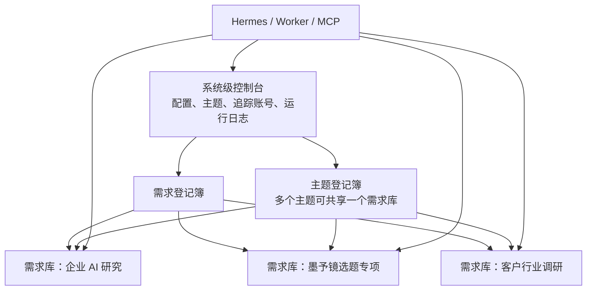

> 状态：proposed
> 版本：0.1.0
> owner：CEO / Product Spec Lead
> last_updated：2026-07-26
> source_of_truth：projects/content-matrix/specs/2026-07-26-需求级飞书工作台架构.md
> depends_on：2026-07-26-社交媒体情报与运营系统重构方案.md

# 需求级飞书工作台架构

## 1. 目的

现有单个飞书多维表格用于演示采集、评论、研究、选题和账号追踪的链路，适合开发验收，但不适合长期日常使用。不同研究、内容专项和客户项目需要各自清晰的范围、字段、权限和结论。

后续采用两层工作台：



- **系统级控制台**只保存跨需求的运行配置与索引，不成为内容和分析正文的堆放处。
- **主题**是采集和加工时使用的语义范围，例如“企业 AI 落地”“AI 职业发展”“疗愈表达”。主题可以跨多个博主，也可以复用同一份证据库。
- **需求库**是数据隔离、协作和交付边界，不等同于一个主题。多个主题可以共用一个需求库；一个主题也可以在不同客户或权限边界下分别建立需求库。
- **本地证据库**仍保存原始响应、媒体、字幕和可复跑工件；需求库只保存可读摘要、链接和结构化状态。

## 2. 系统级控制台

系统级控制台不是“总内容库”，只保留必须跨需求共享的信息。

| 表 | 作用 | 最小字段 | 不存什么 |
| --- | --- | --- | --- |
| 需求登记簿 | 每个需求库的注册表与路由配置 | 需求 ID、名称、类型、状态、飞书 Base 链接/Token、默认路由、负责人、创建/关闭时间 | 内容正文、评论全文、研究结论 |
| 主题登记簿 | 主题与需求库的映射关系 | 主题 ID、名称、描述、默认需求库、隔离级别、状态 | 内容正文、评论全文 |
| 博主追踪 | 已确认的长期追踪账号 | 账号标识、平台、频率、关联主题、状态、最近检查结果 | 该账号所有历史内容全文 |
| 采集运行日志 | 采集任务的审计索引 | 运行 ID、触发来源、需求 ID、数据源、调用数、结果、错误摘要、时间 | API 原始响应、文字稿全文 |
| 链接收件箱 | 异步采集备用队列 | 原始链接、目标需求、状态、结果、错误摘要 | 洞察、选题与长期分析 |

博主追踪不绑定单一需求库。每个博主可关联多个主题；Worker 根据“博主 x 主题”的路由规则将新内容写入相应需求库。未配置任何有效主题路由的账号只允许手动检查，不自动把内容写入任意业务库。

添加、修改、暂停和恢复博主追踪都从飞书聊天发起。系统级“博主追踪”表是配置与审计结果，不要求用户直接填写。

## 2.1 主题、博主与需求库的关系

三者是多对多关系，不能用“一个博主 = 一个主题 = 一个 Base”建模。

```text
博主 A
-> 主题：企业 AI 落地、AI 职业发展
-> 企业 AI 研究库（共享）

博主 B
-> 主题：企业 AI 落地、客户 X 行业案例
-> 企业 AI 研究库（共享）
-> 客户 X 调研库（隔离）
```

| 对象 | 可以关联什么 | 目的 |
| --- | --- | --- |
| 博主 | 多个主题 | 同一个账号的内容可在不同问题下被观察 |
| 主题 | 多个博主、多个需求库 | 定义采集筛选与后续研究语言 |
| 需求库 | 多个主题 | 在同一权限、生命周期和字段合同下复用证据 |

同一内容进入多个需求库时，保留相同的内容唯一键和来源链接。每个需求库只保存自己的“引用记录”和加工结果，避免一个库的状态、标签或客户结论污染另一个库。

## 2.2 飞书聊天添加博主的合同

```text
用户在飞书聊天发送博主主页链接
-> Hermes 解析短链、平台和平台账号 ID
-> Hermes 查询是否已存在同一平台账号
-> 展示确认卡片：博主、平台、主页、主题、检查频率、路由需求库
-> 用户明确确认
-> 写入或更新系统级“博主追踪”记录
-> 每日 Worker 从下一次计划任务开始检查
```

用户可以用自然语言表达，例如：

```text
追踪这个博主：https://...
主题：企业 AI 落地、AI 职业发展
每天检查，写入“企业 AI 研究库”
```

Hermes 必须补齐或要求确认以下信息，不能仅凭主页链接直接启用每日采集：

| 字段 | 规则 |
| --- | --- |
| 博主主页与平台账号 ID | 系统解析；解析失败时不创建启用记录 |
| 主题 | 至少一个已登记主题；可多选 |
| 每个主题的路由需求库 | 必须是运行中的需求库；可多个主题共享一个库 |
| 检查频率 | 每日、每周或手动；默认手动，不默认开启每日 |
| 启用状态 | 仅在用户确认卡片后设为启用 |

同一平台账号已存在时，Hermes 展示已有主题与路由，询问“追加主题、修改频率、暂停或保持不变”，而不是创建重复博主记录。

## 3. 需求库模板

每个需求只创建它需要的表，不强制复制所有 Demo 表。

### 3.1 基础模板：内容证据库

适用于：收藏整理、某一段内容参考、轻量对标观察。

| 表 | 是否必需 | 用途 |
| --- | --- | --- |
| 内容证据 | 是 | 内容元数据、互动快照、来源链接、文字稿文档链接、证据状态 |
| 加工任务 | 否 | 当用户明确要做研究、选题或需求发现时创建 |
| 产物 | 否 | 保存可追溯的研究发现、选题或需求假设 |

### 3.2 研究模板：课题研究

适用于：市场研究、方法论研究、对标研究、客户前置研究。

| 表 | 是否必需 | 用途 |
| --- | --- | --- |
| 内容证据 | 是 | 课题样本与来源索引 |
| 互动证据 | 按需 | 评论、回复及互动信号；只在课题需要时采集 |
| 加工任务 | 是 | 课题问题、范围、停止条件、证据集合、状态 |
| 研究发现 | 是 | 发现、反例、未决问题、建议行动与证据引用 |

### 3.3 运营模板：选题专项

适用于：墨予镜月度选题、一镜一梳内容专项、产品发布前内容准备。

| 表 | 是否必需 | 用途 |
| --- | --- | --- |
| 内容证据 | 是 | 外部案例、表达材料与可引用片段 |
| 加工任务 | 是 | 账号、目标受众、内容目标、证据范围 |
| 候选选题 | 是 | 选题角度、证据、表达边界、状态 |
| 发布反馈 | 按需 | 已采用选题的真实发布链接和外部反馈 |

### 3.4 需求模板：需求发现

适用于：企业 AI 服务机会、产品需求探索、某细分人群问题验证。

| 表 | 是否必需 | 用途 |
| --- | --- | --- |
| 内容证据 | 是 | 供给侧表达与公开案例 |
| 互动证据 | 是 | 评论、回复和互动指标快照 |
| 加工任务 | 是 | 目标人群、待验证问题、样本范围和方法 |
| 需求假设 | 是 | 用户语言、信号类型、反例、待验证动作、结论等级 |
| 外部验证 | 按需 | 访谈、咨询、表单、私信、成交等人工确认事实 |

## 4. 统一字段与需求专属字段

所有需求库共享最小稳定字段，需求专属字段只在模板内出现。

### 4.1 内容证据最小字段

| 字段 | 说明 |
| --- | --- |
| 内容唯一键 | 平台 + 稳定内容 ID；需求内去重键 |
| 平台、内容链接、作者、标题、正文/简介 | 内容来源与基本信息 |
| 发布时间、采集时间、内容类型 | 时间与媒介信息 |
| 点赞、评论、收藏、分享 | 采集时的互动快照，不直接作为结论 |
| 文字稿文档链接、文字稿状态、来源类型 | 长内容的阅读入口与可追溯性 |
| 证据状态 | 待阅读、可引用、忽略、需复核 |

### 4.2 互动证据最小字段

| 字段 | 说明 |
| --- | --- |
| 互动唯一键、内容唯一键 | 去重与关联 |
| 类型 | 评论、回复或平台可得的其他互动 |
| 文本、时间、点赞数 | 原始公开信号 |
| 信号标签 | 可选人工或 Agent 标签，例如提问、抱怨、异议、补充 |
| 证据状态 | 待复核、可引用、忽略 |

“需求类型”“情绪倾向”“是否进入洞察”不再是每个互动证据的必填字段；只有需求发现任务才增加相关分析字段。

## 5. 需求创建合同

创建需求库是一个明确的 Workflow（工作流），不是手工复制已有 Base。

```text
填写需求卡
-> 选择模板
-> 创建飞书多维表格与必要数据表
-> 写入需求登记簿
-> 生成本地 config 与路由文件
-> 返回需求库链接和可用入口
```

### 5.1 需求卡必填项

| 字段 | 示例 |
| --- | --- |
| 需求名称 | 企业 AI 服务落地障碍研究 |
| 类型 | 课题研究 / 选题专项 / 需求发现 / 客户项目 |
| 业务目的 | 为墨予镜内容与企业 AI 服务诊断验证准备证据 |
| 可容纳主题 | 企业 AI 落地、AI 职业发展 |
| 默认路由 | 飞书聊天、关键词或指定主题的追踪内容可写入本需求库 |
| 默认采集策略 | 单条链接仅内容；需求发现才采评论；每次样本上限 |
| 负责人和访问边界 | 谁可查看、谁可编辑；客户项目单独隔离 |
| 生命周期 | 草拟、运行中、暂停、归档 |

### 5.2 创建后的固定产物

- 飞书 Base 链接和 Base Token（仅写入服务器私有配置与需求登记簿索引）。
- `requirements/<需求ID>.json` 本地路由配置，不提交密钥。
- 一份需求说明文档，记录目的、字段、采集边界和人工审核规则。
- Hermes 可识别的需求名称与可用动作列表。

## 6. 采集路由规则

采集入口先确定主题，再由主题判断写入哪个需求库；不能以“总表默认接收”或“博主单一默认库”代替路由。

| 入口 | 路由规则 | 未指定需求时 |
| --- | --- | --- |
| 飞书聊天单条链接 | 用户说出需求或主题；Hermes 根据上下文建议主题并要求确认 | 暂存到系统级收件箱，要求选择主题或需求库，不自动入业务库 |
| 飞书聊天博主主页 | 用户说出“追踪”并粘贴主页；Hermes 先展示确认卡片 | 不创建启用追踪记录，要求明确主题、路由和频率 |
| 链接收件箱 | 人工填“目标主题”；Worker 将主题解析为对应需求库 | 保留待处理，不调用采集 |
| 每日博主追踪 | 读取博主关联的启用主题；每个主题分别路由到对应需求库 | 跳过该主题并回写“缺少有效主题路由”，其他主题仍可继续 |
| 关键词/课题任务 | 加工任务自身指定主题和需求库 | 拒绝执行，提示创建或选择主题与需求库 |

一个内容可以在不同需求库中各存一条“引用记录”，也可以在同一需求库中被多个主题共同引用。跨需求复用时，复制的是结构化引用和必要摘要，不复制原始媒体文件。

### 6.1 何时共享，何时拆分

| 判断问题 | 结论 |
| --- | --- |
| 主题使用同一批证据、相同协作者、相同隐私边界，且字段基本一致吗？ | 放入同一需求库，用“主题”字段和视图区分 |
| 是同一主题，但客户、访问权限、商业保密边界或交付责任不同吗？ | 建立独立需求库，主题可复用 |
| 需要不同的核心字段、不同的审核状态或完全不同的产物模板吗？ | 建立独立需求库 |
| 只是暂时想从另一角度看同一批内容吗？ | 先新增主题和视图，不急于拆库 |

## 7. 总表 Demo 的处置

当前总表保留为 `社交媒体情报系统 Demo`，用途限于：

- 开发联调、字段试验和回归测试。
- 新平台或新采集器的受控真实样本验证。
- 尚未选择目标需求的暂存链接与运行日志。

不得将它继续当作长期业务内容库、客户研究库或账号运营台账。已有样本不强制迁移；从第一个正式需求库创建后，新采集结果按路由写入需求库。

## 8. 实施顺序

1. 将现有总表标记为 Demo，不迁移历史数据。
2. 定义并实现 `需求登记簿` 与本地路由配置格式。
3. 实现 `create-demand-workspace` 命令：按模板创建 Base、必要表与私有配置。
4. 将单条聊天采集改为必须选择需求或进入暂存，不再直接写总表。
5. 将 Creator Worker 改为读取博主关联主题的路由，并每日将新增内容写入一个或多个指定需求库。
6. 以一个真实需求库完成课题研究、选题或需求发现的纵向验收后，再扩展更多模板。

## 9. 现在不做

- 不复制所有 Demo 表到每个需求库。
- 不在创建需求库时自动生成大量视图、仪表盘或自动化规则。
- 不自动判断一条链接属于哪个商业主题；Hermes 可以建议，但必须由人确认。
- 不将不同客户项目、公开内容专项和个人账号素材混在同一个需求库。
