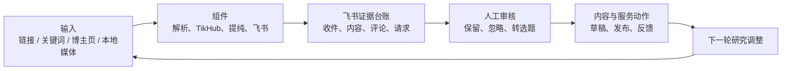

> 状态：working
> 版本：0.1.0
> owner：CEO / Content Lead / Engineering
> last_updated：2026-07-25
> source_of_truth：projects/content-matrix/tasks/2026-07-25-AI营销获客系统真实运行通路复核计划.md
> depends_on：2026-07-21-AI营销获客系统组件化重构方案.md、2026-07-23-iPhone链接收件与飞书群编排规格.md

# AI 营销获客系统真实运行通路复核计划

## 1. 目的

当前系统已具备多个组件和局部联调记录。下一阶段不继续横向增加功能，而是逐条以真实输入跑通通路，复核飞书多维表格字段、状态和人工操作是否自然可用。

本阶段的完成标准是“可重复使用的真实工作流”，不是“命令可运行”或“测试通过”。每条通路都必须留下：真实输入、飞书原行、处理结果、本地证据、人工决定和异常处理记录。



## 2. 运行原则

- 飞书多维表格是日常操作台和状态看板；本地文件保存原始响应、研究简报、转写稿及可复跑工件。
- 自动化只负责采集、标准化、去重、写入和状态回写；是否值得研究、是否转选题、是否发布和是否构成服务机会均由人工判断。
- 每一条飞书手工创建的记录都以飞书 `record_id`（记录 ID）为身份。解析出的平台账号 ID、内容 ID 只能补全该行，不能成为新增同类记录的理由。
- 先使用小样本和单页评论验证。分页、大批量账号追踪、定时任务和 Agent Loop（代理循环）均不作为当前通路的前置条件。
- 任何字段调整先说明旧字段、目标语义、迁移影响和回滚方式；不得仅因一次样本异常改变长期数据合同。
- TikHub 调用、失败原因、人工改动和重复判断需要可追溯。密钥、完整 API 响应和敏感沟通内容不写入飞书。

## 3. 通路总览与优先级

| 顺序 | 通路 | 当前状态 | 本轮目标 | 通过标准 |
| --- | --- | --- | --- | --- |
| T1 | 飞书网页手工粘贴内容链接 | 待真实验收 | 验证最常用的随机发现收件 | 同一收件箱行完成回写，形成内容、评论、研究请求和简报 |
| T2 | iPhone 快捷指令/API 收件 | 待 HTTPS 真实验收 | 验证手机复制链接后的异步收件 | API 入队、飞书回写与 T1 的后续结果一致 |
| T3 | 飞书手工新增博主主页 | 已局部真实验证 | 验证短链解析和原行回写 | 不新建博主行；同一行补全账号 ID 并完成账号采样 |
| T4 | 单篇内容详情研究 | 已有局部联调 | 验证研究目的与人工审核体验 | 内容、评论和候选结论可追溯，且不自动转草稿 |
| T5 | 关键词小样本调研 | 已有局部联调 | 验证样本范围、成本和研究简报 | 结果可说明样本上限、调用数和证据不足处 |
| T6 | 本地媒体提纯 | 待真实验收 | 验证字幕/音视频到清理稿 | 原文、转写和清理稿可定位，不自动下载平台媒体 |
| T7 | 洞察确认到草稿交接 | 已局部模拟/交接 | 验证人工确认的状态门 | 只有“已转选题”候选能生成可编辑交接包 |
| T8 | 发布反馈到服务验证 | 待真实验收 | 验证真实链接、反馈与服务线索归档 | 真实发布链接和人工事实回写，不自动判断成交 |
| T9 | 每周 Agent Loop 准入 | 未启用 | 只检查是否达到启用条件 | 至少 3 个真实闭环后再人工决定是否启用 |

## 4. 每条通路的固定验收记录

每次执行 T1 至 T8 时，在对应 QA 或 delivery（交付）文件记录下列项目。一次真实运行只证明该次样本和当时外部接口有效，不自动升级为永久规则。

| 记录项 | 要回答的问题 |
| --- | --- |
| 用户动作 | 用户在飞书、iPhone 或本地文件中做了什么？ |
| 输入字段 | 填了哪些字段，哪些字段必须留空让系统补齐？ |
| 自动处理 | 调用了哪些 Tool（工具）或 Workflow（工作流）？ |
| 飞书写入/回写 | 创建或更新了哪张表的哪一行、哪些字段？ |
| 本地输出 | 生成了什么队列、研究简报、转写稿或日志路径？ |
| 人工确认点 | 用户需要作出什么业务判断？ |
| 测试动作 | 用了哪个真实样本、命令或 Worker？ |
| 通过标准 | 哪些数据、状态和去重结果必须成立？ |
| 异常处理 | 失败后如何保留原始输入、显示原因和显式重试？ |
| 实际状态 | 未执行、通过、部分通过或阻塞；阻塞必须写明外部原因。 |

## 5. 第一轮执行：T1 飞书链接收件箱

这是第一条要真实打通的通路。它不依赖 iPhone、服务器 HTTPS 或定时调度，能最快暴露表格字段和人工操作问题。

```text
飞书网页“链接收件箱”新建一行
-> 仅填“原始链接”，状态留空或选“待处理”
-> Worker 扫描该行，补齐收件 ID、最终链接、平台、来源
-> TikHub 采集内容详情与一页评论
-> 去重写入“内容更新”“评论样本”“研究请求”
-> 回写同一收件箱行的状态、结果、重试次数和错误摘要
-> 人工查看研究简报，决定保留、忽略或转入后续研究
```

### T1 字段操作合同

| 表 | 人工填写 | 系统填写 | 人工不要做 |
| --- | --- | --- | --- |
| 链接收件箱 | 原始链接；可选来源；状态留空或“待处理” | 收件 ID、最终链接、平台、链接类型、收件时间、处理结果、重试次数、错误摘要 | 不手填收件 ID；不要在处理中改链接或状态 |
| 内容更新 | 无 | 内容唯一键、内容 ID、标题、正文/简介、指标、采集时间 | 不用标题判断重复；不把内容作者当已追踪博主 |
| 评论样本 | 无 | 评论唯一键、内容唯一键、评论文本、基础指标 | 不将单条评论直接标为市场结论 |
| 研究请求 | 无 | 请求 ID、样本数、调用数、简报路径、待人工确认状态 | 不把“待人工确认”改为“已发布” |

### T1 验收清单

- [ ] 飞书网页新增一条仅含支持平台内容链接的收件箱记录。
- [ ] Worker 识别该记录并回写同一 `record_id`，没有重复创建收件行。
- [ ] 内容唯一键去重有效；重复粘贴时能指向已有结果或安全结束。
- [ ] 内容、评论、研究请求均能在飞书筛选到，且研究简报路径存在于本地。
- [ ] 收件箱显示可理解的完成或失败原因；失败后原始链接仍保留。
- [ ] 人工复核字段是否足够完成“收藏整理”决定，并记录需改字段而非直接猜测修改。

## 6. 第二轮执行：T3 博主主页原行回写

账号追踪是补充能力，不是日常主入口。它必须保护用户手工建档的原行身份。

```text
飞书“博主账号”手工新增一行
-> 填来源链接，采集动作选“待解析链接”
-> Worker 展开官方短链，识别博主主页
-> 在同一行回写平台、主页链接、平台账号 ID 和状态
-> 采集动作转为“待检查”或按用户选择继续
-> 账号采样后回写最近检查时间、最近内容时间、任务报告
```

### T3 不变量

- 手工行的飞书 `record_id` 是唯一回写目标。
- 抖音等平台从主页解析出的 `sec_uid`（安全用户 ID）用于采集，但只能覆盖该行的“平台账号ID”。
- 内容详情、关键词搜索返回的作者信息不能自动创建“博主账号”行。
- 解析为单条内容或未识别链接时，停止账号采集并回写“需人工处理”。
- 平台账号 ID 相同的明确追踪请求才允许去重；名称相同、短链不同都不是安全的合并依据。

## 7. 飞书字段合同复核表

此表是当前 schema（字段定义）的复核基线。标记“待复核”的字段必须在相关真实通路运行后才决定保留、重命名、拆分或删除。

### 7.1 博主账号

| 字段 | 写入方 | 必填条件与允许值 | 更新时机 | 禁止或待复核 |
| --- | --- | --- | --- | --- |
| 博主名称 | 人工优先，系统可补充 | 显式追踪账号；文本 | 建档/解析后 | 不以名称去重 |
| 平台 | 人工或系统 | 抖音、小红书、公众号、视频号 | 解析或人工确认 | 待统一中文展示，内部 ID 不进飞书 |
| 平台账号ID | 系统回写或人工确认 | 已确认主页；文本 | 主页解析后 | 不能据此新建手工原行的副本 |
| 主页链接、来源链接、链接类型 | 人工输入 + 系统补全 | 主页/短链来源；链接类型为自动、博主主页、单条内容 | 建档及解析后 | 单条内容不能启动账号采集 |
| 启用状态、检查频率 | 人工 | 启用/暂停/待确认/失效；每日/每周/手动 | 人工策略调整 | 待复核是否保留“每日/每周”，当前不做自动调度 |
| 采集动作、任务状态 | 人工触发 + 系统回写 | 待解析链接、待检查、待回溯；空闲、执行中、完成、失败 | 每次 Worker 执行 | 不手改“执行中”；待复核是否合并为一个状态字段 |
| 最近检查时间、最近内容时间、最近状态、失败原因、任务报告 | 系统 | 采集完成或失败 | 每次账号采样 | 失败原因只写可操作摘要 |
| 数据源类型、数据源地址、采集起始日期、任务锁定时间 | 系统/人工 | TikHub/手工；按需 | 有实际来源或回溯任务时 | 待复核低频字段是否移至本地报告 |

### 7.2 内容更新

| 字段 | 写入方 | 必填条件与允许值 | 更新时机 | 禁止或待复核 |
| --- | --- | --- | --- | --- |
| 内容唯一键 | 系统 | 平台 + 稳定内容 ID | 每次入库 | 唯一去重依据；不可手改 |
| 平台、内容ID、内容链接 | 系统 | 支持平台及合法公开链接 | 采集时 | 不用分享短链替代稳定 ID |
| 博主 | 系统 | 作者显示名，可为空 | 采集时 | 仅为来源元数据，不代表追踪账号 |
| 标题、正文/简介、发布时间、采集时间、内容类型、标签 | 系统 | 以平台返回为准 | 采集时 | 待复核正文长度与飞书字段容量 |
| 点赞数、评论数、收藏数、转发/分享数 | 系统 | 数值，可为空 | 采集时 | 不将单次指标作为需求或成交判断 |
| 分析状态 | 人工 | 待分析、已分析、忽略、需人工复核 | 人工读完证据后 | 待复核是否由“研究请求状态”替代 |

### 7.3 评论样本

| 字段 | 写入方 | 必填条件与允许值 | 更新时机 | 禁止或待复核 |
| --- | --- | --- | --- | --- |
| 评论唯一键、内容唯一键、评论文本 | 系统 | 稳定评论 ID；关联内容；公开评论文本 | 采样时 | 评论唯一键不可手改 |
| 评论时间、点赞数、用户标识 | 系统 | 平台可提供时写入 | 采样时 | 用户标识仅做去重，不用于画像或联系 |
| 需求类型、情绪倾向、是否进入洞察 | 人工或后续洞察 Agent | 已定义枚举 | 人工复核后 | 待复核是否需要增加“证据等级”；不自动标注 |

### 7.4 洞察与选题

| 字段 | 写入方 | 必填条件与允许值 | 更新时机 | 禁止或待复核 |
| --- | --- | --- | --- | --- |
| 洞察标题、证据摘要、建议动作 | Agent 生成，人工修订 | 至少指向内容或评论证据 | 候选产生时 | 不脱离来源证据写结论 |
| 来源内容、来源评论 | 系统 | 内容/评论唯一键列表 | 候选产生时 | 不用自然语言替代可定位 ID |
| 洞察类型、适用账号 | Agent 建议，人工确认 | 选题/用户需求/竞品观察/表达方式/产品线索；墨予镜/一镜一梳 | 审核时 | 企业 AI 服务内容默认归墨予镜，不建独立账号 |
| 状态 | 人工确认后系统同步 | 待处理、已转选题、已验证、暂存 | 人工审核 | “已验证”必须有人工验证依据；待复核是否拆出“忽略” |

### 7.5 研究请求

| 字段 | 写入方 | 必填条件与允许值 | 更新时机 | 禁止或待复核 |
| --- | --- | --- | --- | --- |
| 请求ID、研究目的、服务方向、目标账号 | 系统创建，人工可指定目标 | 每次研究唯一；目标可为墨予镜、一镜一梳或客户项目 | 创建时 | 不用飞书标题替代请求 ID |
| 采集方式、平台、样本上限 | 人工输入或模板默认 | 详情、关键词搜索、账号采样；四平台 | 创建时 | 样本上限要与实际成本匹配 |
| 内容样本数、评论样本数、TikHub调用数 | 系统 | 数值 | 完成时 | 无评论不能得出评论需求结论 |
| 状态、下一步 | 系统初始，人工推进 | 待人工确认、已转选题、已发布、已结束 | 审核/反馈时 | 只有反馈 Workflow 可写“已发布” |
| 研究简报路径、创建时间、更新时间 | 系统 | 项目内相对路径、日期 | 创建/更新时 | 不写入 API 原始响应或本机绝对路径 |

### 7.6 链接收件箱

| 字段 | 写入方 | 必填条件与允许值 | 更新时机 | 禁止或待复核 |
| --- | --- | --- | --- | --- |
| 原始链接 | 人工或 API | 四平台公开 HTTP/HTTPS 链接 | 收件时 | 不在处理中修改；失败也必须保留 |
| 收件ID、最终链接、平台、链接类型、收件时间、来源 | 系统为主 | 内容、博主主页、未识别；来源可为飞书网页/iPhone | 入队/解析时 | 不手填收件 ID；待复核“来源”是否改为单选 |
| 状态 | 系统为主 | 待处理、处理中、已完成、失败、需人工处理 | Worker 生命周期 | 只通过显式重试把失败送回待处理 |
| 处理结果、重试次数、错误摘要 | 系统 | 请求 ID/内容唯一键；数值；简短原因 | 完成或失败时 | 不写入密钥、完整响应和堆栈 |

## 8. 字段调整决策流程

```text
真实通路出现字段摩擦
-> 在 QA 记录具体样本、当前字段和问题
-> 判断是填写说明、状态逻辑、字段选项还是字段缺失
-> 提出最小调整及历史数据影响
-> 更新 schema、操作说明和测试
-> 在飞书新样本验证
-> 将调整原因记录到 delivery
```

字段调整的默认优先级：先改操作说明和状态约束；只有信息确实无法表达时才新增字段；同一语义重复出现时才合并或删除字段。

## 9. 后续执行节奏

1. 完成 T1，并创建一份对应 QA 记录与一份交付记录。
2. 根据 T1 的真实摩擦，只调整“链接收件箱、内容更新、评论样本、研究请求”相关字段。
3. 完成 T3，并重点核验“博主账号”的原行回写与短链账号 ID 覆盖。
4. 依次完成 T2、T4、T5、T6、T7、T8；每次只处理当前通路暴露的问题。
5. 累积至少 3 条真实“研究 -> 发布 -> 外部反馈 -> 下一轮调整”记录后，再运行 T9 准入评估。

## 10. 当前不做

- 不把账号日更、周报或复杂自动重试恢复为默认主路径。
- 不自动发布、私信、评论、报价或判定成交。
- 不从平台内容作者自动创建追踪账号。
- 不把飞书群聊天、飞书表格或 API 响应中的任一种单独当作全部事实来源。
- 不因模拟数据、dry-run（不写入演练）或单次接口成功声称业务闭环完成。
