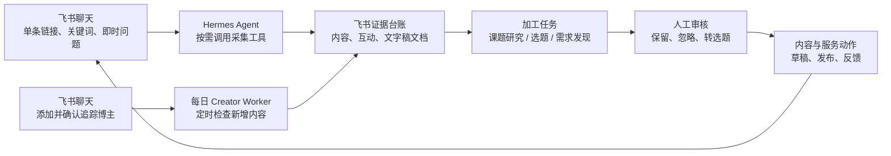

> 状态：working
> 版本：0.2.0
> owner：CEO / Content Lead / Engineering
> last_updated：2026-07-26
> source_of_truth：projects/content-matrix/tasks/2026-07-25-AI营销获客系统真实运行通路复核计划.md
> depends_on：2026-07-26-社交媒体情报与运营系统重构方案.md、2026-07-23-iPhone链接收件与飞书群编排规格.md

# 社交媒体情报与运营系统真实运行通路复核计划

## 1. 目的

当前系统已具备多个组件和局部联调记录。下一阶段不继续横向增加功能，而是逐条以真实输入跑通通路，复核飞书多维表格字段、状态和人工操作是否自然可用。采集默认只形成社交媒体证据；研究、选题、需求发现等加工任务必须由明确目的触发。采集分为账号追踪和单条链接采集两条线；单条链接按“基本信息、内容本体与文字稿、评论与回复”分层执行，详见 [社交媒体采集双线与分层合同](../specs/2026-07-27-社交媒体采集双线与分层合同.md)。

本阶段的完成标准是“可重复使用的真实工作流”，不是“命令可运行”或“测试通过”。每条通路都必须留下：真实输入、飞书原行、处理结果、本地证据、人工决定和异常处理记录。



## 2. 运行原则

- 飞书多维表格是日常操作台和状态看板；本地文件保存原始响应、研究简报、转写稿及可复跑工件。
- 单条随机内容的主入口是飞书聊天：Hermes 收到链接后按需采集，不等待轮询。默认执行一级基本信息和二级内容文字稿；评论与回复仅在用户明确要求或加工任务需要时采集。长文字稿交付为飞书文档，台账只保存链接、分层状态和摘要。
- 添加、修改、暂停和恢复博主追踪均从飞书聊天发起；Creator Worker 只处理经确认启用的账号，并每天固定时间运行一次，不扫描链接收件箱。
- 链接收件箱保留为备用入口：飞书网页批量录入、iPhone 快捷指令或 Hermes 暂不可用时可入箱。它不承担日常单条链接的默认处理方式，轮询频率应低于博主追踪以外的即时需求。
- 自动化只负责采集、标准化、去重、写入和状态回写；是否值得研究、是否转选题、是否发布和是否构成服务机会均由人工判断。
- 每一条飞书手工创建的记录都以飞书 `record_id`（记录 ID）为身份。解析出的平台账号 ID、内容 ID 只能补全该行，不能成为新增同类记录的理由。
- 先使用小样本和单页评论验证。分页、大批量账号追踪、定时任务和 Agent Loop（代理循环）均不作为当前通路的前置条件。
- 任何字段调整先说明旧字段、目标语义、迁移影响和回滚方式；不得仅因一次样本异常改变长期数据合同。
- TikHub 调用、失败原因、人工改动和重复判断需要可追溯。密钥、完整 API 响应和敏感沟通内容不写入飞书。

## 3. 通路总览与优先级

| 顺序 | 通路 | 当前状态 | 本轮目标 | 通过标准 |
| --- | --- | --- | --- | --- |
| T1 | 飞书聊天单条链接按需采集 | 待实现 | 验证即时采集、文字稿文档交付和证据入库 | 聊天发链接后，产生内容证据和可打开的飞书文字稿文档；不默认创建加工任务 |
| T2 | 链接收件箱备用入口 | 已通过，2026-07-26；待按分层合同复验 | 验证网页手工粘贴与异步兜底 | 同一收件箱行完成回写，默认形成 L1 内容证据和 L2 文字稿；仅明确要求时采评论 |
| T3 | iPhone 快捷指令/API 收件 | 待 HTTPS 真实验收 | 验证手机复制链接后的备用异步收件 | API 入队、飞书回写与 T2 的后续结果一致 |
| T4 | 飞书聊天添加博主与每日追踪 | 已有 Worker 代码，待聊天入口与定时部署验收 | 验证主页解析、确认卡片和每日新增内容检查 | 聊天确认后创建或更新同一追踪记录；仅处理启用且有主题路由的博主 |
| T5 | 课题研究 | 待实现 | 验证从证据库到研究报告 | 人工确认课题后，产物含发现、反例、未决问题和建议行动 |
| T6 | 选题生成 | 待实现 | 验证从证据库到指定账号的候选选题 | 每个候选关联证据、受众、角度和表达边界 |
| T7 | 用户真实需求发现 | 待实现 | 验证评论、回复、互动和跨内容重复的综合判断 | 输出可验证的需求假设卡，不将互动直接认定为需求 |
| T8 | 视频文字稿与媒体提纯 | 已真实验证，待飞书文档交付 | 验证平台字幕优先、语音转写兜底与阅读体验 | 原字幕、原始转写和清理稿可定位；飞书可直接打开整理稿 |
| T9 | 洞察确认到草稿交接 | 已局部模拟/交接 | 验证人工确认的状态门 | 只有“已转选题”候选能生成可编辑交接包 |
| T10 | 发布反馈到服务验证 | 待真实验收 | 验证真实链接、反馈与服务线索归档 | 真实发布链接和人工事实回写，不自动判断成交 |
| T11 | 每周 Agent Loop 准入 | 未启用 | 只检查是否达到启用条件 | 至少 3 个真实闭环后再人工决定是否启用 |

## 4. 每条通路的固定验收记录

每次执行 T1 至 T9 时，在对应 QA 或 delivery（交付）文件记录下列项目。一次真实运行只证明该次样本和当时外部接口有效，不自动升级为永久规则。

| 记录项 | 要回答的问题 |
| --- | --- |
| 用户动作 | 用户在飞书、iPhone 或本地文件中做了什么？ |
| 输入字段 | 填了哪些字段，哪些字段必须留空让系统补齐？ |
| 自动处理 | 调用了哪些 Tool（工具）或 Workflow（工作流）？ |
| 飞书写入/回写 | 创建或更新了哪张表的哪一行、哪些字段？ |
| 本地输出 | 生成了什么队列、研究简报、转写稿或日志路径？ |
| 人工确认点 | 用户需要作出什么业务判断？ |
| 测试动作 | 用了哪个真实样本、命令或 Worker？ |
| 通过标准 | 哪些数据、状态和去重结果必须成立？ |
| 异常处理 | 失败后如何保留原始输入、显示原因和显式重试？ |
| 实际状态 | 未执行、通过、部分通过或阻塞；阻塞必须写明外部原因。 |

## 5. 第一轮执行：T1 飞书聊天单条链接按需采集

这是随机发现内容的默认主入口。用户不必打开多维表格、填写字段或等待轮询；在指定飞书聊天中直接发送公开内容链接，并说明可选研究目的，例如“收藏整理”“评论挖需求”或“拆解表达方式”。

```text
飞书聊天：链接 + 可选采集范围
-> Hermes 识别平台和任务类型
-> 按需调用 TikHub 详情与视频文字稿 Workflow
-> 去重写入“内容更新”与本地原始工件
-> 创建飞书文字稿文档，回传文档链接和简短结果
-> 人工在聊天或台账中决定：仅收藏、发起课题研究、生成选题或做需求发现
```

### T1 输入与交付合同

| 环节 | 用户动作 | 系统动作 | 不做什么 |
| --- | --- | --- | --- |
| 聊天输入 | 发送一条支持平台的公开链接；可附“采评论”“转文字稿”等范围 | 识别链接、展开短链、判断内容或主页 | 不要求用户填写收件 ID、平台 ID 或表格字段 |
| 采集 | 等待当次响应 | 默认采内容详情；视频字幕优先、转写兜底；评论仅在明确要求时采集 | 不轮询飞书表格；不自动扩大到账号全量内容 |
| 交付 | 在聊天中接收结果 | 回传内容摘要、内容唯一键、飞书文字稿文档链接和失败说明 | 不在聊天窗口粘贴整篇长文字稿 |
| 台账 | 可选进入飞书表查看证据 | 去重写入内容；如明确采评论则写评论样本 | 不自动创建加工任务、转选题、成稿或发布 |

### T1 验收清单

- [ ] 在飞书聊天中发送一条支持平台内容链接，不创建“链接收件箱”记录也能完成采集。
- [ ] Hermes 只为本次请求调用必要的 TikHub 接口，并在结果中报告调用数量。
- [ ] 内容能在飞书筛选到，重复链接不产生重复内容；未要求评论时不产生评论样本。
- [ ] 视频有文字稿时，聊天返回可打开的飞书文档链接；无文字稿时明确说明降级原因。
- [ ] 不默认创建加工任务、洞察或选题；用户明确发起时才进入对应通路。

## 6. 第二轮执行：T2 链接收件箱备用入口

该入口用于飞书网页批量录入、iPhone 快捷指令和聊天入口不可用时的异步兜底。它保留可靠队列、原行回写、失败重试能力，但不再是单条链接的日常默认入口。

```text
飞书网页“链接收件箱”新建一行
-> 仅填“原始链接”，状态留空或选“待处理”
-> Worker 扫描该行，补齐收件 ID、最终链接、平台、来源
-> TikHub 采集内容详情与内容文字稿
-> 去重写入“内容更新”；仅明确要求时写“评论样本”
-> 回写同一收件箱行的状态、结果、重试次数和错误摘要
-> 人工决定保留、忽略或另行发起加工任务
```

### T2 字段操作合同

| 表 | 人工填写 | 系统填写 | 人工不要做 |
| --- | --- | --- | --- |
| 链接收件箱 | 原始链接；可选来源；状态留空或“待处理” | 收件 ID、最终链接、平台、链接类型、收件时间、处理结果、重试次数、错误摘要 | 不手填收件 ID；不要在处理中改链接或状态 |
| 内容更新 | 无 | 内容唯一键、内容 ID、标题、正文/简介、指标、采集时间、分层采集状态 | 不用标题判断重复；不把内容作者当已追踪博主 |
| 评论样本 | 无 | 仅明确采评论时写入：评论唯一键、内容唯一键、评论文本、基础指标 | 不将单条评论直接标为市场结论 |

### T2 验收清单

- [ ] 飞书网页新增一条仅含支持平台内容链接的收件箱记录。
- [ ] Worker 识别该记录并回写同一 `record_id`，没有重复创建收件行。
- [ ] 内容唯一键去重有效；重复粘贴时能指向已有结果或安全结束。
- [ ] 内容能在飞书筛选到；未要求评论时无评论样本和研究请求；文字稿本地工件可定位。
- [ ] 收件箱显示可理解的完成或失败原因；失败后原始链接仍保留。
- [ ] 人工复核字段是否足够完成“收藏整理”决定，并记录需改字段而非直接猜测修改。

## 7. 第三轮执行：T4 每日博主追踪

账号追踪是定时 Worker 的专属场景，不与单条链接按需采集混用。它必须保护用户手工建档的原行身份，并且只处理人工确认、启用且设置为“每日”的账号。

```text
飞书聊天：追踪这个博主 + 主页链接 + 可选主题/频率
-> Hermes 展开官方短链，识别博主主页与账号 ID
-> Hermes 展示主题、需求库路由和频率确认卡片
-> 用户明确确认后创建或更新系统级“博主追踪”记录
-> 每日固定时间 Creator Worker 检查近期内容
-> 去重写入新增内容；回写最近检查时间、最近内容时间、任务报告
```

### T4 不变量

- 已创建追踪记录的飞书 `record_id` 是唯一回写目标；聊天重复提交同一主页只能更新该记录，不能新增副本。
- 抖音等平台从主页解析出的 `sec_uid`（安全用户 ID）用于采集，但只能覆盖该行的“平台账号ID”。
- 内容详情、关键词搜索返回的作者信息不能自动创建“博主账号”行；必须由用户在飞书聊天明确说“追踪”。
- 解析为单条内容或未识别链接时，停止账号采集并回写“需人工处理”。
- 平台账号 ID 相同的明确追踪请求才允许去重；名称相同、短链不同都不是安全的合并依据。

## 7. 飞书字段合同复核表

此表是当前 schema（字段定义）的复核基线。标记“待复核”的字段必须在相关真实通路运行后才决定保留、重命名、拆分或删除。

### 7.1 博主账号

| 字段 | 写入方 | 必填条件与允许值 | 更新时机 | 禁止或待复核 |
| --- | --- | --- | --- | --- |
| 博主名称 | 系统解析，人工确认 | 显式追踪账号；文本 | 飞书聊天确认后 | 不以名称去重 |
| 平台 | 系统解析，人工确认 | 抖音、小红书、公众号、视频号 | 主页解析后 | 待统一中文展示，内部 ID 不进飞书 |
| 平台账号ID | 系统回写 | 已确认主页；文本 | 主页解析后 | 不能据此新建同一账号的副本 |
| 主页链接、来源链接、链接类型 | 聊天输入 + 系统补全 | 主页/短链来源；链接类型为自动、博主主页、单条内容 | 建档及解析后 | 单条内容不能启动账号采集 |
| 关联主题、启用状态、检查频率 | 用户在聊天确认 | 至少一个主题；启用/暂停/待确认/失效；每日/每周/手动 | 确认卡片后 | 每日账号必须有有效主题路由；手动账号不随定时任务运行 |
| 采集动作、任务状态 | 人工触发 + 系统回写 | 待解析链接、待检查、待回溯；空闲、执行中、完成、失败 | 每次 Worker 执行 | 不手改“执行中”；待复核是否合并为一个状态字段 |
| 最近检查时间、最近内容时间、最近状态、失败原因、任务报告 | 系统 | 采集完成或失败 | 每次账号采样 | 失败原因只写可操作摘要 |
| 数据源类型、数据源地址、采集起始日期、任务锁定时间 | 系统/人工 | TikHub/手工；按需 | 有实际来源或回溯任务时 | 待复核低频字段是否移至本地报告 |

### 7.2 内容更新

| 字段 | 写入方 | 必填条件与允许值 | 更新时机 | 禁止或待复核 |
| --- | --- | --- | --- | --- |
| 内容唯一键 | 系统 | 平台 + 稳定内容 ID | 每次入库 | 唯一去重依据；不可手改 |
| 平台、内容ID、内容链接 | 系统 | 支持平台及合法公开链接 | 采集时 | 不用分享短链替代稳定 ID |
| 博主 | 系统 | 作者显示名，可为空 | 采集时 | 仅为来源元数据，不代表追踪账号 |
| 标题、正文/简介、发布时间、采集时间、内容类型、标签 | 系统 | 以平台返回为准 | 采集时 | 待复核正文长度与飞书字段容量 |
| 点赞数、评论数、收藏数、转发/分享数 | 系统 | 数值，可为空 | 采集时 | 不将单次指标作为需求或成交判断 |
| 分析状态 | 人工 | 待分析、已分析、忽略、需人工复核 | 人工读完证据后 | 待复核是否由“研究请求状态”替代 |

### 7.3 评论样本

| 字段 | 写入方 | 必填条件与允许值 | 更新时机 | 禁止或待复核 |
| --- | --- | --- | --- | --- |
| 评论唯一键、内容唯一键、评论文本 | 系统 | 稳定评论 ID；关联内容；公开评论文本 | 采样时 | 评论唯一键不可手改 |
| 评论时间、点赞数、用户标识 | 系统 | 平台可提供时写入 | 采样时 | 用户标识仅做去重，不用于画像或联系 |
| 需求类型、情绪倾向、是否进入洞察 | 人工或后续洞察 Agent | 已定义枚举 | 人工复核后 | 待复核是否需要增加“证据等级”；不自动标注 |

### 7.4 洞察与选题

| 字段 | 写入方 | 必填条件与允许值 | 更新时机 | 禁止或待复核 |
| --- | --- | --- | --- | --- |
| 洞察标题、证据摘要、建议动作 | Agent 生成，人工修订 | 至少指向内容或评论证据 | 候选产生时 | 不脱离来源证据写结论 |
| 来源内容、来源评论 | 系统 | 内容/评论唯一键列表 | 候选产生时 | 不用自然语言替代可定位 ID |
| 洞察类型、适用账号 | Agent 建议，人工确认 | 选题/用户需求/竞品观察/表达方式/产品线索；墨予镜/一镜一梳 | 审核时 | 企业 AI 服务内容默认归墨予镜，不建独立账号 |
| 状态 | 人工确认后系统同步 | 待处理、已转选题、已验证、暂存 | 人工审核 | “已验证”必须有人工验证依据；待复核是否拆出“忽略” |

### 7.5 研究请求

| 字段 | 写入方 | 必填条件与允许值 | 更新时机 | 禁止或待复核 |
| --- | --- | --- | --- | --- |
| 请求ID、研究目的、服务方向、目标账号 | 系统创建，人工可指定目标 | 每次研究唯一；目标可为墨予镜、一镜一梳或客户项目 | 创建时 | 不用飞书标题替代请求 ID |
| 采集方式、平台、样本上限 | 人工输入或模板默认 | 详情、关键词搜索、账号采样；四平台 | 创建时 | 样本上限要与实际成本匹配 |
| 内容样本数、评论样本数、TikHub调用数 | 系统 | 数值 | 完成时 | 无评论不能得出评论需求结论 |
| 状态、下一步 | 系统初始，人工推进 | 待人工确认、已转选题、已发布、已结束 | 审核/反馈时 | 只有反馈 Workflow 可写“已发布” |
| 研究简报路径、创建时间、更新时间 | 系统 | 项目内相对路径、日期 | 创建/更新时 | 不写入 API 原始响应或本机绝对路径 |

### 7.6 链接收件箱

| 字段 | 写入方 | 必填条件与允许值 | 更新时机 | 禁止或待复核 |
| --- | --- | --- | --- | --- |
| 原始链接 | 人工或 API | 四平台公开 HTTP/HTTPS 链接 | 收件时 | 不在处理中修改；失败也必须保留；单条日常研究优先走飞书聊天 |
| 收件ID、最终链接、平台、链接类型、收件时间、来源 | 系统为主 | 内容、博主主页、未识别；来源可为飞书网页/iPhone | 入队/解析时 | 不手填收件 ID；待复核“来源”是否改为单选 |
| 状态 | 系统为主 | 待处理、处理中、已完成、失败、需人工处理 | Worker 生命周期 | 只通过显式重试把失败送回待处理 |
| 处理结果、重试次数、错误摘要 | 系统 | 请求 ID/内容唯一键；数值；简短原因 | 完成或失败时 | 不写入密钥、完整响应和堆栈 |

## 8. 字段调整决策流程

```text
真实通路出现字段摩擦
-> 在 QA 记录具体样本、当前字段和问题
-> 判断是填写说明、状态逻辑、字段选项还是字段缺失
-> 提出最小调整及历史数据影响
-> 更新 schema、操作说明和测试
-> 在飞书新样本验证
-> 将调整原因记录到 delivery
```

字段调整的默认优先级：先改操作说明和状态约束；只有信息确实无法表达时才新增字段；同一语义重复出现时才合并或删除字段。

## 9. 后续执行节奏

1. 完成 T1，优先验证飞书聊天按需采集和飞书文字稿文档交付，不默认创建加工任务。
2. 将 T2 保持为低频异步备用入口，继续验证 iPhone 场景的 T3。
3. 完成 T4，部署每天固定时间执行的 Creator Worker，并重点核验“博主账号”的原行回写、短链账号 ID 覆盖与新增内容去重。
4. 依次完成 T5（课题研究）、T6（选题）、T7（需求发现）和 T8 至 T10；每次只处理当前通路暴露的问题。
5. 累积至少 3 条真实“加工任务 -> 发布或验证 -> 外部反馈 -> 下一轮调整”记录后，再运行 T11 准入评估。

## 10. 当前不做

- 不把博主每日追踪扩展为全平台、全账号或不受限的高频轮询。
- 不让单条随机链接等待定时 Worker；聊天按需采集失败时才转入链接收件箱备用队列。
- 不自动发布、私信、评论、报价或判定成交。
- 不从平台内容作者自动创建追踪账号。
- 不把飞书群聊天、飞书表格或 API 响应中的任一种单独当作全部事实来源。
- 不因模拟数据、dry-run（不写入演练）或单次接口成功声称业务闭环完成。
