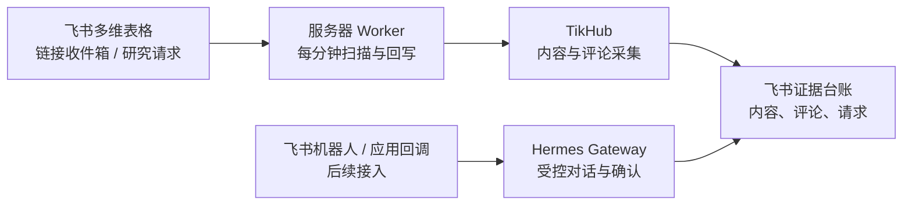

> 状态：working
> 版本：0.2.0
> owner：CEO / Engineering
> last_updated：2026-07-26
> source_of_truth：projects/content-matrix/tasks/2026-07-25-Hermes与服务器Worker上线计划.md
> depends_on：2026-07-25-AI营销获客系统真实运行通路复核计划.md

# Hermes 与服务器 Worker 上线计划

## 1. 目标

将本机手动执行的收件 Worker（后台处理器）迁移到 release 服务器，并让 Hermes 成为后续飞书对话式编排入口。

Hermes 不直接替代 Worker，也不直接读取或写入另一套内容库。它只解释用户意图、展示将执行的动作、获得确认后调用既有工作流，并把结果回写到现有飞书表。

## 2. 当前实机状态

2026-07-26 已在 release 服务器 `42.192.65.145` 完成首轮部署：

- 资源可用：约 78 GB 磁盘空间、6.5 GiB 可用内存。
- Hermes Agent `0.19.0` 已安装于独立 Python 3.12 环境 `/opt/content-matrix-inbox/hermes-venv`；`hermes-content-matrix.service` 已启用并只监听 `127.0.0.1:9119`。
- Hermes 已使用 release 原有 DeepSeek 凭据和 `deepseek-v4-pro` 完成最小模型调用验证。服务密钥和模型配置保存在服务器私有文件，未写入仓库。
- `hermes.jingshu.cc` 已解析到该服务器，但 HTTPS 证书和 Nginx 虚拟主机尚未配置；当前不对公网暴露 Hermes。
- 服务器现有的 Node 进程监听 `4318/4319`，属于已有服务，不能复用端口或改动其进程。
- 当前 release checkout 是脏工作区，且没有 `projects/content-matrix/tools/influencer-tracker`。内容系统必须部署到独立目录，不能在现有 checkout 中直接拉取或修改。
- Worker 源码已同步至独立目录 `/opt/content-matrix-inbox/app`。`link-inbox-worker.timer` 已启用，每分钟调用一次 Worker；首轮空队列检查成功，没有写入新内容。
- Worker 使用服务器专用飞书 CLI 应用的 Bot 身份；已验证能读取“链接收件箱”。TikHub Key、飞书表配置和 Worker 环境文件均为服务器私有文件。

## 3. 目标运行边界

| 组件 | 运行位置 | 网络边界 | 权限 | 不负责 |
| --- | --- | --- | --- | --- |
| Hermes Gateway | release 服务器，本机 `127.0.0.1` | 经 Nginx 以 `https://hermes.jingshu.cc` 暴露；API 仍需密钥 | 模型调用、受控 Tool 调用 | 自动发布、私信、报价、成交判断 |
| 飞书对话适配器 | release 服务器，后续 | 仅接受飞书签名校验后的事件 | 创建或查询既有研究请求 | 直接执行未确认写操作 |
| Link Inbox HTTP Receiver | release 服务器，本机 `127.0.0.1:8787` | 仅 Nginx HTTPS 转发 `POST /v1/inbox/links` | 令牌校验后入队 | 同步等待 TikHub 或自动研究判断 |
| Link Inbox Worker | release 服务器，systemd timer 每分钟 | 主动访问 TikHub 与飞书 | 读取待处理行、回写同一行 | 无界重试、自动转选题 |
| 飞书多维表格 | 飞书 | 日常协作界面 | 人工审核、状态查看 | 存完整 API 原文或模型密钥 |

## 4. 上线顺序

### P0：服务器独立部署基座（已完成）

1. 在 release 服务器建立独立目录，例如 `/opt/content-matrix-inbox/app`，不触碰现有 `/opt/aimandala-release/app/mindsync` 脏工作区。
2. 部署当前已验证的 `influencer-tracker` 代码与 Node 运行环境。
3. 创建仅服务器可读的 `/etc/content-matrix-inbox.env` 和 `config/feishu.local.json`；不得提交或打印其内容。
4. 安装并验证 Lark CLI 的用户授权可读写现有飞书多维表格。

验收结果：独立目录、Node、TikHub Key、飞书 Bot 读权限与本地日志目录均已验证；首次 Worker 扫描 `0` 条待处理记录，未产生外部写入。

### P1：Hermes Gateway（本机服务已完成，HTTPS 待完成）

1. 使用独立 Python 虚拟环境安装 Hermes Agent，不改动已有 Node 服务。
2. 创建 `/etc/hermes-content-matrix.env`，至少包含模型提供商配置和 `API_SERVER_KEY`（网关 API 密钥）。
3. 创建 `hermes-content-matrix.service`：仅监听 `127.0.0.1`，以低权限服务账户运行，自动重启。
4. 为 `hermes.jingshu.cc` 添加独立 Nginx virtual host（虚拟主机），申请并验证该域名专属 TLS 证书。
5. 验证 HTTPS、API 健康检查、带密钥的最小对话与日志脱敏。

当前验收：Hermes 服务 active，监听 `127.0.0.1:9119`；`/api/health` 未认证返回 `401`；DeepSeek 最小调用成功。待补 Nginx、TLS 和公网 HTTPS 验收。

### P2：服务器 Link Inbox Worker（定时 Worker 已完成，HTTP 收件待完成）

1. 使用独立 systemd 服务和 timer 部署 `link-inbox.service`、`link-inbox-worker.service`、`link-inbox-worker.timer`。
2. Nginx 仅将 `/health` 与 `POST /v1/inbox/links` 转发至 `127.0.0.1:8787`；不与 Hermes API 路由混用。
3. 先以一条飞书网页手工行做受控真实验收：同一收件行完成回写，内容、评论、研究请求和本地简报可读回。
4. 再配置 iPhone 快捷指令指向 HTTPS 收件接口。

当前验收：timer 已启用，首轮执行成功；Worker 每轮只领取一条记录的代码合同已通过既有测试。下一步以一条飞书网页手工行验证服务器端真实采集、回写、内容去重和研究简报。

### P3：飞书对话入口

飞书机器人或自建应用不是 Hermes Gateway 自带能力，需要单独适配。仅在 P1 与 P2 都稳定后实施：

1. 在飞书创建应用或机器人，取得 App ID、App Secret、事件订阅 Token 和加密密钥。
2. 配置回调 URL，例如 `https://hermes.jingshu.cc/feishu/events`，实施签名验证、URL 校验和幂等事件处理。
3. 首批只支持：查询待处理收件、查询待人工确认研究请求、请求创建研究、请求重试。
4. 所有写操作先返回确认卡片，用户明确确认后才调用 Worker 或研究 Workflow。

验收：回调签名错误被拒绝；重复事件不重复创建请求；写操作没有确认不执行；操作结果可在同一飞书表读回。

## 5. 凭据与人工输入

以下值必须在部署时由用户提供、确认复用或在服务器生成；不写入本仓库、任务文档、飞书字段或终端输出。

| 配置 | 用途 | 当前状态 |
| --- | --- | --- |
| 模型提供商 API Key 与模型名 | Hermes 最小对话 | 已配置 DeepSeek `deepseek-v4-pro` 并通过最小调用 |
| Hermes Gateway API Server Key | Gateway 鉴权 | Hermes 后端本机认证已启用；公网适配前再确定外部访问密钥策略 |
| TikHub API Key | Worker 真实采集 | 已安全迁移至服务器私有环境文件 |
| 飞书 Lark CLI 应用配置 | Worker 读写多维表格 | 服务器专用 Bot 应用已发布并验证表读取 |
| 飞书应用回调凭据 | P3 飞书对话入口 | 尚未提供或配置 |
| 收件接口 Bearer Token | iPhone/API 收件 | 需服务器生成 |

## 6. 不做

- 不把 Hermes 公网 API 裸露为无鉴权聊天页面。
- 不让 Hermes 自动发布、私信、报价或把候选标成已发布。
- 不修改 release 服务器已有 Node 服务、Nginx 现有站点或脏 checkout。
- 不在 Hermes 未完成模型对话验证前宣称飞书 Agent 已上线。
- 不把所有收件内容自动升级为研究请求；收件箱与研究队列的分流规则在 P2 前复核。
