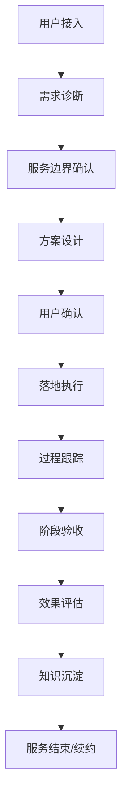

# 超级用户案例跟踪模板与知识沉淀体系
## 一、案例跟踪记录模板
### 1. 超级用户基础信息表
| 字段 | 说明 | 示例 |
|------|------|------|
| 用户ID | 唯一标识 | SU-001 |
| 用户标签 | 核心特征标签 | 连续创业者、跨行业背景、AI产品早期用户 |
| 核心诉求 | 本次服务的核心目标 | 职业转型、个人IP打造、AI工具落地 |
| 服务周期 | 预计服务时间范围 | 2026-04-01 至 2026-06-30 |
| 当前阶段 | 服务进展阶段 | 需求诊断 → 方案设计 → 落地执行 → 效果评估 → 沉淀复盘 |
| 对接角色 | 负责服务的团队角色 | 商业顾问、产品专家、AI训练师 |
---
### 2. 服务过程跟踪记录表
#### 每次服务记录
| 记录项 | 内容要求 |
|--------|----------|
| 服务时间 | 具体日期与时长 |
| 参与角色 | 本次参与的双方人员 |
| 核心议题 | 本次沟通的主要话题 |
| 关键事实 | 确认的客观信息、用户反馈、实际情况 |
| 共识结论 | 双方达成的一致意见和决策 |
| 待办事项 | 后续需要执行的任务、责任人、截止时间 |
| 风险点 | 潜在的问题、障碍或不确定性 |
| 用户情绪/状态 | 用户的态度、满意度、情绪变化 |
| 价值点识别 | 本次沟通中发现的可沉淀知识、可复用模式 |
---
### 3. 阶段成果验收表
| 阶段 | 验收内容 | 完成情况 | 确认签字 |
|------|----------|----------|----------|
| 需求诊断阶段 | 1. 用户核心诉求明确 2. 服务边界清晰 3. 预期效果对齐 | ✅/🔄/❌ | |
| 方案设计阶段 | 1. 解决方案针对性强 2. 实施路径可行 3. 资源投入明确 | ✅/🔄/❌ | |
| 落地执行阶段 | 1. 按计划推进实施 2. 问题及时响应解决 3. 阶段性效果达标 | ✅/🔄/❌ | |
| 效果评估阶段 | 1. 核心目标完成情况评估 2. ROI分析 3. 用户满意度调研 | ✅/🔄/❌ | |
| 沉淀复盘阶段 | 1. 案例总结完成 2. 知识沉淀入库 3. SOP优化建议 | ✅/🔄/❌ | |
## 二、知识沉淀点定义
### 1. 事实类沉淀点
- **用户画像**：超级用户的背景特征、行为模式、需求偏好
- **服务过程**：完整的服务流程记录、关键节点的决策依据
- **效果数据**：可量化的服务效果、用户反馈数据、ROI数据
- **问题记录**：服务过程中遇到的问题、解决过程、最终方案
### 2. 模式类沉淀点
- **需求分类**：不同类型用户的核心诉求分类框架
- **解决方案模式**：针对特定问题的有效解决方案模板
- **沟通模式**：与不同类型用户的高效沟通方法论
- **风险应对模式**：常见风险的预判与应对机制
### 3. 方法论类沉淀点
- **服务框架**：完整的超级用户服务方法论体系
- **评估体系**：服务效果的量化与定性评估标准
- **价值提取方法**：从服务过程中提取可复用知识的流程
- **产品迭代输入**：可转化为产品功能的用户需求与场景
## 三、可复用服务SOP初稿
### SOP 001：超级用户服务全流程

#### 各环节核心动作
1. **用户接入阶段**
   - 收集用户基础信息
   - 初步评估用户匹配度
   - 分配对接团队
2. **需求诊断阶段**
   - 深度沟通挖掘核心诉求
   - 梳理用户背景与历史经历
   - 明确用户期望与底线
3. **服务边界确认阶段**
   - 明确服务范围与不包含范围
   - 对齐预期效果与衡量标准
   - 确定服务周期与节奏
4. **方案设计阶段**
   - 定制化解决方案设计
   - 评估方案可行性与资源需求
   - 明确各环节责任人
5. **落地执行阶段**
   - 按计划推进各项工作
   - 定期同步进展与问题
   - 及时调整优化方案
6. **效果评估阶段**
   - 对照目标评估完成情况
   - 收集用户反馈与建议
   - 计算投入产出比
7. **知识沉淀阶段**
   - 整理服务全流程资料
   - 提取可复用模式与方法论
   - 更新知识库与SOP
### SOP 002：知识沉淀操作规范
1. 每次服务结束后24小时内完成服务记录填写
2. 每个阶段结束后3个工作日内完成阶段沉淀
3. 全服务周期结束后7个工作日内完成完整案例沉淀
4. 沉淀内容需经过至少1人交叉审核后入库
5. 定期（每月）对沉淀知识进行归类整理和模式提炼
## 四、模板使用说明
1. 本模板为通用模板，可根据具体行业和用户类型进行定制化调整
2. 所有记录要求客观真实，避免主观臆断和过度修饰
3. 知识沉淀要求区分事实、判断和建议三个层次
4. 敏感信息需要进行脱敏处理后方可入库